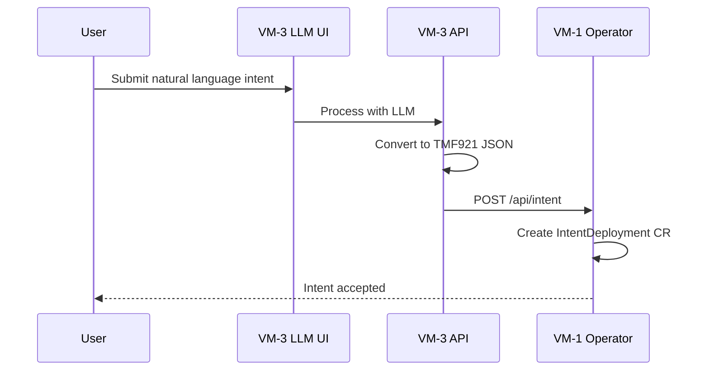
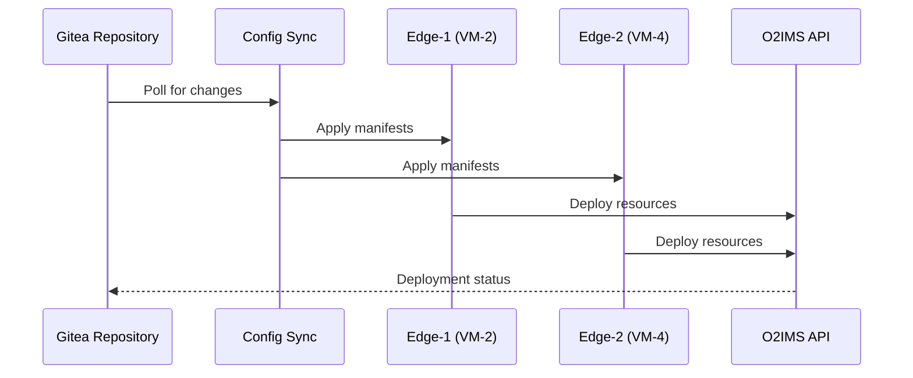
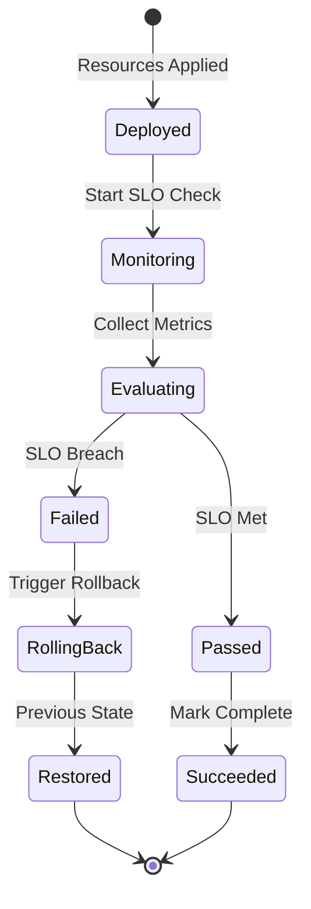
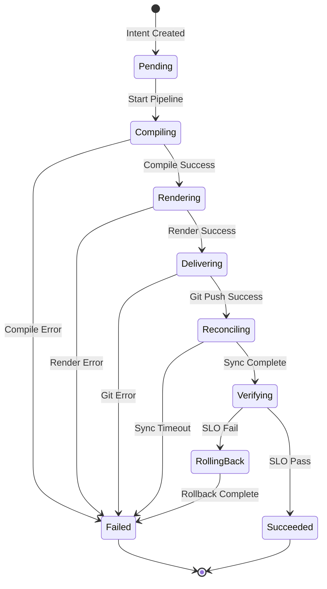
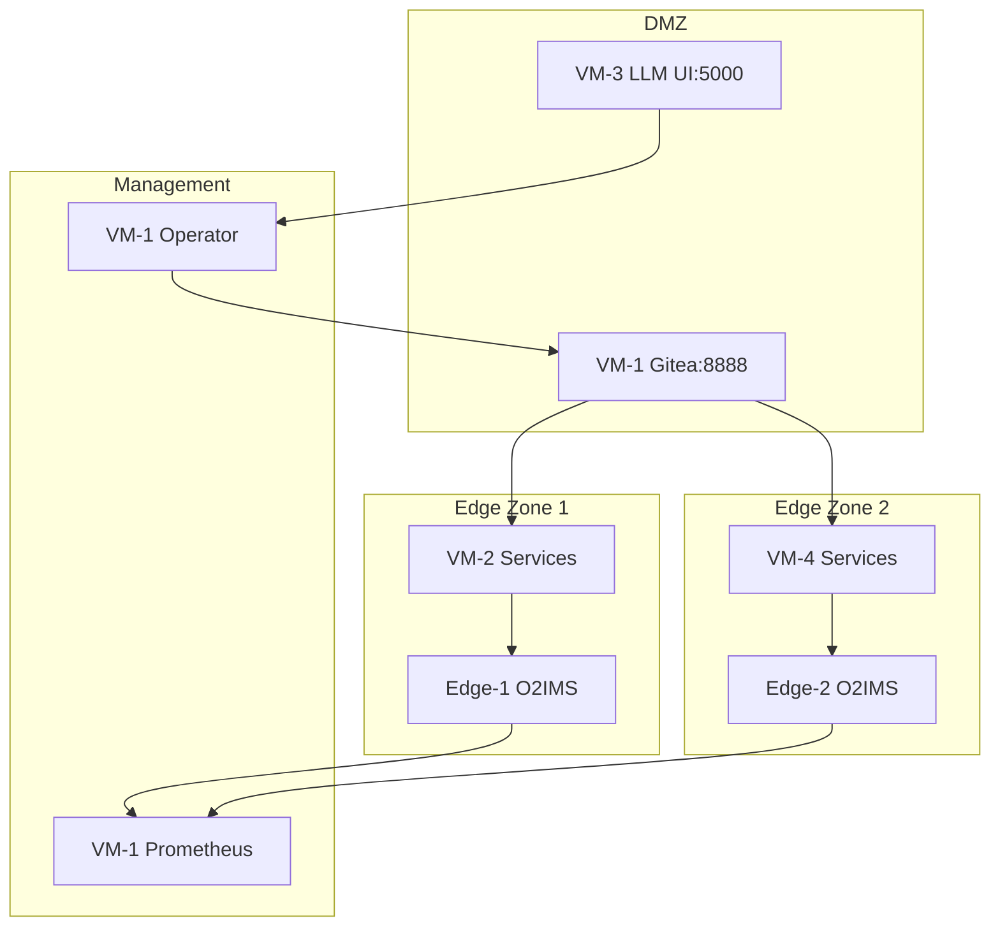
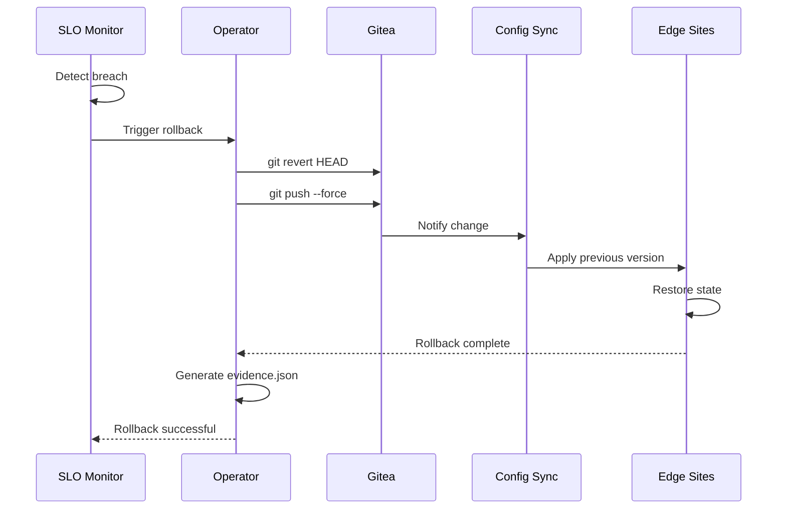

# 🔄 Network Workflows & Data Flows

**Version**: 1.0.0
**Created**: 2025-09-16
**Purpose**: Detailed workflow documentation for Nephio Intent-to-O2 Demo

---

## 📊 Intent Processing Workflow

### Phase 1: Intent Submission


### Phase 2: Compilation & Rendering

```mermaid
sequenceDiagram
    participant Operator as VM-1 Operator
    participant Compiler as Intent Compiler
    participant KPT as KPT Renderer
    participant Git as Gitea (8888)

    Operator->>Compiler: Phase: Compiling
    Compiler->>Compiler: TMF921→28.312
    Compiler->>KPT: Generate KRM packages
    KPT->>KPT: kpt fn render
    KPT->>Git: Commit manifests
    Git-->>Operator: Phase: Rendering complete
```


### Phase 3: GitOps Synchronization


## 🎯 SLO Validation Workflow



### SLO Metrics Collection Points
| Metric | Source | Target | Threshold | Action on Breach |
|--------|--------|--------|-----------|------------------|
| API Latency | Edge:30090 | VM-1:9090 | <100ms P95 | Rollback |
| Error Rate | Edge:31080 | VM-1:9090 | <1% | Alert |
| CPU Usage | Edge:30090 | VM-1:9090 | <80% | Scale/Rollback |
| Memory | Edge:30090 | VM-1:9090 | <85% | Alert |
| Pod Ready | K8s API | VM-1 | 100% | Rollback |

## 🔧 Operator State Machine



### Phase Transition Triggers
| From Phase | To Phase | Trigger | Timeout |
|------------|----------|---------|---------|
| Pending | Compiling | Reconciler start | 30s |
| Compiling | Rendering | intent-compiler success | 2m |
| Rendering | Delivering | kpt fn render success | 3m |
| Delivering | Reconciling | git push success | 1m |
| Reconciling | Verifying | RootSync synced | 5m |
| Verifying | Succeeded | SLO thresholds met | 10m |
| Verifying | RollingBack | SLO breach detected | immediate |
| Any | Failed | Error or timeout | varies |

## 🌐 Network Flow Patterns

### Pattern 1: North-South (External Access)
```
Internet → 147.251.115.x → VM Public IP → NodePort Service
  Example: User → 147.251.115.156:5000 → VM-3 LLM UI
```

### Pattern 2: East-West (Internal Service Mesh)
```
VM-1 → 172.16.x.x → Edge Sites → Service Discovery → Pods
  Example: Operator → 172.16.4.45:31280 → O2IMS Service
```

### Pattern 3: Management Plane
```
kubectl → 172.16.x.x:6443 → K8s API → Controllers → Resources
  Example: VM-1 → Edge-1:6443 → Deployments → Pods
```

### Pattern 4: GitOps Pull
```
Config Sync → Gitea:8888 → Repository → Manifests → Clusters
  Example: Edge-1 → VM-1:8888/edge1-config → Apply
```

## 📈 Traffic Analysis

### Peak Load Distribution
| Path | Volume/Day | Peak TPS | Avg Size | Protocol |
|------|------------|----------|----------|----------|
| LLM UI→Operator | 1000 reqs | 10 | 2KB | HTTP/JSON |
| Operator→Git | 5000 ops | 50 | 10KB | Git/HTTPS |
| Git→ConfigSync | 10000 pulls | 100 | 50KB | Git/HTTPS |
| Edge→O2IMS | 50000 calls | 500 | 1KB | HTTP/REST |
| Metrics→Prom | 100000 points | 1000 | 500B | HTTP/Prom |

## 🔒 Security Zones

### Zone Architecture


### Security Controls
| Zone | Control | Implementation | Status |
|------|---------|----------------|--------|
| DMZ | Rate Limiting | nginx | ✅ Active |
| Management | RBAC | K8s/Git | ✅ Configured |
| Edge | Network Policy | Calico | ✅ Enforced |
| All | Firewall | iptables | ✅ Hardened |

## 📊 Performance Optimization

### Caching Strategy
| Component | Cache Type | TTL | Hit Rate | Location |
|-----------|------------|-----|----------|----------|
| LLM UI | Response | 5m | 70% | Memory |
| Git | Pack files | ∞ | 95% | Disk |
| ConfigSync | Manifests | 1m | 99% | Memory |
| O2IMS | API responses | 30s | 60% | Memory |
| Prometheus | Queries | 5m | 80% | Memory |

### Optimization Recommendations
1. **Enable HTTP/2** on all services for multiplexing
2. **Implement CDN** for static assets (not critical for demo)
3. **Use connection pooling** for database connections
4. **Enable gzip compression** on all HTTP endpoints
5. **Implement circuit breakers** for fault tolerance

## 🔄 Rollback Workflow



### Rollback Evidence Structure
```json
{
  "timestamp": "2025-09-16T10:00:00Z",
  "trigger": "slo_breach",
  "metrics": {
    "latency_p95": 150,
    "threshold": 100,
    "breach_duration": 300
  },
  "actions": [
    {
      "action": "git_revert",
      "commit": "abc123",
      "timestamp": "2025-09-16T10:00:30Z"
    },
    {
      "action": "sync_complete",
      "sites": ["edge1", "edge2"],
      "timestamp": "2025-09-16T10:02:00Z"
    }
  ],
  "result": "success",
  "restored_version": "v1.1.0"
}
```

## 📋 Monitoring Dashboards

### Critical Metrics Dashboard
```yaml
panels:
  - title: "Intent Processing Rate"
    query: "rate(intent_processed_total[5m])"
    unit: "req/s"

  - title: "GitOps Sync Lag"
    query: "gitops_sync_lag_seconds"
    unit: "seconds"

  - title: "O2IMS API Latency"
    query: "histogram_quantile(0.95, o2ims_request_duration_seconds)"
    unit: "ms"

  - title: "SLO Compliance"
    query: "(1 - rate(slo_violations_total[1h])) * 100"
    unit: "%"
```

## 🚀 Emergency Procedures

### Intent Pipeline Failure
```bash
#!/bin/bash
# Emergency recovery for stuck intents

# 1. Check operator status
kubectl --context kind-nephio-demo get pods -n intent-operator-system

# 2. Force phase transition
kubectl --context kind-nephio-demo patch intentdeployment $NAME \
  --type='json' -p='[{"op": "replace", "path": "/status/phase", "value": "Failed"}]'

# 3. Clear stuck resources
kubectl --context kind-nephio-demo delete intentdeployment --all --grace-period=0

# 4. Restart operator
kubectl --context kind-nephio-demo rollout restart deployment \
  -n intent-operator-system intent-operator-controller-manager
```

### GitOps Sync Recovery
```bash
#!/bin/bash
# Fix broken GitOps sync

# 1. Force sync on Edge1
kubectl --context edge1 annotate rootsync root-sync \
  -n config-management-system sync.gke.io/force=true --overwrite

# 2. Check sync status
kubectl --context edge1 get rootsync -n config-management-system \
  -o jsonpath='{.items[0].status.sync.status}'

# 3. If still broken, delete and recreate
kubectl --context edge1 delete rootsync root-sync -n config-management-system
kubectl --context edge1 apply -f gitops/edge1-config/rootsync.yaml
```

### Complete System Reset
```bash
#!/bin/bash
# Full system reset to known good state

# 1. Backup current state
./scripts/backup_state.sh

# 2. Reset to checkpoint
git checkout v1.1.1-checkpoint
git push --force origin main

# 3. Clear all CRs
kubectl --context kind-nephio-demo delete intentdeployments --all

# 4. Restart all components
make -f Makefile.summit restart-all

# 5. Verify health
./scripts/health_check_all.sh
```

---

**Document Status**: Complete
**Next Update**: Post-Summit Review