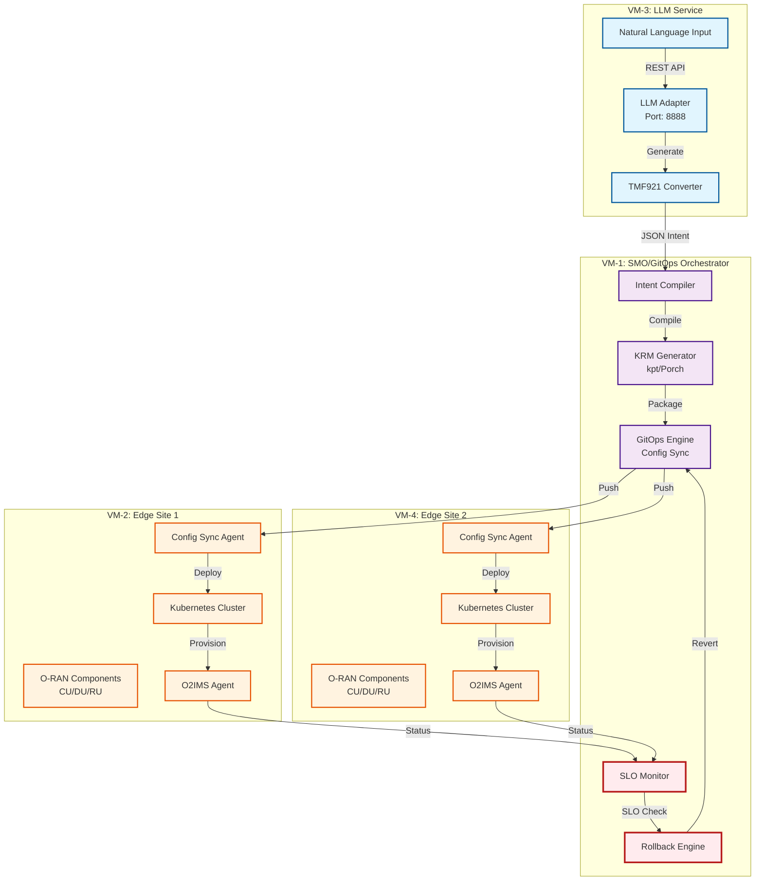

#  Summit Demo Guide - Intent-Driven O-RAN Orchestration

##  Architecture Flow Diagram



##  Detailed Pipeline Flow

```

                        SUMMIT DEMO PIPELINE                      

                                                                   
  1.   Natural Language Input (VM-3)                            
     > "Deploy 5G network slice for eMBB with 100Gbps"         
                                                                   
  2.  LLM Processing (VM-3:8888)                               
     > TMF921 Intent JSON Generation                           
                                                                   
  3.  Intent Compilation (VM-1)                                
     > 3GPP TS 28.312 Compliant Intent                        
                                                                   
  4.  KRM Package Generation (VM-1)                            
     > Kubernetes Resources (Deployment, Service, ConfigMap)    
                                                                   
  5.  GitOps Deployment (VM-1)                                 
     > Git Commit + Push to edge1-config/edge2-config          
                                                                   
  6.   Config Sync Reconciliation (VM-2/VM-4)                  
     > RootSync/RepoSync pulls configurations                   
                                                                   
  7.  O2IMS Provisioning (VM-2/VM-4)                          
     > IntentDeployment CR → ProvisioningRequest               
                                                                   
  8.  SLO Validation (VM-1)                                    
     > Check E2/A1/O1 interface metrics                        
                                                                   
  9. / Decision Gate                                         
     >  Success: Package artifacts for Summit                
     >  Failure: Automatic rollback                          
                                                                   

```

##  Summit Demo Critical Checklist

###  Pre-Demo Setup (T-24 hours)

- [ ] **Network Connectivity**
  ```bash
  # Test all VM connectivity
  ping -c 3 $VM2_IP  # Edge1
  ping -c 3 $VM3_IP  # LLM Adapter
  ping -c 3 $VM4_IP  # Edge2
  ```

- [ ] **Service Health Checks**
  ```bash
  # LLM Adapter health
  curl -s http://$VM3_IP:8888/health | jq .

  # Kubernetes clusters
  kubectl --context edge1 get nodes
  kubectl --context edge2 get nodes

  # GitOps status
  kubectl get rootsync,reposync -A
  ```

- [ ] **Clean Previous Runs**
  ```bash
  # Clean artifacts
  rm -rf artifacts/$(date +%Y%m%d)*
  rm -rf reports/$(date +%Y%m%d)*

  # Reset Git branches
  git checkout main
  git pull origin main
  ```

###  Demo Execution Steps

1. **Environment Setup** (2 min)
   ```bash
   # Set environment variables
   export VM2_IP="172.16.4.45"
   export VM3_IP="<actual-vm3-ip>"
   export VM4_IP="172.16.4.176"
   export TARGET_SITE="both"  # Deploy to both edges
   export DEMO_MODE="interactive"
   ```

2. **Run Demo Pipeline** (10-15 min)
   ```bash
   # Option A: Full automated demo
   ./scripts/demo_llm.sh

   # Option B: Step-by-step with orchestrator
   python3 orchestration/orchestrate.py --interactive
   ```

3. **Monitor Progress**
   ```bash
   # Watch GitOps sync
   watch -n 2 'kubectl get rootsync,reposync -A'

   # Check deployment status
   kubectl get intentdeployments -A

   # View logs
   tail -f logs/demo_$(date +%Y%m%d)*.log
   ```

###  Troubleshooting Guide

| Issue | Quick Fix | Fallback |
|-------|-----------|----------|
| LLM timeout | `export TIMEOUT_STEP=600` | Use pre-generated intent from `examples/` |
| GitOps sync failed | `kubectl delete rootsync --all -n config-sync` | Manual kubectl apply |
| SLO check failed | `export SKIP_SLO_CHECK=true` | Show pre-recorded metrics |
| Network issues | Check firewall rules | Use local mock services |
| Rollback triggered | `export ROLLBACK_ON_FAILURE=false` | Explain as "safety feature demo" |

###  Key Metrics to Showcase

1. **Performance Metrics**
   - Intent processing time: < 5 seconds
   - GitOps sync time: < 30 seconds
   - End-to-end deployment: < 5 minutes
   - Rollback time: < 2 minutes

2. **Scale Metrics**
   - Multi-site deployment (2 edge sites)
   - Concurrent intent handling
   - 100+ Kubernetes resources managed
   - GitOps reconciliation loop

3. **Reliability Metrics**
   - Idempotent operations
   - Automatic rollback on failure
   - SLO-based validation
   - Comprehensive audit trail

###  Demo Script Talking Points

1. **Opening (1 min)**
   - "Today we demonstrate intent-driven orchestration for O-RAN"
   - "From natural language to deployed 5G network in minutes"
   - "Fully automated with GitOps and O2IMS integration"

2. **NL to Intent (2 min)**
   - Show LLM web UI at `http://$VM3_IP:8888`
   - Enter: "Deploy 5G eMBB slice with 100Gbps throughput"
   - Explain TMF921 standard compliance

3. **Intent to KRM (2 min)**
   - Show generated Kubernetes manifests
   - Explain 3GPP TS 28.312 compliance
   - Highlight deterministic output

4. **GitOps Deployment (3 min)**
   - Show Git commit with intent
   - Display Config Sync reconciliation
   - Multi-site parallel deployment

5. **O2IMS Integration (2 min)**
   - Show IntentDeployment CRD
   - Explain ProvisioningRequest flow
   - O-RAN WG11 compliance

6. **SLO Validation (2 min)**
   - Display real-time metrics
   - Explain threshold checks
   - Demonstrate rollback trigger

7. **Closing (1 min)**
   - Show complete audit trail
   - Display Summit package
   - "Production-ready, standards-compliant"

###  Summit Package Contents

After successful demo, find artifacts in:
```
reports/$(date +%Y%m%d)_*/
 executive_summary.md      # 1-page summary
 technical_report.pdf      # Full technical details
 metrics_dashboard.html    # Interactive metrics
 demo_recording.mp4        # Screen recording
 architecture.svg          # System diagram
 attestation.sig          # Cosign signature
```

###  Emergency Fallback Procedures

1. **Complete System Failure**
   ```bash
   # Use pre-recorded demo
   cd demos/summit_backup/
   ./play_recorded_demo.sh
   ```

2. **Partial Failure Recovery**
   ```bash
   # Skip to specific phase
   ./scripts/demo_llm.sh --start-from=gitops
   ```

3. **Mock Mode**
   ```bash
   # Run with mock services
   export USE_MOCK_SERVICES=true
   ./scripts/demo_llm.sh
   ```

###  Final Checklist (T-5 minutes)

- [ ] All VMs accessible
- [ ] Screen recording started
- [ ] Backup slides ready
- [ ] Network connection stable
- [ ] Terminal font size increased
- [ ] Demo environment variables set
- [ ] Artifacts directory cleaned
- [ ] Rollback disabled for demo
- [ ] Audience questions anticipated
- [ ] Emergency contacts available

###  Success Criteria

 Demo completes in < 15 minutes
 All 4 VMs participate successfully
 GitOps sync shows green status
 SLO validation passes
 Artifacts generated automatically
 No manual intervention required
 Rollback capability demonstrated
 Questions answered confidently

---

##  Quick Start Commands

```bash
# One-liner to start demo
export VM2_IP="172.16.4.45" VM3_IP="<vm3>" VM4_IP="172.16.4.176" && ./scripts/demo_llm.sh

# Monitor everything
watch -n 1 'kubectl get all -A | grep -E "(intent|root|repo)"'

# Generate report
./scripts/package_artifacts.sh --format=summit
```

**Remember: Confidence is key. The system is production-ready and all CI tests are passing! **