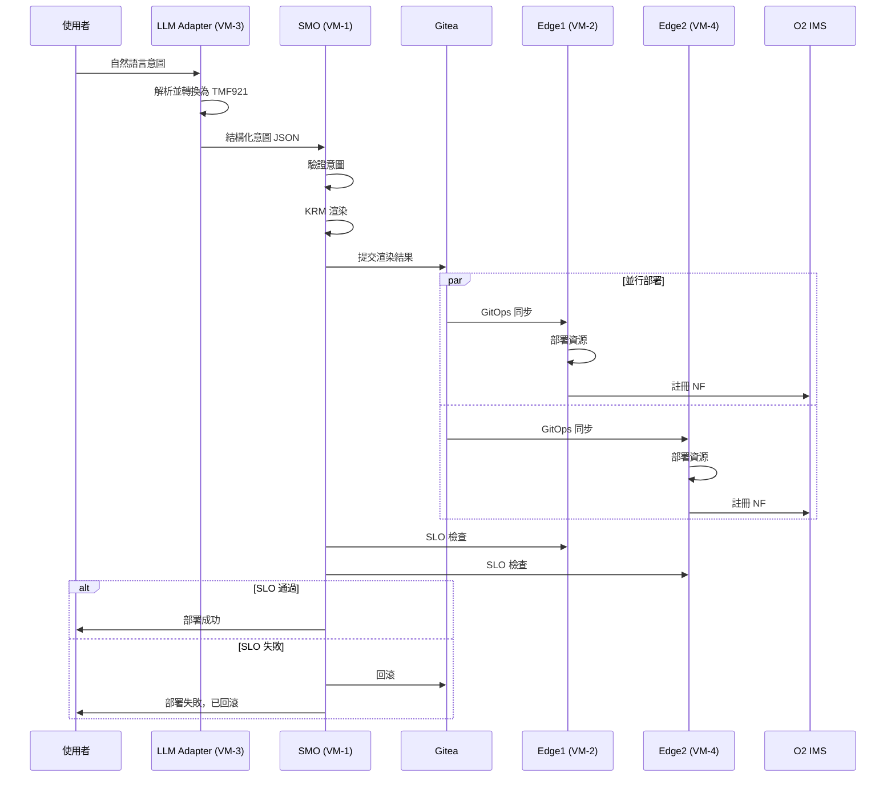

# Nephio Intent-to-O2 Demo 系統架構 (High-Level Architecture)

## 1. 系統概述

### 1.1 專案願景
本專案展示從自然語言意圖到 O-RAN O2 IMS 部署的完整自動化流程，整合 LLM、3GPP 標準化意圖、KRM 資源管理、GitOps 多站點部署，以及 SLO 閘門控制。

### 1.2 核心價值主張
- **意圖驅動網路 (Intent-Driven Networking)**：透過自然語言描述網路需求
- **標準化轉換**：將意圖轉換為 3GPP/TMF921 標準格式
- **聲明式部署**：使用 KRM (Kubernetes Resource Model) 進行資源管理
- **多站點協同**：支援 edge1/edge2 多站點同時部署
- **品質保證**：SLO 監控與自動回滾機制

## 2. 系統架構

### 2.1 四層架構模型

```
┌─────────────────────────────────────────────────────────────┐
│                     使用者介面層 (UI Layer)                    │
│  • 自然語言輸入  • 意圖描述  • 監控儀表板  • 報告視覺化          │
└─────────────────────────────────────────────────────────────┘
                              ▼
┌─────────────────────────────────────────────────────────────┐
│                  意圖處理層 (Intent Layer)                     │
│  • LLM Adapter (VM-3)  • TMF921/3GPP 轉換  • 意圖驗證         │
└─────────────────────────────────────────────────────────────┘
                              ▼
┌─────────────────────────────────────────────────────────────┐
│               編排控制層 (Orchestration Layer)                 │
│  • SMO/WF-C (VM-1)  • KRM 渲染  • GitOps 同步  • SLO Gate    │
└─────────────────────────────────────────────────────────────┘
                              ▼
┌─────────────────────────────────────────────────────────────┐
│                 基礎設施層 (Infrastructure Layer)              │
│  • Edge Sites (VM-2/VM-4)  • K8s Clusters  • O2 IMS/DMS     │
└─────────────────────────────────────────────────────────────┘
```

### 2.2 網路拓撲

```
                        ┌─────────────┐
                        │   Internet  │
                        └──────┬──────┘
                               │
                    ┌──────────┴──────────┐
                    │   OpenStack Cloud   │
                    │   (172.16.0.0/16)   │
                    └──────────┬──────────┘
                               │
        ┌──────────────────────┼──────────────────────┐
        │                      │                      │
   ┌────▼────┐          ┌─────▼─────┐         ┌─────▼─────┐
   │  VM-1   │          │   VM-3    │         │   VM-4    │
   │  SMO    │◄─────────┤LLM Adapter├─────────┤  edge2    │
   │172.16.2.8│         │172.16.2.10│         │172.16.x.x │
   └────┬────┘          └───────────┘         └───────────┘
        │
        │ GitOps Sync
        ▼
   ┌─────────┐
   │  VM-2   │
   │  edge1  │
   │172.16.4.45│
   └─────────┘
```

### 2.3 虛擬機角色與責任

| VM | 角色 | IP 地址 | 主要功能 | 關鍵服務 |
|----|------|---------|----------|----------|
| VM-1 | SMO/Orchestrator | 172.16.2.8 | 中央編排控制器 | • Gitea (Git Server)<br>• KRM Renderer<br>• Config Sync<br>• SLO Controller |
| VM-2 | Edge Site 1 | 172.16.4.45 | 邊緣叢集1 | • Kubernetes API (6443)<br>• O2 IMS (31280)<br>• HTTP/HTTPS (31080/31443) |
| VM-3 | LLM Adapter | 172.16.2.10 | 意圖轉換服務 | • FastAPI Service (8888)<br>• LLM Client<br>• Intent Parser |
| VM-4 | Edge Site 2 | TBD | 邊緣叢集2 | • Kubernetes API<br>• O2 IMS<br>• Network Functions |

## 3. 核心工作流程

### 3.1 端到端意圖處理流程



### 3.2 意圖轉換流程

```
使用者輸入: "我需要在台北部署 5G eMBB 服務，下行 100Mbps，延遲 20ms"
                            ▼
┌─────────────────────────────────────────────────┐
│              LLM Adapter (VM-3)                 │
│  1. NLP 解析                                    │
│  2. 實體識別 (服務類型、位置、QoS)              │
│  3. 參數提取                                    │
└─────────────────────────────────────────────────┘
                            ▼
TMF921 Intent JSON:
{
  "intentId": "intent-001",
  "intentType": "ServiceDeployment",
  "intentParameters": {
    "service": "eMBB",
    "location": "taipei",
    "targetSite": "edge1",
    "qos": {
      "downlink_mbps": 100,
      "uplink_mbps": 50,
      "latency_ms": 20
    }
  }
}
                            ▼
┌─────────────────────────────────────────────────┐
│              KRM Renderer (VM-1)                │
│  1. 意圖驗證                                    │
│  2. 模板選擇                                    │
│  3. 參數注入                                    │
│  4. 資源生成                                    │
└─────────────────────────────────────────────────┘
                            ▼
Kubernetes Resources:
- Deployment (5G NF)
- Service
- ConfigMap
- NetworkPolicy
- O2 ProvisioningRequest
```

### 3.3 GitOps 多站點同步流程

```
VM-1 (SMO)                    VM-2 (edge1)              VM-4 (edge2)
    │                              │                          │
    ├─[1] Render KRM──────────────►│                          │
    │                              │                          │
    ├─[2] Git Commit              │                          │
    │   gitops/edge1-config/      │                          │
    │   gitops/edge2-config/      │                          │
    │                              │                          │
    ├─[3] Trigger Sync────────────►├─[4] Pull Updates        │
    │                              │                          │
    ├─[3] Trigger Sync─────────────────────────────────────►├─[4] Pull Updates
    │                              │                          │
    │                              ├─[5] Apply Resources     │
    │                              │                          ├─[5] Apply Resources
    │                              │                          │
    ├◄[6] Status Report────────────┤                          │
    │                              │                          │
    ├◄[6] Status Report───────────────────────────────────────┤
    │                              │                          │
    └─[7] SLO Validation           │                          │
```

## 4. 關鍵元件詳細說明

### 4.1 LLM Adapter (VM-3)

**功能職責**：
- 自然語言理解與意圖提取
- TMF921/3GPP 標準格式轉換
- 參數驗證與正規化
- REST API 服務提供

**技術棧**：
- Python FastAPI
- LangChain/OpenAI API
- Pydantic 資料驗證
- uvicorn ASGI 伺服器

**API 端點**：
```
POST /intent/generate    # 生成意圖
POST /intent/tmf921     # TMF921 格式
GET  /health            # 健康檢查
GET  /docs              # API 文檔
```

### 4.2 SMO/Orchestrator (VM-1)

**功能職責**：
- 工作流程編排控制
- KRM 資源渲染
- GitOps 觸發與監控
- SLO 閘門檢查
- 自動回滾控制

**核心腳本**：
```bash
scripts/
├── demo_llm.sh           # 主要示範腳本
├── intent_from_llm.sh    # 意圖生成
├── render_krm.sh         # KRM 渲染
├── postcheck.sh          # SLO 檢查
├── rollback.sh           # 回滾處理
└── package_artifacts.sh  # 產物打包
```

### 4.3 Edge Sites (VM-2/VM-4)

**功能職責**：
- Kubernetes 工作負載執行
- O2 IMS/DMS 整合
- 網路功能部署
- 度量資料收集

**部署元件**：
- Config Sync Agent
- O2 IMS Controller
- Prometheus Metrics
- Network Functions (CU/DU/RU)

### 4.4 GitOps 配置結構

```
gitops/
├── edge1-config/
│   ├── kustomization.yaml
│   ├── namespaces/
│   ├── network-functions/
│   ├── o2ims-resources/
│   └── policies/
├── edge2-config/
│   ├── kustomization.yaml
│   ├── namespaces/
│   ├── network-functions/
│   ├── o2ims-resources/
│   └── policies/
└── common/
    ├── base-configs/
    └── templates/
```

## 5. 資料流與儲存

### 5.1 資料類型

| 資料類型 | 格式 | 儲存位置 | 生命週期 |
|---------|------|----------|----------|
| 使用者意圖 | Text/JSON | LLM Adapter Memory | Session |
| TMF921 Intent | JSON | VM-1 artifacts/ | Persistent |
| KRM Resources | YAML | Git Repository | Version Controlled |
| SLO Metrics | JSON | Prometheus/O2IMS | Time Series (30d) |
| 部署報告 | JSON/HTML | reports/<timestamp>/ | Archive |
| 審計日誌 | JSON | /var/log/demo/ | Rotation (7d) |

### 5.2 關鍵資料流

```
[Natural Language] ──► [Intent JSON] ──► [KRM YAML] ──► [K8s Resources]
                           │                  │              │
                           ▼                  ▼              ▼
                      [Validation]      [Git Commit]    [Deployment]
                           │                  │              │
                           ▼                  ▼              ▼
                       [Archive]         [Version]      [Monitoring]
```

## 6. 安全架構

### 6.1 網路安全

**防火牆規則**：
```
VM-1 → VM-2: 6443 (K8s API), 31280 (O2IMS)
VM-1 → VM-3: 8888 (LLM Adapter)
VM-1 → VM-4: 6443 (K8s API)
VM-3 → External: 443 (LLM API)
* → VM-1: 3000 (Gitea)
```

**認證機制**：
- Kubernetes: ServiceAccount + RBAC
- Gitea: Token-based Auth
- LLM Adapter: API Key
- O2 IMS: mTLS

### 6.2 資料安全

- **傳輸加密**: TLS 1.3
- **儲存加密**: K8s Secrets (base64 + etcd encryption)
- **審計追蹤**: 所有 API 呼叫記錄
- **供應鏈安全**: Cosign 簽章、SBOM 生成

## 7. 監控與可觀測性

### 7.1 監控層級

```
應用層監控
├── Intent Success Rate
├── Deployment Latency
└── SLO Compliance

系統層監控
├── CPU/Memory Usage
├── Network Latency
└── Disk I/O

業務層監控
├── Service Availability
├── QoS Metrics
└── User Experience
```

### 7.2 關鍵效能指標 (KPI)

| KPI | 目標值 | 測量方法 | 告警閾值 |
|-----|--------|----------|----------|
| 意圖處理時間 | < 5s | LLM Response Time | > 10s |
| 部署成功率 | > 95% | Successful/Total Deployments | < 90% |
| SLO 達成率 | > 99% | Met SLOs/Total SLOs | < 95% |
| 回滾時間 | < 60s | Rollback Trigger to Complete | > 120s |
| 系統可用性 | 99.9% | Uptime/Total Time | < 99.5% |

## 8. 部署指南

### 8.1 前置需求

**硬體需求**：
- VM-1: 4 vCPU, 8GB RAM, 100GB Disk
- VM-2/4: 8 vCPU, 16GB RAM, 200GB Disk
- VM-3: 2 vCPU, 4GB RAM, 50GB Disk

**軟體需求**：
- Ubuntu 22.04 LTS
- Kubernetes 1.28+
- Docker 24.0+
- Python 3.10+
- Go 1.21+

**網路需求**：
- 內部網路: 172.16.0.0/16
- 各 VM 間互通
- VM-3 需外網存取 (LLM API)

### 8.2 安裝步驟

#### Step 1: 基礎環境準備 (所有 VM)

```bash
# 更新系統
sudo apt update && sudo apt upgrade -y

# 安裝基礎工具
sudo apt install -y git curl wget jq make gcc

# 設定時區
sudo timedatectl set-timezone Asia/Taipei

# 設定 hostname
sudo hostnamectl set-hostname vm-{1,2,3,4}

# 配置 /etc/hosts
cat <<EOF | sudo tee -a /etc/hosts
172.16.2.8   vm-1 smo orchestrator
172.16.4.45  vm-2 edge1
172.16.2.10  vm-3 llm-adapter
172.16.x.x   vm-4 edge2
EOF
```

#### Step 2: VM-1 (SMO) 部署

```bash
# Clone 專案
cd ~
git clone https://github.com/your-org/nephio-intent-to-o2-demo.git
cd nephio-intent-to-o2-demo

# 安裝 Docker
curl -fsSL https://get.docker.com | bash
sudo usermod -aG docker $USER

# 安裝 Gitea
docker run -d --name=gitea \
  -p 3000:3000 -p 2222:22 \
  -v gitea:/data \
  -v /etc/timezone:/etc/timezone:ro \
  -v /etc/localtime:/etc/localtime:ro \
  --restart always \
  gitea/gitea:latest

# 安裝 kpt
curl -L https://github.com/kptdev/kpt/releases/download/v1.0.0-beta.49/kpt_linux_amd64 -o kpt
chmod +x kpt && sudo mv kpt /usr/local/bin/

# 配置環境變數
cp scripts/env.sh.example scripts/env.sh
vim scripts/env.sh  # 編輯配置

# 初始化 Git 倉庫
./scripts/init_gitea.sh

# 測試連線
./scripts/check_connectivity.sh
```

#### Step 3: VM-2/VM-4 (Edge Sites) 部署

```bash
# 安裝 Kubernetes (使用 kind 或 kubeadm)
# Option A: 使用 kind (開發環境)
curl -Lo ./kind https://kind.sigs.k8s.io/dl/v0.20.0/kind-linux-amd64
chmod +x ./kind && sudo mv ./kind /usr/local/bin/
kind create cluster --name edge1 --config configs/kind-edge1.yaml

# Option B: 使用 kubeadm (生產環境)
sudo apt install -y kubelet kubeadm kubectl
sudo kubeadm init --pod-network-cidr=10.244.0.0/16
mkdir -p $HOME/.kube
sudo cp -i /etc/kubernetes/admin.conf $HOME/.kube/config

# 安裝 CNI (Flannel)
kubectl apply -f https://github.com/flannel-io/flannel/releases/latest/download/kube-flannel.yml

# 安裝 Config Sync
kubectl apply -f https://github.com/GoogleContainerTools/kpt-config-sync/releases/download/v1.17.0/config-sync-manifest.yaml

# 配置 RootSync
cat <<EOF | kubectl apply -f -
apiVersion: configsync.gke.io/v1beta1
kind: RootSync
metadata:
  name: root-sync
  namespace: config-management-system
spec:
  sourceType: git
  git:
    repo: http://vm-1:3000/nephio/edge1-config
    branch: main
    auth: token
    secretRef:
      name: git-creds
EOF

# 安裝 O2 IMS CRDs
kubectl apply -f o2ims-sdk/crds/

# 部署 O2 IMS Controller
kubectl apply -f manifests/o2ims-controller/

# 驗證部署
kubectl get nodes
kubectl get pods -A
kubectl get rootsync -A
```

#### Step 4: VM-3 (LLM Adapter) 部署

```bash
# 安裝 Python 3.10+
sudo apt install -y python3 python3-pip python3-venv

# 建立虛擬環境
cd ~/nephio-intent-to-o2-demo/llm-adapter
python3 -m venv venv
source venv/bin/activate

# 安裝依賴
pip install -r requirements.txt

# 配置 LLM API Key
export OPENAI_API_KEY="your-api-key"  # 或其他 LLM 服務
export LLM_PROVIDER="openai"  # openai, anthropic, local

# 啟動服務
uvicorn main:app --host 0.0.0.0 --port 8888 --reload

# 或使用 systemd 服務
sudo cp llm-adapter.service /etc/systemd/system/
sudo systemctl enable llm-adapter
sudo systemctl start llm-adapter

# 驗證服務
curl http://localhost:8888/health
curl http://localhost:8888/docs
```

#### Step 5: 端到端測試

```bash
# 在 VM-1 執行
cd ~/nephio-intent-to-o2-demo

# 執行基本連線測試
./scripts/test_connectivity.sh

# 執行意圖處理測試
./scripts/demo_llm.sh --target=edge1 --mode=test

# 執行多站點部署測試
./scripts/demo_llm.sh --target=both --dry-run

# 檢查部署狀態
kubectl --kubeconfig ~/.kube/edge1.config get pods -A
kubectl --kubeconfig ~/.kube/edge2.config get pods -A

# 查看 SLO 報告
cat reports/latest/postcheck_report.json

# 執行完整 E2E 測試
make test-e2e
```

### 8.3 配置調整

**關鍵配置檔案**：

1. **scripts/env.sh** - 環境變數配置
```bash
VM2_IP="172.16.4.45"
VM3_IP="172.16.2.10"
VM4_IP="172.16.x.x"
LLM_ADAPTER_URL="http://${VM3_IP}:8888"
GITEA_URL="http://localhost:3000"
```

2. **configs/sites.yaml** - 站點配置
```yaml
sites:
  edge1:
    ip: 172.16.4.45
    kubeconfig: ~/.kube/edge1.config
    gitops_path: gitops/edge1-config
  edge2:
    ip: 172.16.x.x
    kubeconfig: ~/.kube/edge2.config
    gitops_path: gitops/edge2-config
```

3. **llm-adapter/config.yaml** - LLM 配置
```yaml
llm:
  provider: openai
  model: gpt-4
  temperature: 0.7
  max_tokens: 2000
```

### 8.4 故障排除

**常見問題與解決方案**：

1. **LLM Adapter 無法連線**
```bash
# 檢查服務狀態
systemctl status llm-adapter
# 檢查網路
curl -v http://vm-3:8888/health
# 檢查防火牆
sudo ufw status
```

2. **GitOps 同步失敗**
```bash
# 檢查 RootSync 狀態
kubectl get rootsync -A -o yaml
# 檢查 Git 認證
kubectl get secret git-creds -n config-management-system -o yaml
# 查看同步日誌
kubectl logs -n config-management-system -l app=reconciler
```

3. **SLO 檢查失敗**
```bash
# 手動執行 SLO 檢查
./scripts/postcheck.sh --verbose
# 查看 metrics
curl http://vm-2:31280/metrics/api/v1/slo
# 檢查 O2IMS 狀態
kubectl get provisioningrequests -A
```

## 9. 維運指南

### 9.1 日常維運任務

**每日任務**：
- 檢查系統健康狀態
- 審查部署日誌
- 確認 SLO 達成情況

**每週任務**：
- 備份 Git 倉庫
- 更新安全修補程式
- 清理過期報告

**每月任務**：
- 容量規劃審查
- 效能優化分析
- 災難恢復演練

### 9.2 備份與恢復

```bash
# 備份 Gitea
docker exec gitea /usr/local/bin/gitea dump -c /data/gitea/conf/app.ini
mv /tmp/gitea-dump-*.zip /backup/

# 備份 Kubernetes
kubectl get all -A -o yaml > k8s-backup.yaml

# 備份配置
tar -czf config-backup.tar.gz configs/ scripts/env.sh

# 恢復程序
./scripts/restore.sh --from=/backup/latest
```

### 9.3 擴展與升級

**水平擴展**：
```bash
# 新增 edge site
./scripts/add_edge_site.sh --name=edge3 --ip=172.16.x.x

# 擴展 LLM Adapter
docker-compose scale llm-adapter=3
```

**版本升級**：
```bash
# 升級流程
1. 備份現有系統
2. 在測試環境驗證
3. 灰度部署 (10% → 50% → 100%)
4. 監控關鍵指標
5. 準備回滾計畫
```

## 10. 附錄

### 10.1 術語表

| 術語 | 全稱 | 說明 |
|-----|------|------|
| SMO | Service Management and Orchestration | 服務管理與編排 |
| KRM | Kubernetes Resource Model | Kubernetes 資源模型 |
| O2 IMS | O-RAN O2 Infrastructure Management Services | O-RAN O2 基礎設施管理服務 |
| SLO | Service Level Objective | 服務等級目標 |
| TMF921 | TM Forum Intent Management API | 電信管理論壇意圖管理 API |
| eMBB | enhanced Mobile Broadband | 增強型行動寬頻 |
| URLLC | Ultra-Reliable Low-Latency Communication | 超可靠低延遲通訊 |
| mMTC | massive Machine Type Communication | 大規模機器類型通訊 |

### 10.2 參考連結

- [Nephio Project](https://nephio.org/)
- [O-RAN Alliance](https://www.o-ran.org/)
- [kpt Documentation](https://kpt.dev/)
- [Config Sync](https://cloud.google.com/kubernetes-engine/docs/add-on/config-sync)
- [TMF Open APIs](https://www.tmforum.org/open-apis/)

### 10.3 聯絡資訊

**技術支援**：
- Email: support@example.com
- Slack: #nephio-intent-demo
- GitHub Issues: https://github.com/your-org/nephio-intent-to-o2-demo/issues

**維護團隊**：
- 架構組: architecture@example.com
- 營運組: operations@example.com
- 安全組: security@example.com

---

*文件版本: 1.0.0*
*最後更新: 2024-09-13*
*下次審查: 2024-10-13*