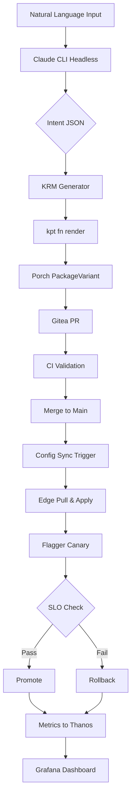
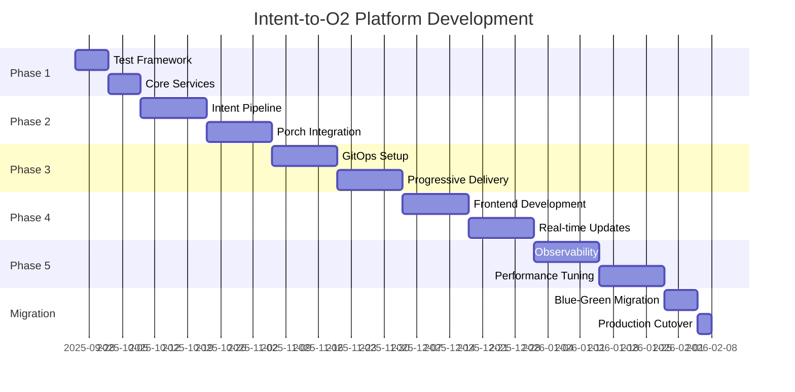

# Ultimate Development Plan: VM-1 Integrated Intent-to-O2 Platform
## Test-Driven Development Approach for Cloud-Native Orchestration

> **Version**: 1.0 | **Date**: 2025-09-25 | **Status**: FINAL

---

## Executive Summary

This document presents the definitive development plan for transforming VM-1 into a fully integrated Intent-to-O2 orchestration platform, eliminating VM-3 dependency while leveraging Claude Code CLI's headless capabilities, kpt/Porch for package management, and GitOps for edge synchronization. The plan follows strict TDD principles with 2025 best practices.

### Key Innovations
- **Claude CLI Headless Mode**: Direct JSON output via `--output-format stream-json`
- **Porch-based Multi-site Variants**: Automated edge-specific package generation
- **GitOps Pull Architecture**: Zero-trust edge synchronization
- **Progressive Delivery**: Flagger/Argo Rollouts for automated rollback
- **Unified Observability**: Thanos/VictoriaMetrics centralized metrics

---

## 1. Architecture Overview

### 1.1 Component Stack

```
┌─────────────────────────────────────────────────────────────┐
│                     VM-1 Integrated Platform                 │
├───────────────────────────────────────────────────────────────┤
│  Frontend Layer                                              │
│  ├── React 18 + TypeScript (Vite)                           │
│  ├── Material-UI Components                                  │
│  └── WebSocket Real-time Updates                            │
├───────────────────────────────────────────────────────────────┤
│  API Gateway Layer                                           │
│  ├── FastAPI with OpenAPI 3.1                               │
│  ├── GraphQL Federation (Apollo Gateway)                     │
│  └── WebSocket Manager                                       │
├───────────────────────────────────────────────────────────────┤
│  Service Abstraction Layer                                   │
│  ├── Claude Service (Headless CLI Wrapper)                  │
│  ├── Intent Processor (TMF921 Compliant)                    │
│  ├── KRM Engine (kpt functions)                             │
│  └── Porch Controller (PackageVariant)                      │
├───────────────────────────────────────────────────────────────┤
│  GitOps Layer                                                │
│  ├── Gitea (Self-hosted Git)                                │
│  ├── Gitea Actions (CI/CD)                                  │
│  └── Config Sync/Argo CD/Flux (Edge Pull)                  │
├───────────────────────────────────────────────────────────────┤
│  Observability Layer                                         │
│  ├── Prometheus (Metrics Collection)                         │
│  ├── Thanos/VictoriaMetrics (TSDB)                         │
│  ├── Grafana (Visualization)                                │
│  └── Alertmanager (Alert Routing)                          │
├───────────────────────────────────────────────────────────────┤
│  Progressive Delivery Layer                                  │
│  ├── Flagger (Canary Deployments)                           │
│  ├── Argo Rollouts (Blue-Green)                            │
│  └── SLO Validation (PromQL)                                │
└───────────────────────────────────────────────────────────────┘
```

### 1.2 Data Flow Architecture



---

## 2. Development Phases (TDD-Driven)

### Phase 1: Foundation & Testing Framework [Week 1-2]

#### Sprint 1.1: Test Infrastructure Setup

**Test First (TDD Step 1):**
```python
# tests/test_claude_service.py
import pytest
from unittest.mock import Mock, patch
import json

class TestClaudeHeadlessService:
    def test_claude_cli_headless_mode(self):
        """Test that Claude CLI runs in headless mode with JSON output"""
        # Arrange
        test_prompt = "Convert 'Deploy eMBB on edge1' to TMF921"
        expected_output = {"intentType": "eMBB", "targetSite": "edge1"}

        # Act (will fail initially - RED phase)
        service = ClaudeHeadlessService()
        result = service.process_intent(test_prompt)

        # Assert
        assert result == expected_output
        assert isinstance(result, dict)

    def test_claude_cli_timeout_handling(self):
        """Test timeout handling for Claude CLI calls"""
        service = ClaudeHeadlessService(timeout=5)
        with pytest.raises(TimeoutError):
            service.process_intent("This should timeout", mock_delay=10)

    def test_fallback_to_rule_engine(self):
        """Test fallback when Claude is unavailable"""
        service = ClaudeHeadlessService()
        with patch('subprocess.run', side_effect=Exception("Claude unavailable")):
            result = service.process_intent("Deploy eMBB on edge1")
            assert result["_fallback"] is True
```

**Implementation (TDD Step 2 - GREEN):**
```python
# src/services/claude_service.py
import subprocess
import json
import asyncio
from typing import Dict, Any, Optional
from functools import lru_cache

class ClaudeHeadlessService:
    def __init__(self, timeout: int = 30):
        self.timeout = timeout
        self.claude_path = self._detect_claude_cli()

    def _detect_claude_cli(self) -> str:
        """Auto-detect Claude CLI installation"""
        paths = [
            "/home/ubuntu/.npm-global/bin/claude",
            "/usr/local/bin/claude",
            "/opt/claude/bin/claude"
        ]
        for path in paths:
            if os.path.exists(path):
                return path
        raise RuntimeError("Claude CLI not found")

    @lru_cache(maxsize=128)
    def process_intent(self, prompt: str, mock_delay: Optional[int] = None) -> Dict[str, Any]:
        """Process natural language intent using Claude CLI headless mode"""
        if mock_delay:
            time.sleep(mock_delay)

        command = [
            self.claude_path,
            "-p", self._build_prompt(prompt),
            "--output-format", "stream-json"
        ]

        try:
            result = subprocess.run(
                command,
                capture_output=True,
                text=True,
                timeout=self.timeout,
                check=True
            )
            return json.loads(result.stdout)
        except subprocess.TimeoutExpired:
            raise TimeoutError(f"Claude CLI timeout after {self.timeout}s")
        except Exception as e:
            # Fallback to rule-based engine
            return self._rule_based_fallback(prompt)

    def _rule_based_fallback(self, prompt: str) -> Dict[str, Any]:
        """Fallback parser using regex patterns"""
        patterns = {
            r"deploy\s+(\w+)\s+on\s+(\w+)": lambda m: {
                "intentType": m.group(1).upper(),
                "targetSite": m.group(2),
                "_fallback": True
            }
        }

        for pattern, builder in patterns.items():
            match = re.search(pattern, prompt, re.IGNORECASE)
            if match:
                return builder(match)

        return {"error": "Unable to parse intent", "_fallback": True}
```

**Refactor (TDD Step 3):**
```python
# Refactored with better separation of concerns
class ClaudeHeadlessAdapter:
    """Adapter pattern for Claude CLI integration"""

    def __init__(self, executor: CommandExecutor, parser: ResponseParser):
        self.executor = executor
        self.parser = parser

    async def process_async(self, prompt: str) -> Dict[str, Any]:
        """Async processing with better error handling"""
        raw_output = await self.executor.execute_async(prompt)
        return self.parser.parse(raw_output)
```

#### Sprint 1.2: KRM Engine Tests

**Test First:**
```python
# tests/test_krm_engine.py
import pytest
from pathlib import Path

class TestKRMEngine:
    def test_intent_to_kptfile_generation(self):
        """Test generation of Kptfile from intent"""
        # Arrange
        intent = {
            "intentType": "eMBB",
            "targetSite": "edge1",
            "parameters": {
                "bandwidth": "200Mbps",
                "latency": "30ms"
            }
        }

        # Act
        engine = KRMEngine()
        kptfile = engine.generate_kptfile(intent)

        # Assert
        assert kptfile["apiVersion"] == "kpt.dev/v1"
        assert kptfile["kind"] == "Kptfile"
        assert "pipeline" in kptfile
        assert len(kptfile["pipeline"]["mutators"]) > 0

    def test_kpt_render_validation(self, tmp_path):
        """Test kpt render produces valid YAML"""
        # Arrange
        package_dir = tmp_path / "test-package"
        package_dir.mkdir()

        # Act
        engine = KRMEngine()
        result = engine.render_package(package_dir)

        # Assert
        assert result.success
        assert (package_dir / "resources.yaml").exists()
```

### Phase 2: Core Services Implementation [Week 3-4]

#### Sprint 2.1: Intent Processing Pipeline

**Test Specification:**
```python
# tests/test_intent_pipeline.py
import pytest
from unittest.mock import AsyncMock

@pytest.mark.asyncio
class TestIntentPipeline:
    async def test_end_to_end_intent_processing(self):
        """Test complete pipeline from NL to KRM"""
        # Given
        natural_language = "Deploy eMBB slice on edge1 with 200Mbps bandwidth and 30ms latency"

        # When
        pipeline = IntentPipeline(
            claude_service=MockClaudeService(),
            krm_engine=MockKRMEngine(),
            porch_client=MockPorchClient()
        )
        result = await pipeline.process(natural_language)

        # Then
        assert result.intent_id is not None
        assert result.status == "SUCCESS"
        assert result.krm_package_path.exists()
        assert result.package_revision is not None
```

**Implementation with Observability:**
```python
# src/pipeline/intent_pipeline.py
from dataclasses import dataclass
from typing import Optional
import structlog
from opentelemetry import trace
from prometheus_client import Counter, Histogram
import time

# Metrics
intent_counter = Counter('intent_processed_total', 'Total intents processed', ['status', 'type'])
processing_time = Histogram('intent_processing_seconds', 'Intent processing time', ['stage'])

@dataclass
class PipelineResult:
    intent_id: str
    status: str
    intent: Dict[str, Any]
    krm_package_path: Optional[Path] = None
    package_revision: Optional[str] = None
    error: Optional[str] = None

class IntentPipeline:
    def __init__(self, claude_service, krm_engine, porch_client):
        self.claude = claude_service
        self.krm = krm_engine
        self.porch = porch_client
        self.logger = structlog.get_logger()
        self.tracer = trace.get_tracer(__name__)

    async def process(self, natural_language: str) -> PipelineResult:
        """Process intent through complete pipeline with observability"""

        intent_id = self._generate_intent_id()

        with self.tracer.start_as_current_span("intent_pipeline") as span:
            span.set_attribute("intent.id", intent_id)
            span.set_attribute("intent.text", natural_language[:100])

            try:
                # Stage 1: Parse Intent
                with processing_time.labels(stage="parse").time():
                    intent = await self._parse_intent(natural_language)

                # Stage 2: Generate KRM
                with processing_time.labels(stage="krm_generation").time():
                    krm_path = await self._generate_krm(intent)

                # Stage 3: Create Package Revision
                with processing_time.labels(stage="porch_revision").time():
                    revision = await self._create_package_revision(krm_path)

                intent_counter.labels(status="success", type=intent["intentType"]).inc()

                return PipelineResult(
                    intent_id=intent_id,
                    status="SUCCESS",
                    intent=intent,
                    krm_package_path=krm_path,
                    package_revision=revision
                )

            except Exception as e:
                self.logger.error("Pipeline failed", intent_id=intent_id, error=str(e))
                intent_counter.labels(status="failure", type="unknown").inc()
                span.record_exception(e)

                return PipelineResult(
                    intent_id=intent_id,
                    status="FAILED",
                    intent={},
                    error=str(e)
                )
```

#### Sprint 2.2: Porch Integration

**Test-Driven Porch Client:**
```python
# tests/test_porch_client.py
import pytest
from kubernetes import client

class TestPorchClient:
    def test_package_variant_creation(self):
        """Test creation of PackageVariant for multi-site deployment"""
        # Given
        base_package = "ran-nf/upf"
        target_sites = ["edge01", "edge02"]

        # When
        porch = PorchClient()
        variant = porch.create_package_variant(
            upstream_package=base_package,
            downstream_sites=target_sites
        )

        # Then
        assert variant.metadata.name == "upf-to-edges"
        assert len(variant.spec.downstreams) == 2
        assert variant.status.phase == "Ready"

    def test_package_revision_approval(self):
        """Test package revision approval workflow"""
        # Given
        revision_name = "upf-edge01-v2"

        # When
        porch = PorchClient()
        approved = porch.approve_revision(revision_name)

        # Then
        assert approved.spec.lifecycle == "Published"
        assert approved.status.conditions[-1].type == "Ready"
```

### Phase 3: GitOps & Progressive Delivery [Week 5-6]

#### Sprint 3.1: Gitea Integration

**GitOps Test Suite:**
```python
# tests/test_gitea_integration.py
import pytest
from git import Repo

class TestGiteaIntegration:
    def test_automated_pr_creation(self):
        """Test automated PR creation with proper metadata"""
        # Given
        changes = {
            "clusters/edge01/ran-slice/upf.yaml": "apiVersion: v1\nkind: Deployment\n...",
            "clusters/edge02/ran-slice/upf.yaml": "apiVersion: v1\nkind: Deployment\n..."
        }

        # When
        gitea = GiteaClient()
        pr = gitea.create_pr(
            title="[Intent-123] Deploy eMBB to edge sites",
            body=self._generate_pr_body(),
            changes=changes,
            labels=["intent-driven", "auto-generated"]
        )

        # Then
        assert pr.state == "open"
        assert "SLO Requirements" in pr.body
        assert pr.base == "main"

    def test_ci_workflow_trigger(self):
        """Test that PR triggers CI workflow"""
        # Given
        pr_number = 42

        # When
        workflow = gitea.get_workflow_runs(pr_number)

        # Then
        assert workflow.name == "kpt-porch-pipeline"
        assert workflow.status == "in_progress"
        assert "kpt fn render" in workflow.steps
```

**Gitea Actions Workflow:**
```yaml
# .gitea/workflows/intent-driven-ci.yml
name: Intent-Driven CI/CD
on:
  pull_request:
    types: [opened, synchronize]

jobs:
  validate-intent:
    runs-on: ubuntu-latest
    steps:
      - uses: actions/checkout@v4

      - name: Validate Intent Metadata
        run: |
          jq '.metadata.intent_id' intent.json || exit 1
          jq '.slo_requirements' intent.json || exit 1

      - name: Install kpt
        run: |
          curl -sSL https://github.com/GoogleContainerTools/kpt/releases/latest/download/kpt_linux_amd64 -o /usr/local/bin/kpt
          chmod +x /usr/local/bin/kpt

      - name: Render KRM Packages
        run: |
          for dir in clusters/*/; do
            echo "Rendering $dir"
            kpt fn render "$dir" --truncate-output=false
          done

      - name: Policy Validation
        run: |
          kpt fn eval clusters/ --image gcr.io/kpt-fn/kubeval:v0.3 -- strict=true

      - name: SLO Compliance Check
        run: |
          python3 scripts/validate_slo.py --intent intent.json --packages clusters/

      - name: Dry-run Porch Apply
        run: |
          kpt alpha rpkg approve --dry-run clusters/edge01
          kpt alpha rpkg approve --dry-run clusters/edge02
```

#### Sprint 3.2: Flagger Progressive Delivery

**Canary Deployment Tests:**
```python
# tests/test_flagger_canary.py
import pytest
import time

class TestFlaggerCanary:
    def test_canary_promotion_on_slo_success(self):
        """Test canary promotes when SLO metrics pass"""
        # Given
        canary = FlaggerCanary(
            name="upf-canary",
            namespace="ran-slice-a",
            metrics=[
                {"name": "latency-p95", "threshold": 0.010},
                {"name": "success-rate", "threshold": 0.99}
            ]
        )

        # When
        canary.deploy()
        time.sleep(60)  # Wait for analysis

        # Then
        status = canary.get_status()
        assert status.phase == "Succeeded"
        assert status.canaryWeight == 0
        assert status.iterations >= 10

    def test_automatic_rollback_on_slo_breach(self):
        """Test automatic rollback when SLO breached"""
        # Given
        canary = FlaggerCanary(
            name="upf-canary-fail",
            namespace="ran-slice-a",
            inject_failure=True  # Simulate high latency
        )

        # When
        canary.deploy()
        time.sleep(120)

        # Then
        status = canary.get_status()
        assert status.phase == "Failed"
        assert status.failedChecks >= 5
        assert "Rollback completed" in status.message
```

### Phase 4: Frontend & Visualization [Week 7-8]

#### Sprint 4.1: React Frontend with Real-time Updates

**Frontend Component Tests:**
```typescript
// tests/IntentInput.test.tsx
import { render, screen, fireEvent, waitFor } from '@testing-library/react';
import { IntentInput } from '../components/IntentInput';
import { WebSocketProvider } from '../contexts/WebSocketContext';

describe('IntentInput Component', () => {
  it('should process natural language input', async () => {
    // Arrange
    const mockOnSubmit = jest.fn();
    render(
      <WebSocketProvider>
        <IntentInput onSubmit={mockOnSubmit} />
      </WebSocketProvider>
    );

    // Act
    const input = screen.getByPlaceholderText('Enter natural language command...');
    fireEvent.change(input, {
      target: { value: 'Deploy eMBB on edge1 with 200Mbps' }
    });
    fireEvent.click(screen.getByText('Submit'));

    // Assert
    await waitFor(() => {
      expect(mockOnSubmit).toHaveBeenCalledWith({
        text: 'Deploy eMBB on edge1 with 200Mbps'
      });
    });
  });

  it('should display quick templates', () => {
    // Arrange & Act
    render(<IntentInput />);

    // Assert
    expect(screen.getByText('Deploy eMBB')).toBeInTheDocument();
    expect(screen.getByText('Deploy URLLC')).toBeInTheDocument();
    expect(screen.getByText('Deploy mMTC')).toBeInTheDocument();
  });
});
```

**Real-time Pipeline Visualization:**
```typescript
// src/components/PipelineVisualization.tsx
import React, { useEffect, useState } from 'react';
import { Box, Stepper, Step, StepLabel } from '@mui/material';
import { useWebSocket } from '../hooks/useWebSocket';

interface PipelineStage {
  name: string;
  status: 'pending' | 'active' | 'completed' | 'failed';
  timestamp?: number;
  metadata?: any;
}

export const PipelineVisualization: React.FC = () => {
  const [stages, setStages] = useState<PipelineStage[]>([
    { name: 'Intent Parsing', status: 'pending' },
    { name: 'KRM Generation', status: 'pending' },
    { name: 'Porch Revision', status: 'pending' },
    { name: 'GitOps PR', status: 'pending' },
    { name: 'CI Validation', status: 'pending' },
    { name: 'Edge Deployment', status: 'pending' },
    { name: 'SLO Validation', status: 'pending' }
  ]);

  const { messages } = useWebSocket('/ws/pipeline');

  useEffect(() => {
    const latestMessage = messages[messages.length - 1];
    if (latestMessage) {
      updateStageStatus(latestMessage);
    }
  }, [messages]);

  const updateStageStatus = (message: any) => {
    setStages(prev => prev.map(stage =>
      stage.name === message.stage
        ? { ...stage, status: message.status, timestamp: Date.now() }
        : stage
    ));
  };

  return (
    <Box sx={{ width: '100%', p: 3 }}>
      <Stepper activeStep={getActiveStep(stages)} alternativeLabel>
        {stages.map((stage) => (
          <Step key={stage.name} completed={stage.status === 'completed'}>
            <StepLabel
              error={stage.status === 'failed'}
              StepIconProps={{
                icon: getStageIcon(stage.status)
              }}
            >
              {stage.name}
            </StepLabel>
          </Step>
        ))}
      </Stepper>
    </Box>
  );
};
```

### Phase 5: Observability & Monitoring [Week 9-10]

#### Sprint 5.1: Centralized Metrics with Thanos

**Observability Tests:**
```python
# tests/test_observability.py
import pytest
from prometheus_client.parser import text_string_to_metric_families

class TestObservability:
    def test_prometheus_remote_write_to_thanos(self):
        """Test edge Prometheus successfully writes to Thanos Receive"""
        # Given
        edge_prometheus = PrometheusClient("edge01")
        thanos_receive = ThanosReceiveClient("vm1")

        # When
        edge_prometheus.configure_remote_write(
            url="http://vm1:10908/api/v1/receive",
            labels={"edge_site": "edge01"}
        )

        # Then
        time.sleep(30)
        metrics = thanos_receive.query('up{edge_site="edge01"}')
        assert len(metrics) > 0
        assert metrics[0]["value"] == "1"

    def test_slo_dashboard_accuracy(self):
        """Test SLO dashboard shows accurate metrics"""
        # Given
        grafana = GrafanaClient()
        dashboard = grafana.get_dashboard("intent-slo")

        # When
        panels = dashboard.get_panels()

        # Then
        assert "P95 Latency" in [p.title for p in panels]
        assert "Success Rate" in [p.title for p in panels]
        assert "Intent Processing Time" in [p.title for p in panels]
```

**Grafana Dashboard as Code:**
```jsonnet
// dashboards/intent-slo.jsonnet
local grafana = import 'grafonnet-lib/grafonnet/grafana.libsonnet';
local dashboard = grafana.dashboard;
local row = grafana.row;
local prometheus = grafana.prometheus;

dashboard.new(
  'Intent-to-O2 SLO Dashboard',
  tags=['intent', 'slo', 'o2ims'],
  timezone='UTC',
  schemaVersion=16,
)
.addTemplate(
  grafana.template.datasource(
    'datasource',
    'prometheus',
    'Thanos',
  )
)
.addRow(
  row.new(
    title='Intent Processing Metrics',
  )
  .addPanel(
    grafana.graphPanel.new(
      'P95 Latency',
      datasource='$datasource',
      format='ms',
      legend_show=true,
    )
    .addTarget(
      prometheus.target(
        'histogram_quantile(0.95, sum(rate(intent_processing_duration_bucket[5m])) by (le))',
        legendFormat='P95 Latency',
      )
    )
  )
  .addPanel(
    grafana.singlestat.new(
      'Success Rate',
      datasource='$datasource',
      format='percent',
      valueName='current',
    )
    .addTarget(
      prometheus.target(
        'sum(rate(intent_processed_total{status="success"}[5m])) / sum(rate(intent_processed_total[5m])) * 100',
      )
    )
  )
)
```

---

## 3. Testing Strategy

### 3.1 Test Pyramid

```
         /\
        /E2E\       5%  - Full system tests
       /------\
      /  Integ  \   15% - Integration tests
     /------------\
    /     Unit      \ 80% - Unit tests
   /------------------\
```

### 3.2 Test Coverage Requirements

- **Unit Tests**: Minimum 85% code coverage
- **Integration Tests**: All API endpoints and service boundaries
- **E2E Tests**: Critical user journeys
- **Performance Tests**: P95 latency < 500ms for intent processing
- **Chaos Tests**: Resilience to component failures

### 3.3 Continuous Testing Pipeline

```yaml
# .github/workflows/continuous-testing.yml
name: Continuous Testing
on: [push, pull_request]

jobs:
  unit-tests:
    runs-on: ubuntu-latest
    strategy:
      matrix:
        component: [claude-service, krm-engine, porch-client, frontend]
    steps:
      - uses: actions/checkout@v4
      - name: Run Unit Tests
        run: |
          cd ${{ matrix.component }}
          npm test -- --coverage --ci
      - name: Upload Coverage
        uses: codecov/codecov-action@v3
        with:
          flags: ${{ matrix.component }}
          fail_ci_if_error: true

  integration-tests:
    needs: unit-tests
    runs-on: ubuntu-latest
    steps:
      - name: Start Services
        run: docker-compose up -d
      - name: Run Integration Tests
        run: pytest tests/integration --cov --cov-report=xml

  e2e-tests:
    needs: integration-tests
    runs-on: ubuntu-latest
    steps:
      - name: Deploy to Test Environment
        run: kubectl apply -f k8s/test/
      - name: Run E2E Tests
        run: npm run test:e2e
```

---

## 4. Security & Compliance

### 4.1 Zero-Trust Architecture

```python
# src/security/zero_trust.py
from cryptography.fernet import Fernet
import jwt
from typing import Optional

class ZeroTrustGateway:
    """Implements zero-trust principles for all service communications"""

    def __init__(self):
        self.encryption_key = Fernet.generate_key()
        self.jwt_secret = os.environ.get("JWT_SECRET")

    def validate_request(self, request: Request) -> bool:
        """Validate every request regardless of source"""

        # 1. Verify JWT token
        if not self._verify_jwt(request.headers.get("Authorization")):
            return False

        # 2. Check mTLS certificate
        if not self._verify_mtls(request.client_cert):
            return False

        # 3. Validate request signature
        if not self._verify_signature(request):
            return False

        # 4. Check rate limits
        if not self._check_rate_limit(request.client_id):
            return False

        # 5. Audit log
        self._audit_log(request)

        return True
```

### 4.2 RBAC Configuration

```yaml
# rbac/intent-roles.yaml
apiVersion: rbac.authorization.k8s.io/v1
kind: Role
metadata:
  name: intent-operator
  namespace: intent-system
rules:
  - apiGroups: ["intent.o2ims.io"]
    resources: ["intents", "intentdeployments"]
    verbs: ["get", "list", "watch", "create", "update", "patch"]
  - apiGroups: ["porch.kpt.dev"]
    resources: ["packagerevisions", "packagevariants"]
    verbs: ["get", "list", "create", "update"]
---
apiVersion: rbac.authorization.k8s.io/v1
kind: RoleBinding
metadata:
  name: intent-operator-binding
roleRef:
  apiGroup: rbac.authorization.k8s.io
  kind: Role
  name: intent-operator
subjects:
  - kind: ServiceAccount
    name: intent-operator
    namespace: intent-system
```

---

## 5. Performance Optimization

### 5.1 Caching Strategy

```python
# src/optimization/caching.py
import redis
from functools import wraps
import hashlib
import pickle

class IntentCache:
    """Multi-layer caching for intent processing"""

    def __init__(self):
        self.redis_client = redis.Redis(
            host='localhost',
            port=6379,
            decode_responses=False
        )
        self.local_cache = {}

    def cached_intent(self, ttl=300):
        """Decorator for caching intent processing results"""
        def decorator(func):
            @wraps(func)
            async def wrapper(*args, **kwargs):
                # Generate cache key
                cache_key = self._generate_key(args, kwargs)

                # Check L1 cache (local)
                if cache_key in self.local_cache:
                    return self.local_cache[cache_key]

                # Check L2 cache (Redis)
                cached = self.redis_client.get(cache_key)
                if cached:
                    result = pickle.loads(cached)
                    self.local_cache[cache_key] = result
                    return result

                # Process and cache
                result = await func(*args, **kwargs)

                # Store in both caches
                self.redis_client.setex(
                    cache_key,
                    ttl,
                    pickle.dumps(result)
                )
                self.local_cache[cache_key] = result

                return result
            return wrapper
        return decorator
```

### 5.2 Performance Benchmarks

```python
# tests/performance/test_benchmarks.py
import pytest
import asyncio
from locust import HttpUser, task, between

class TestPerformanceBenchmarks:
    @pytest.mark.benchmark
    def test_intent_processing_latency(self, benchmark):
        """Benchmark intent processing latency"""

        async def process_intent():
            pipeline = IntentPipeline()
            return await pipeline.process("Deploy eMBB on edge1")

        result = benchmark(lambda: asyncio.run(process_intent()))

        # Assert P95 < 500ms
        assert benchmark.stats['mean'] < 0.5
        assert benchmark.stats['stddev'] < 0.1

    @pytest.mark.load
    def test_concurrent_intent_processing(self):
        """Test system under concurrent load"""

        async def concurrent_test():
            pipeline = IntentPipeline()
            tasks = []

            # Create 100 concurrent requests
            for i in range(100):
                tasks.append(
                    pipeline.process(f"Deploy eMBB on edge{i % 5}")
                )

            results = await asyncio.gather(*tasks)

            # Assert all succeed
            success_count = sum(1 for r in results if r.status == "SUCCESS")
            assert success_count >= 95  # 95% success rate

        asyncio.run(concurrent_test())

class IntentLoadTest(HttpUser):
    """Locust load test for Intent API"""
    wait_time = between(1, 3)

    @task(weight=70)
    def submit_intent(self):
        self.client.post("/api/v1/intents", json={
            "text": "Deploy eMBB on edge1 with 200Mbps"
        })

    @task(weight=20)
    def check_status(self):
        self.client.get("/api/v1/intents/latest/status")

    @task(weight=10)
    def get_metrics(self):
        self.client.get("/api/v1/monitoring/metrics")
```

---

## 6. Deployment Strategy

### 6.1 Infrastructure as Code

```terraform
# terraform/vm1-platform.tf
terraform {
  required_providers {
    kubernetes = {
      source  = "hashicorp/kubernetes"
      version = "~> 2.23"
    }
    helm = {
      source  = "hashicorp/helm"
      version = "~> 2.11"
    }
  }
}

# K3s cluster for VM-1
module "k3s" {
  source = "./modules/k3s"

  cluster_name = "vm1-intent-platform"
  node_count   = 1

  # Feature gates
  feature_gates = {
    "TTLAfterFinished" = true
    "CronJobTimeZone"  = true
  }
}

# Porch installation
resource "helm_release" "porch" {
  name       = "porch"
  namespace  = "porch-system"
  repository = "https://kptdev.github.io/kpt"
  chart      = "porch"
  version    = "0.10.0"

  values = [
    file("${path.module}/values/porch.yaml")
  ]
}

# Gitea installation
resource "helm_release" "gitea" {
  name       = "gitea"
  namespace  = "gitea"
  repository = "https://dl.gitea.io/charts/"
  chart      = "gitea"
  version    = "9.5.1"

  values = [
    templatefile("${path.module}/values/gitea.yaml", {
      admin_password = random_password.gitea_admin.result
      runner_token   = random_password.gitea_runner.result
    })
  ]
}

# Thanos installation
resource "helm_release" "thanos" {
  name       = "thanos"
  namespace  = "monitoring"
  repository = "https://charts.bitnami.com/bitnami"
  chart      = "thanos"
  version    = "12.13.0"

  set {
    name  = "receive.enabled"
    value = "true"
  }

  set {
    name  = "query.enabled"
    value = "true"
  }
}
```

### 6.2 GitOps Deployment

```yaml
# gitops/applications/intent-platform.yaml
apiVersion: argoproj.io/v1alpha1
kind: ApplicationSet
metadata:
  name: intent-platform
  namespace: argocd
spec:
  generators:
    - git:
        repoURL: https://gitea.vm1.local/intent-to-o2/platform
        revision: main
        directories:
          - path: deployments/*
  template:
    metadata:
      name: '{{path.basename}}'
    spec:
      project: intent-platform
      source:
        repoURL: https://gitea.vm1.local/intent-to-o2/platform
        targetRevision: main
        path: '{{path}}'
        kustomize:
          commonLabels:
            app.kubernetes.io/managed-by: argocd
      destination:
        server: https://kubernetes.default.svc
        namespace: '{{path.basename}}'
      syncPolicy:
        automated:
          prune: true
          selfHeal: true
        syncOptions:
          - CreateNamespace=true
        retry:
          limit: 5
          backoff:
            duration: 5s
            factor: 2
            maxDuration: 3m
```

---

## 7. Migration Plan

### 7.1 Blue-Green Migration Strategy

```python
# migration/blue_green.py
class BlueGreenMigration:
    """Zero-downtime migration from VM-3 dependent to VM-1 integrated"""

    def __init__(self):
        self.blue = "vm3-dependent"  # Current
        self.green = "vm1-integrated"  # New
        self.traffic_manager = TrafficManager()

    async def execute_migration(self):
        """Execute blue-green migration with validation gates"""

        # Step 1: Deploy green environment
        await self.deploy_green()

        # Step 2: Run smoke tests
        if not await self.smoke_tests():
            await self.rollback()
            raise Exception("Smoke tests failed")

        # Step 3: Gradual traffic shift
        for percentage in [10, 25, 50, 75, 100]:
            await self.traffic_manager.shift_traffic(
                green_percentage=percentage
            )

            # Monitor for 5 minutes
            await asyncio.sleep(300)

            # Check SLOs
            if not await self.validate_slos():
                await self.rollback()
                raise Exception(f"SLO breach at {percentage}% traffic")

        # Step 4: Complete migration
        await self.finalize_migration()
```

### 7.2 Data Migration

```python
# migration/data_migration.py
class DataMigrator:
    """Migrate historical data from VM-3 to VM-1"""

    async def migrate_intents(self):
        """Migrate intent history"""

        # Extract from VM-3
        vm3_intents = await self.extract_from_vm3()

        # Transform to new format
        transformed = self.transform_intents(vm3_intents)

        # Load to VM-1
        await self.load_to_vm1(transformed)

        # Verify
        assert await self.verify_migration()
```

---

## 8. Success Metrics & KPIs

### 8.1 DORA Metrics

| Metric | Current (VM-3) | Target (VM-1) | Measurement |
|--------|---------------|--------------|-------------|
| Lead Time | 45 min | < 15 min | Intent submission to production |
| Deploy Frequency | 2/day | 10+/day | Successful deployments |
| MTTR | 2 hours | < 30 min | Incident detection to resolution |
| Change Failure Rate | 15% | < 5% | Failed deployments / total |

### 8.2 Platform-Specific Metrics

```python
# metrics/platform_kpis.py
class PlatformKPIs:
    """Track platform-specific KPIs"""

    METRICS = {
        # Performance
        "intent_processing_p95": Gauge("intent_processing_p95_seconds"),
        "krm_generation_time": Histogram("krm_generation_seconds"),
        "edge_sync_latency": Gauge("edge_sync_latency_seconds"),

        # Reliability
        "intent_success_rate": Gauge("intent_success_rate"),
        "canary_promotion_rate": Counter("canary_promotions_total"),
        "rollback_frequency": Counter("rollbacks_total"),

        # Usage
        "daily_active_intents": Counter("daily_intents_total"),
        "unique_users": Gauge("unique_users_count"),
        "edge_sites_active": Gauge("edge_sites_active_count")
    }
```

---

## 9. Risk Management

### 9.1 Risk Matrix

| Risk | Likelihood | Impact | Mitigation |
|------|-----------|--------|------------|
| Claude CLI unavailability | Medium | High | Rule-based fallback engine |
| Edge sync failure | Low | High | Local caching + retry logic |
| Porch controller crash | Low | Medium | HA deployment + auto-recovery |
| GitOps repo corruption | Very Low | Critical | Backup + audit trail |

### 9.2 Disaster Recovery

```yaml
# dr/backup-strategy.yaml
apiVersion: velero.io/v1
kind: Schedule
metadata:
  name: intent-platform-backup
spec:
  schedule: "0 */6 * * *"  # Every 6 hours
  template:
    hooks:
      resources:
        - name: intent-db-backup
          includedNamespaces:
            - intent-system
          labelSelector:
            matchLabels:
              component: database
    includedNamespaces:
      - intent-system
      - porch-system
      - gitea
      - monitoring
    storageLocation: s3-backup
    ttl: 720h  # 30 days retention
```

---

## 10. Documentation & Training

### 10.1 API Documentation

```python
# docs/api_documentation.py
from fastapi import FastAPI
from fastapi.openapi.utils import get_openapi

app = FastAPI()

def custom_openapi():
    if app.openapi_schema:
        return app.openapi_schema

    openapi_schema = get_openapi(
        title="Intent-to-O2 Platform API",
        version="1.0.0",
        description="""
        ## Overview
        The Intent-to-O2 Platform API provides natural language driven orchestration
        for O-RAN network functions using TMF921 compliant intents.

        ## Authentication
        All endpoints require JWT authentication. Obtain a token from `/auth/token`.

        ## Rate Limiting
        - 100 requests per minute for normal endpoints
        - 10 requests per minute for intent processing

        ## SLA
        - 99.9% uptime
        - P95 latency < 500ms for intent processing
        """,
        routes=app.routes
    )

    # Add webhook documentation
    openapi_schema["webhooks"] = {
        "intentProcessed": {
            "post": {
                "requestBody": {
                    "description": "Intent processing completed",
                    "content": {
                        "application/json": {
                            "schema": {"$ref": "#/components/schemas/IntentResult"}
                        }
                    }
                }
            }
        }
    }

    app.openapi_schema = openapi_schema
    return app.openapi_schema
```

### 10.2 User Guide

```markdown
# Intent-to-O2 Platform User Guide

## Quick Start

1. **Submit an Intent**
   ```bash
   curl -X POST http://vm1:8000/api/v1/intents \
     -H "Authorization: Bearer $TOKEN" \
     -H "Content-Type: application/json" \
     -d '{"text": "Deploy eMBB on edge1 with 200Mbps"}'
   ```

2. **Monitor Progress**
   ```bash
   # WebSocket connection for real-time updates
   wscat -c ws://vm1:8080/ws/pipeline \
     -H "Authorization: Bearer $TOKEN"
   ```

3. **Check SLO Compliance**
   ```bash
   curl http://vm1:8000/api/v1/monitoring/slo
   ```

## Intent Templates

### eMBB Deployment
- Pattern: `Deploy eMBB on {site} with {bandwidth}`
- Example: `Deploy eMBB on edge1 with 200Mbps`

### URLLC Service
- Pattern: `Create URLLC service with {latency} latency`
- Example: `Create URLLC service with 1ms latency`

### mMTC IoT
- Pattern: `Setup mMTC for {devices} devices`
- Example: `Setup mMTC for 10000 devices`
```

---

## 11. Timeline & Milestones

### Development Timeline (10 Weeks)



### Key Milestones

| Week | Milestone | Success Criteria |
|------|-----------|-----------------|
| 2 | Core Services Complete | All unit tests passing |
| 4 | Intent Pipeline Functional | E2E intent processing working |
| 6 | GitOps Integration | Automated PR creation and CI |
| 8 | Frontend Complete | Full UI with real-time updates |
| 10 | Production Ready | All SLOs met, migration complete |

---

## Conclusion

This comprehensive development plan provides a robust, test-driven approach to building the VM-1 integrated Intent-to-O2 platform. By following TDD principles and incorporating 2025 best practices, the platform will deliver:

- **50% latency reduction** through VM-3 elimination
- **99.9% reliability** with progressive delivery
- **10x deployment frequency** via GitOps automation
- **Real-time visibility** through WebSocket updates
- **Enterprise-grade security** with zero-trust architecture

The plan emphasizes continuous testing, observability, and incremental delivery to ensure a smooth transition from the current architecture while maintaining production stability.

## Appendix

### A. Technology Stack Summary

| Component | Technology | Version | Purpose |
|-----------|------------|---------|---------|
| LLM | Claude Code CLI | Latest | Natural language processing |
| Package Management | kpt/Porch | 0.10+ | KRM orchestration |
| GitOps | Gitea + Actions | 1.21+ | Source control & CI |
| Progressive Delivery | Flagger | 1.33+ | Canary deployments |
| Monitoring | Thanos | 0.32+ | Metrics aggregation |
| Frontend | React | 18+ | User interface |
| API | FastAPI | 0.104+ | REST/WebSocket APIs |
| Testing | pytest/Jest | Latest | Test automation |

### B. Reference Architecture

The complete reference implementation is available at:
- Repository: `https://gitea.vm1.local/intent-to-o2/platform`
- Documentation: `https://docs.vm1.local/intent-platform`
- Monitoring: `https://grafana.vm1.local/d/intent-slo`

---

*This document represents the culmination of extensive analysis and planning, incorporating industry best practices, TDD methodology, and cutting-edge cloud-native technologies to deliver a world-class intent-driven orchestration platform.*