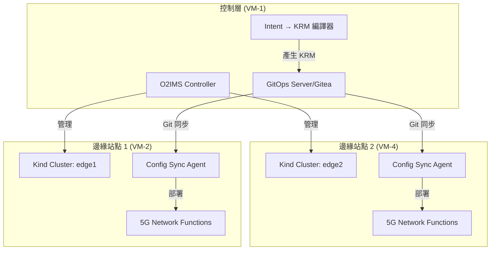

# 📡 VM-4 (Edge2) 實際配置說明

## 🎯 VM-4 的角色定位

VM-4 是**第二個邊緣站點 (Edge2)**，它的主要功能是：

### 1. **Edge Cloud 站點**
- 運行 Kind Kubernetes 叢集 (edge2)
- 作為 5G 網路功能的部署目標
- 接收來自 VM-1 的 GitOps 配置

### 2. **沒有 O2IMS Controller**
- VM-4 **不是** O2IMS 控制器
- O2IMS 實際上在 **VM-1** 的 Kubernetes 叢集中運行
- VM-4 是被 O2IMS **管理**的邊緣站點

## 🏗️ VM-4 實際安裝的元件

根據部署文件，VM-4 上有以下元件：

### ✅ 已安裝的服務

1. **Docker** (v27.5.1)
   - 用於運行 Kind 叢集

2. **Kind Cluster: edge2**
   - Kubernetes v1.27.3
   - API Server: `https://172.16.0.89:6443`
   - 單節點叢集 (control-plane)

3. **Config Sync Operator** (v1.17.0)
   - 從 GitOps 儲存庫同步配置
   - 監聽 `edge2-config` 儲存庫的 `/edge2` 目錄

4. **GitOps Agent 元件**
   ```
   - reconciler-manager
   - root-reconciler-edge2-rootsync
   - otel-collector (觀測性)
   - resource-group-controller-manager
   ```

### ❌ VM-4 沒有的東西

1. **沒有 O2IMS Controller**
2. **沒有 LLM 服務**
3. **沒有 Intent 處理器**
4. **沒有 Gitea 服務**
5. **沒有主要的編排邏輯**

## 🔄 VM-4 在整體架構中的運作方式



## 📋 VM-4 的具體功能

### 1. **接收 GitOps 配置**
```yaml
# VM-4 的 RootSync 配置
apiVersion: configsync.gke.io/v1beta1
kind: RootSync
metadata:
  name: edge2-rootsync
  namespace: config-management-system
spec:
  sourceFormat: unstructured
  git:
    repo: http://172.16.0.78:8888/admin1/edge2-config
    branch: main
    dir: "/edge2"  # 只同步這個子目錄
    auth: token
    secretRef:
      name: git-creds
```

### 2. **部署 5G 網路功能**
當 GitOps 推送配置時，VM-4 會自動部署：
- O-RAN DU (Distributed Unit)
- O-RAN CU (Central Unit)
- 5G Core 網路功能的邊緣部分
- 網路切片配置

### 3. **回報狀態給控制層**
- Config Sync 會回報同步狀態
- Kubernetes metrics 可被 VM-1 的監控系統收集
- SLO 指標由 VM-1 的 postcheck 腳本檢查

## 🌐 VM-4 的網路連線需求

### 需要連到的服務：
1. **VM-1 Gitea** (172.16.0.78:8888)
   - 用於 GitOps 配置同步

2. **VM-1 Kubernetes API** (可選)
   - 如果需要集中式監控

### 提供的服務：
1. **Kubernetes API** (172.16.0.89:6443)
   - 供 VM-1 的 O2IMS 或監控系統查詢

## 🎯 為什麼 VM-4 不需要 O2IMS？

### O2IMS 的架構設計
O2IMS (O-RAN O2 Interface Management Services) 是**集中式管理服務**：

1. **單一控制點**
   - O2IMS Controller 只需要在 SMO (VM-1) 運行
   - 它管理所有的邊緣站點

2. **標準 O-RAN 架構**
   ```
   SMO (Service Management & Orchestration)
    └── O2IMS Controller
         ├── 管理 Edge1 (VM-2)
         └── 管理 Edge2 (VM-4)
   ```

3. **邊緣站點角色**
   - 邊緣站點只需要 Kubernetes + Config Sync
   - 透過標準 Kubernetes API 被管理
   - 不需要自己的 O2IMS 實例

## 📊 VM-4 vs 其他 VM 的功能對比

| 功能 | VM-1 | VM-2 | VM-3 | VM-4 |
|------|------|------|------|------|
| 角色 | SMO/編排器 | Edge1 | LLM 服務 | Edge2 |
| Kubernetes | ✅ Master | ✅ Kind | ❌ | ✅ Kind |
| O2IMS Controller | ✅ | ❌ | ❌ | ❌ |
| Config Sync | ✅ | ✅ | ❌ | ✅ |
| GitOps Server | ✅ Gitea | ❌ | ❌ | ❌ |
| LLM Service | ❌ | ❌ | ✅ | ❌ |
| Intent Compiler | ✅ | ❌ | ❌ | ❌ |
| 5G NF 部署目標 | ❌ | ✅ | ❌ | ✅ |

## 🚀 VM-4 的使用場景

### 1. 多站點部署
```bash
# 當 target=both 時，VM-1 會：
1. 產生兩份 KRM 配置
2. 推送到 edge1-config 和 edge2-config
3. VM-2 和 VM-4 同時接收並部署
```

### 2. 站點特定配置
```yaml
# VM-4 會收到專屬的配置
apiVersion: ran.openairinterface.org/v1alpha1
kind: GNBDUFunction
metadata:
  name: gnb-du-edge2
spec:
  plmnId: "00102"  # Edge2 專用 PLMN
  tac: 2            # Edge2 專用 TAC
  cellId: 2
```

### 3. 負載平衡與故障轉移
- 當 Edge1 (VM-2) 故障時
- 流量可以轉移到 Edge2 (VM-4)
- 由 VM-1 的編排邏輯控制

## 📝 總結

**VM-4 (Edge2) 是一個純粹的邊緣執行環境**：
- ✅ 運行 Kubernetes 叢集
- ✅ 接收 GitOps 配置
- ✅ 部署 5G 網路功能
- ❌ 不運行 O2IMS（由 VM-1 集中管理）
- ❌ 不處理 Intent（由 VM-1 處理）
- ❌ 不生成配置（由 VM-1 生成）

這符合標準的 O-RAN 架構，其中 SMO (VM-1) 集中管理多個 O-Cloud 邊緣站點 (VM-2, VM-4)。