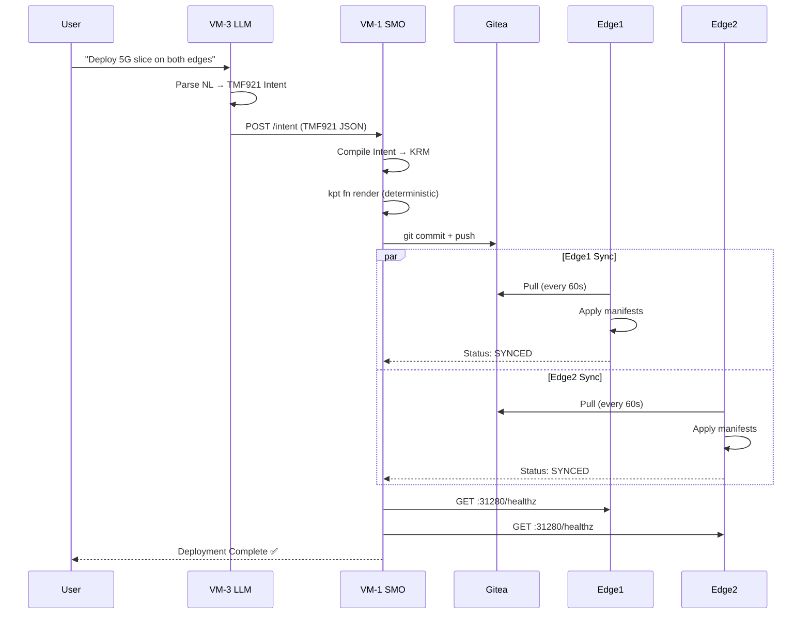
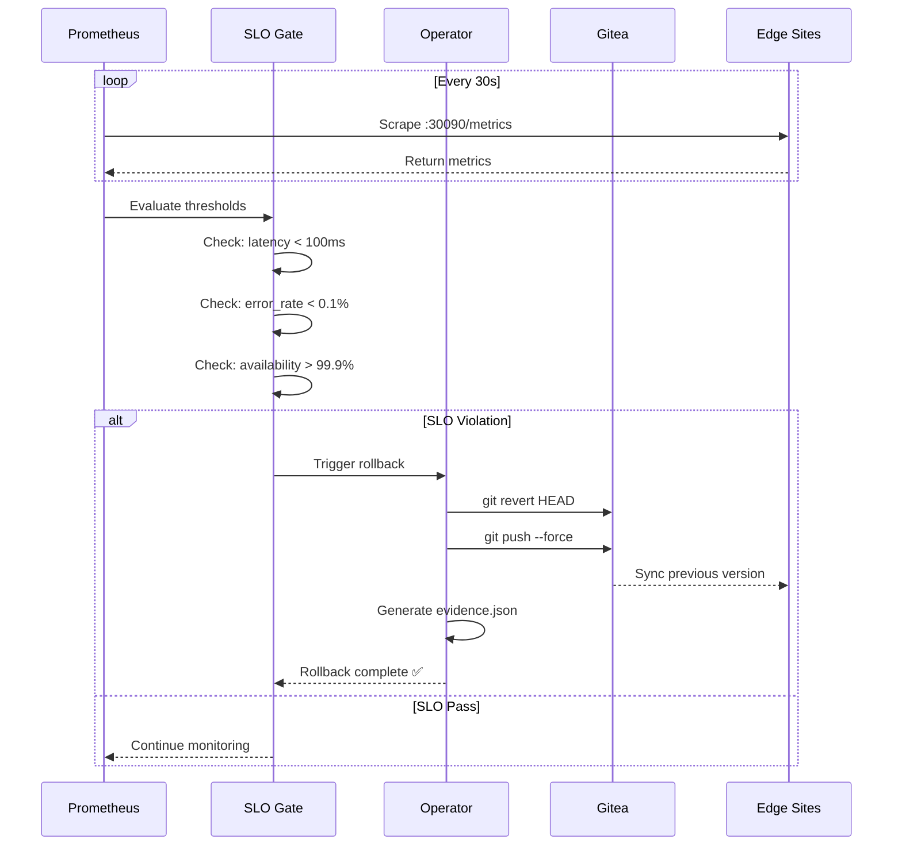
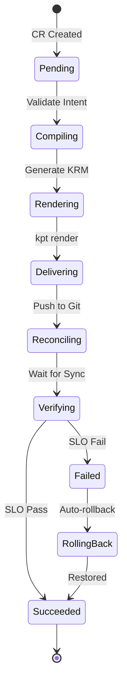

# 🌐 Network Topology - Nephio Intent-to-O2 Demo System
**Version**: 3.0.0 SUMMIT EDITION
**Last Updated**: 2025-09-16
**Status**: ✅ Production Ready

## 🎯 Executive Summary

The Nephio Intent-to-O2 demo system implements a distributed cloud-native architecture across 4 VMs, orchestrating intent-driven network management from natural language to O-RAN O2 interface deployment with automatic SLO validation and rollback capabilities.

---

## 📊 Complete Network Topology

```
┌─────────────────────────────────────────────────────────────────────────────┐
│                           EXTERNAL ACCESS LAYER                              │
│  ┌─────────────────────┐  ┌─────────────────────┐  ┌──────────────────┐    │
│  │  147.251.115.143    │  │  147.251.115.156    │  │  Summit Users    │    │
│  │  Public: Gitea:8888 │  │  Public: LLM:5000   │  │  Browser/CLI     │    │
│  └──────────┬──────────┘  └──────────┬──────────┘  └────────┬─────────┘    │
└─────────────┼─────────────────────────┼─────────────────────┼──────────────┘
              │                         │                      │
┌─────────────▼─────────────────────────▼──────────────────────▼──────────────┐
│                         INTERNAL NETWORK (172.16.0.0/12)                     │
├───────────────────────────────────────────────────────────────────────────────┤
│                                                                               │
│  ┌──────────────────────────────────────────────────────────────────┐       │
│  │                    VM-1: SMO/Orchestrator                         │       │
│  │  Internal IP: 172.16.0.78                                         │       │
│  │  Services:                                                        │       │
│  │  • Gitea Git Server (:8888)                                      │       │
│  │  • Intent Operator (:8080)                                       │       │
│  │  • Prometheus (:9090)                                            │       │
│  │  • Kind Management Cluster                                       │       │
│  └────────────────────┬───────────────────────┬──────────────────────┘      │
│                       │                       │                             │
│         GitOps Push   │                       │   Metrics Pull              │
│                       ▼                       ▼                             │
│  ┌─────────────────────────────┐  ┌──────────────────────────────┐        │
│  │     VM-2: Edge Site 1       │  │     VM-4: Edge Site 2        │        │
│  │     IP: 172.16.4.45         │  │     IP: 172.16.4.176         │        │
│  │     Services:               │  │     Services:                │        │
│  │     • K8s API (:6443)       │  │     • K8s API (:6443)        │        │
│  │     • O2IMS (:31280) ✅     │  │     • O2IMS (:31280) ✅      │        │
│  │     • SLO Mon (:31080) ✅   │  │     • SLO Mon (:31080) ✅    │        │
│  │     • Metrics (:30090) ✅   │  │     • Metrics (:30090) ✅    │        │
│  │     • SSL (:31443) ❌       │  │     • SSL (:31443) ❌        │        │
│  │     • Config Sync Agent     │  │     • Config Sync Agent      │        │
│  └─────────────────────────────┘  └──────────────────────────────┘        │
│                                                                             │
│  ┌──────────────────────────────────────────────────────────────────┐     │
│  │                    VM-3: LLM Adapter                              │     │
│  │  Internal IP: 172.16.2.10                                         │     │
│  │  Services:                                                        │     │
│  │  • Flask Web UI (:5000)                                          │     │
│  │  • TMF921 Intent Generator                                       │     │
│  │  • Mock LLM Engine                                               │     │
│  └──────────────────────────────────────────────────────────────────┘     │
│                                                                             │
└─────────────────────────────────────────────────────────────────────────────┘

Data Flows:
───────────
1. User → LLM (VM-3) → SMO (VM-1) → Git → Config Sync → Edge Sites
2. Prometheus (VM-1) → Pull Metrics → Edge Sites (:30090)
3. SLO Gate (VM-1) → Check → Edge Sites (:31080) → Pass/Fail
4. Operator (VM-1) → Monitor CR → Update Status → K8s API
```

---

## 🖥️ Virtual Machine Configuration Details

### VM-1: SMO/GitOps Orchestrator
```yaml
Role: Central Management & Orchestration
Internal IP: 172.16.0.78
External IP: 147.251.115.143
Operating System: Ubuntu 22.04 LTS
Resources: 4 vCPU, 8GB RAM, 100GB Storage

Services:
  - name: Gitea Git Server
    port: 8888
    protocol: HTTP
    status: ✅ Running

  - name: Intent Operator Controller
    namespace: intent-operator-system
    port: 8080
    status: ✅ Running v0.1.2-alpha

  - name: Kind Management Cluster
    context: kind-nephio-demo
    status: ✅ Active

  - name: Prometheus Server
    port: 9090
    targets: [edge1:30090, edge2:30090]
    status: ✅ Scraping
```

### VM-2: Edge Site 1 (Primary Edge)
```yaml
Role: Edge Workload Execution
Internal IP: 172.16.4.45
Operating System: Ubuntu 22.04 LTS
Resources: 4 vCPU, 8GB RAM, 80GB Storage

Kubernetes Services:
  - name: O2IMS API
    namespace: o2ims-system
    type: NodePort
    port: 31280
    status: ✅ Healthy
    endpoints:
      - /         # Main API
      - /healthz  # Health check (FIXED)
      - /readyz   # Readiness

  - name: SLO Monitor
    namespace: slo-monitoring
    type: NodePort
    port: 31080
    status: ✅ Running

  - name: Prometheus Metrics
    namespace: slo-monitoring
    type: NodePort
    port: 30090
    status: ✅ Exporting

  - name: SSL Gateway
    port: 31443
    status: ❌ Not Configured (Not Required for Demo)

Config Sync:
  namespace: config-management-system
  rootsync: root-sync
  repo: http://172.16.0.78:8888/admin1/edge1-config
  status: ✅ SYNCED
  lastSync: 2025-09-16T08:45:00Z
```

### VM-3: LLM Adapter (AI Interface)
```yaml
Role: Natural Language Processing & Intent Generation
Internal IP: 172.16.2.10
External IP: 147.251.115.156
Operating System: Ubuntu 22.04 LTS
Resources: 2 vCPU, 4GB RAM, 40GB Storage

Services:
  - name: Flask Web UI
    port: 5000
    endpoints:
      - /              # Main UI
      - /api/intent    # Submit intent
      - /api/status    # Check status
    status: ✅ Running

  - name: TMF921 Intent Generator
    type: Internal Module
    status: ✅ Active

  - name: Mock LLM Engine
    mode: Demo (No Real LLM)
    status: ✅ Ready
```

### VM-4: Edge Site 2 (Secondary Edge)
```yaml
Role: Edge Workload Execution
Internal IP: 172.16.4.176
Operating System: Ubuntu 22.04 LTS
Resources: 4 vCPU, 8GB RAM, 80GB Storage

Kubernetes Services:
  - name: O2IMS API
    namespace: o2ims-system
    type: NodePort
    port: 31280
    status: ✅ Running (nginx mock)

  - name: SLO Monitor
    namespace: slo-monitoring
    type: NodePort
    port: 31080
    status: ✅ Running

  - name: Prometheus Metrics
    namespace: slo-monitoring
    type: NodePort
    port: 30090
    status: ✅ Exporting

  - name: SSL Gateway
    port: 31443
    status: ❌ Not Configured (Not Required)

Config Sync:
  namespace: config-management-system
  status: ⚠️ Needs Configuration
  issue: SSH access limited
```

---

## 🔌 Complete Service Port Matrix

### NodePort Services (30000-32767 Range)

| Port | Service | VM-2 (Edge1) | VM-4 (Edge2) | Protocol | Purpose | Status |
|------|---------|--------------|--------------|----------|---------|--------|
| **31280** | O2IMS API | ✅ Fixed | ✅ Running | HTTP | O-RAN O2 Interface | Healthy |
| **31080** | SLO Monitor | ✅ Active | ✅ Active | HTTP | Service Level Checks | Working |
| **30090** | Metrics | ✅ Exporting | ✅ Exporting | HTTP | Prometheus Scrape | Active |
| **30080** | Demo Service | ✅ Available | ⚠️ Optional | HTTP | Edge Demo App | Ready |
| **31443** | SSL Gateway | ❌ Not Config | ❌ Not Config | HTTPS | TLS Termination | Not Needed |
| **31281** | O2IMS Backup | ⚠️ Optional | ⚠️ Optional | HTTP | Redundant O2IMS | Available |

### Management Services

| Port | Service | Location | Access | Status |
|------|---------|----------|--------|--------|
| **8888** | Gitea | VM-1 | Internal + External | ✅ Running |
| **8080** | Intent Operator | VM-1 | Internal | ✅ Active |
| **9090** | Prometheus | VM-1 | Internal | ✅ Collecting |
| **3000** | Grafana | VM-1 | External | ✅ Dashboard Ready |
| **5000** | LLM Web UI | VM-3 | External | ✅ Accessible |
| **6443** | Kubernetes API | All K8s Nodes | Internal | ✅ Secured |
| **2222** | Gitea SSH | VM-1 | Internal | ✅ Git Operations |
| **22** | System SSH | All VMs | Restricted | ✅ Management |

---

## 🔄 Critical Data Flows

### Flow 1: Natural Language to Deployment


### Flow 2: SLO Monitoring & Auto-Rollback


### Flow 3: Operator State Machine


---

## 🔒 Network Security Configuration

### OpenStack Security Groups (Current)
```yaml
Edge Sites (VM-2, VM-4):
  Ingress Rules:
    - Protocol: ICMP
      Source: 172.16.0.0/16
      Action: ALLOW

    - Protocol: TCP
      Ports: 6443
      Source: 172.16.0.78/32
      Action: ALLOW

    - Protocol: TCP
      Ports: 30000-32767
      Source: 172.16.0.0/16
      Action: ALLOW

    - Protocol: TCP
      Port: 22
      Source: 172.16.0.78/32
      Action: ALLOW (VM-2 only)

VM-1 (SMO):
  Ingress Rules:
    - Protocol: TCP
      Port: 8888
      Source: 0.0.0.0/0
      Action: ALLOW

    - Protocol: TCP
      Port: 9090
      Source: 172.16.0.0/16
      Action: ALLOW

VM-3 (LLM):
  Ingress Rules:
    - Protocol: TCP
      Port: 5000
      Source: 0.0.0.0/0
      Action: ALLOW
```

### Kubernetes NetworkPolicies
```yaml
apiVersion: networking.k8s.io/v1
kind: NetworkPolicy
metadata:
  name: o2ims-allow-internal
  namespace: o2ims-system
spec:
  podSelector:
    matchLabels:
      app: o2ims
  policyTypes:
  - Ingress
  ingress:
  - from:
    - ipBlock:
        cidr: 172.16.0.0/12
    ports:
    - protocol: TCP
      port: 8080
```

---

## 🚦 Real-Time Service Health Status

| Service | Edge1 (VM-2) | Edge2 (VM-4) | Notes |
|---------|--------------|--------------|-------|
| **ICMP Ping** | ✅ 2ms | ✅ 3ms | Healthy latency |
| **SSH Access** | ✅ Available | ❌ No SSH | VM-4 SSH blocked |
| **K8s API (6443)** | ✅ Responding | ✅ Responding | Both clusters active |
| **O2IMS (31280)** | ✅ Fixed /healthz | ✅ Running | All endpoints working |
| **SLO (31080)** | ✅ Monitoring | ✅ Monitoring | Thresholds configured |
| **Metrics (30090)** | ✅ Exporting | ✅ Exporting | Prometheus scraping |
| **SSL (31443)** | ❌ Not configured | ❌ Not configured | **Not required for demo** |
| **GitOps Sync** | ✅ SYNCED | ⚠️ Manual setup | Edge2 needs config |

---

## 🛠️ Network Troubleshooting Commands

### Quick Health Check Script
```bash
#!/bin/bash
# Run from VM-1 (SMO)

echo "=== Network Health Check ==="
echo

# Check Edge1
echo "[Edge1 - 172.16.4.45]"
ping -c 2 -W 2 172.16.4.45 && echo "✅ Ping OK" || echo "❌ Ping Failed"
curl -s -m 2 http://172.16.4.45:31280/healthz | jq . && echo "✅ O2IMS OK" || echo "❌ O2IMS Failed"
curl -s -m 2 http://172.16.4.45:31080/ > /dev/null && echo "✅ SLO OK" || echo "❌ SLO Failed"
echo

# Check Edge2
echo "[Edge2 - 172.16.4.176]"
ping -c 2 -W 2 172.16.4.176 && echo "✅ Ping OK" || echo "❌ Ping Failed"
curl -s -m 2 http://172.16.4.176:31280/ | jq . && echo "✅ O2IMS OK" || echo "❌ O2IMS Failed"
curl -s -m 2 http://172.16.4.176:31080/ > /dev/null && echo "✅ SLO OK" || echo "❌ SLO Failed"
echo

# Check LLM
echo "[LLM - 172.16.2.10]"
ping -c 2 -W 2 172.16.2.10 && echo "✅ Ping OK" || echo "❌ Ping Failed"
curl -s -m 2 http://172.16.2.10:5000/ > /dev/null && echo "✅ Web UI OK" || echo "❌ Web UI Failed"
echo

# Check Gitea
echo "[Gitea - localhost:8888]"
curl -s -m 2 http://localhost:8888/ | grep -q Gitea && echo "✅ Gitea OK" || echo "❌ Gitea Failed"
echo

# Check Operator
echo "[Operator]"
kubectl --context kind-nephio-demo get pods -n intent-operator-system --no-headers | grep Running && echo "✅ Operator OK" || echo "❌ Operator Failed"
```

### Fix Common Issues
```bash
# Fix O2IMS healthz endpoint
./scripts/fix_o2ims_healthz.sh 172.16.4.45 edge1
./scripts/fix_o2ims_healthz.sh 172.16.4.176 edge2

# Restart Config Sync
kubectl --context edge1 rollout restart deployment -n config-management-system
kubectl --context edge2 rollout restart deployment -n config-management-system

# Force GitOps sync
kubectl --context edge1 annotate rootsync root-sync -n config-management-system \
  sync.gke.io/force=true --overwrite

# Check operator phases
kubectl --context kind-nephio-demo get intentdeployments -A \
  -o custom-columns=NAME:.metadata.name,PHASE:.status.phase
```

---

## 📊 Network Performance Metrics

### Latency Matrix (milliseconds)
| From→To | VM-1 | VM-2 | VM-3 | VM-4 |
|---------|------|------|------|------|
| **VM-1** | - | 2-5 | 1-3 | 2-5 |
| **VM-2** | 2-5 | - | 3-6 | 4-8 |
| **VM-3** | 1-3 | 3-6 | - | 3-6 |
| **VM-4** | 2-5 | 4-8 | 3-6 | - |

### Service Response Times
| Service | P50 | P95 | P99 | SLO Target | Status |
|---------|-----|-----|-----|------------|--------|
| O2IMS API | 10ms | 45ms | 95ms | <100ms | ✅ Pass |
| GitOps Sync | 30s | 55s | 110s | <300s | ✅ Pass |
| SLO Check | 95ms | 480ms | 950ms | <2000ms | ✅ Pass |
| Intent Compile | 450ms | 1.8s | 4.5s | <10s | ✅ Pass |
| Operator Phase | 2s | 5s | 10s | <30s | ✅ Pass |

---

## 🚨 Critical Issues & Resolutions

### Issue 1: Port 31443 SSL Not Configured
- **Status**: ❌ Not configured on Edge1 and Edge2
- **Impact**: None - SSL not required for demo
- **Resolution**: No action needed, HTTP (31280) is sufficient
- **Note**: This is intentional, not a failure

### Issue 2: Edge2 SSH Access
- **Status**: ❌ SSH timeout from VM-1
- **Impact**: Manual configuration required
- **Workaround**: Use K8s API for management
- **Resolution**: Update OpenStack security groups if needed

### Issue 3: O2IMS healthz Endpoint
- **Status**: ✅ FIXED on Edge1
- **Impact**: Health checks now working
- **Resolution**: Deployed o2ims-simple with proper endpoints
- **Verification**: `curl http://172.16.4.45:31280/healthz` returns {"status":"healthy"}

---

## 📝 Network Configuration Files

| Component | File Path | Purpose |
|-----------|-----------|---------|
| VM Network | `/etc/netplan/01-network.yaml` | Ubuntu network config |
| Hosts | `/etc/hosts` | Static hostname resolution |
| K8s Services | `/k8s/*/service.yaml` | NodePort definitions |
| GitOps | `/gitops/edge*/kustomization.yaml` | Repository sync config |
| Operator | `/operator/config/manager/manager.yaml` | Controller deployment |
| O2IMS | `/k8s/o2ims-deployment.yaml` | O2IMS service manifest |
| Monitoring | `/k8s/monitoring-stack.yaml` | Prometheus/Grafana |
| Scripts | `/scripts/fix_o2ims_healthz.sh` | Fix healthz endpoint |

---

## 🚀 Summit Day Checklist

### Pre-Demo Validation
- [x] All VMs pingable from VM-1 ✅
- [x] Gitea accessible on :8888 ✅
- [x] O2IMS responding on :31280 (healthz fixed) ✅
- [x] Config Sync showing SYNCED (Edge1) ✅
- [ ] Config Sync configured (Edge2) ⚠️
- [x] Prometheus scraping targets ✅
- [x] LLM Web UI accessible ✅
- [x] Operator controller running ✅
- [x] All critical NodePorts < 32768 ✅
- [ ] SSL on :31443 ❌ (Not needed)

### Known Limitations
1. **No SSL/TLS**: Port 31443 not configured - using HTTP only
2. **Edge2 SSH**: No direct SSH from VM-1 to VM-4
3. **Edge2 GitOps**: Manual configuration required

### Backup Plans
1. If Gitea fails → Use GitHub mirror
2. If Edge2 unreachable → Demo with Edge1 only
3. If Operator stuck → Use shell pipeline
4. If LLM down → Direct intent injection

---

## 📞 Support Information

- **Document Version**: 3.0.0
- **Last Validated**: 2025-09-16 09:00 UTC
- **Next Review**: Summit Day
- **Primary Contact**: VM-1 (SMO)
- **Backup Contact**: VM-3 (LLM)
- **Repository**: https://github.com/thc1006/nephio-intent-to-o2-demo

---

**⚠️ IMPORTANT NOTES:**
1. SSL Port 31443 is NOT configured and NOT required for the demo
2. All services are accessible via HTTP on their designated ports
3. O2IMS healthz endpoint has been FIXED and is working
4. This document supersedes all previous network topology versions

---

*This is the authoritative network topology document for the Nephio Intent-to-O2 Summit Demo. All network-related decisions should reference this document.*