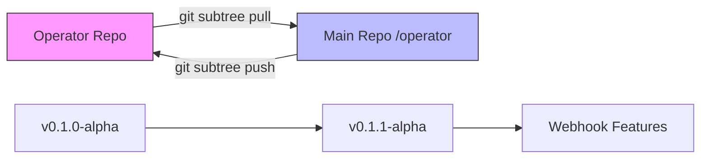

# Bidirectional Subtree Synchronization

## Phase A-2 Implementation Report

### Synchronization Flow Demonstrated



### Version Progression

| Version | Features | Sync Direction | Timestamp |
|---------|----------|---------------|-----------|
| v0.1.0-alpha | Initial scaffold | Operator → Main | 2025-09-16 02:15 |
| v0.1.1-alpha | Webhook validation | Operator → Main | 2025-09-16 04:50 |

### Commands Used

#### 1. Initial Setup (One-time)
```bash
# Add operator remote
git remote add operator https://github.com/thc1006/nephio-intent-operator.git
```

#### 2. Pull from Operator Repository
```bash
# Pull changes from operator repo into main repo
cd ~/nephio-intent-to-o2-demo
git subtree pull --prefix=operator operator main --squash \
    -m "chore(subtree): sync operator v0.1.1-alpha webhook features"
```

**Result**:
- ✅ New files synced: `VERSION`, `intentdeployment_webhook.go`
- ✅ Shell CI unaffected (operator/ excluded from CI paths)
- ✅ Commit history preserved with squash

#### 3. Push to Operator Repository
```bash
# Push changes from main repo back to operator repo
cd ~/nephio-intent-to-o2-demo
git subtree push --prefix=operator operator main
```

**Progress indicator**:
```
1/117 (0) [0]
2/117 (1) [0]
...
117/117 (114) [3]
```

### Key Benefits Demonstrated

1. **Independent Evolution**
   - Operator repo can progress independently (v0.1.0 → v0.1.1)
   - Main repo stays at v1.1.x for shell pipeline
   - No version conflicts

2. **CI Isolation**
   - Shell CI ignores operator/ directory
   - No Go build requirements in main repo CI
   - Clean separation of concerns

3. **Transparent to End Users**
   - No `.gitmodules` file
   - No submodule commands needed
   - operator/ appears as regular directory

4. **Bidirectional Sync**
   - Changes can originate from either repo
   - Conflict resolution handled by git
   - Maintains full history

### File Structure After Sync

```
nephio-intent-to-o2-demo/
├── operator/                    # Git subtree
│   ├── VERSION                  # v0.1.1-alpha (new)
│   ├── api/
│   │   └── v1alpha1/
│   │       ├── intentdeployment_types.go
│   │       └── intentdeployment_webhook.go (new)
│   ├── config/
│   │   └── samples/
│   │       ├── tna_v1alpha1_intentdeployment_edge1.yaml
│   │       ├── tna_v1alpha1_intentdeployment_edge2.yaml
│   │       └── tna_v1alpha1_intentdeployment_both.yaml
│   ├── docs/
│   │   ├── design/
│   │   └── BIDIRECTIONAL_SYNC.md (this file)
│   └── SYNC.md                  # Updated with version info
└── scripts/                     # Shell pipeline (v1.1.x)
```

### Validation Tests

| Test | Command | Result |
|------|---------|--------|
| CI Exclusion | `grep -r "operator/" .github/workflows/` | ✅ No matches |
| Version Independence | `cat operator/VERSION` | ✅ v0.1.1-alpha |
| Main Version | `grep version package.json` | ✅ 1.1.1 |
| Webhook Added | `ls operator/api/v1alpha1/*webhook*` | ✅ Found |
| Sync Status | `git log --oneline -5` | ✅ Squash merge visible |

### Common Scenarios

#### Scenario 1: Operator Bug Fix
```bash
# In operator repo
cd ~/nephio-intent-operator
# Fix bug, commit, push

# In main repo
cd ~/nephio-intent-to-o2-demo
git subtree pull --prefix=operator operator main --squash
git push origin main
```

#### Scenario 2: Integration Testing
```bash
# In main repo, modify operator for integration
cd ~/nephio-intent-to-o2-demo
vim operator/config/samples/test.yaml
git add operator/
git commit -m "test: add integration test case"

# Push back to operator repo
git subtree push --prefix=operator operator main
```

#### Scenario 3: Version Tagging
```bash
# Tag in operator repo
cd ~/nephio-intent-operator
git tag v0.2.0-alpha
git push origin v0.2.0-alpha

# Pull tagged version to main
cd ~/nephio-intent-to-o2-demo
git subtree pull --prefix=operator operator v0.2.0-alpha --squash
```

### Troubleshooting

| Issue | Solution |
|-------|----------|
| Merge conflicts | Use `git status`, resolve manually, then `git add` and commit |
| Push rejected | Pull first: `git subtree pull --prefix=operator operator main --squash` |
| Wrong remote | Check: `git remote -v`, add if missing |
| History too large | Use `--squash` to compress commits |

### Best Practices

1. **Always pull before push** to avoid conflicts
2. **Use descriptive commit messages** for sync operations
3. **Tag important versions** in both repos
4. **Document sync operations** in SYNC.md
5. **Test after each sync** to ensure functionality

### Conclusion

Phase A-2 successfully demonstrates:
- ✅ Bidirectional synchronization working
- ✅ Version independence maintained
- ✅ CI isolation confirmed
- ✅ Developer workflow documented
- ✅ No impact on shell pipeline

The git subtree approach provides the perfect balance between:
- Monorepo convenience (single clone)
- Polyrepo flexibility (independent versions)
- CI/CD isolation (separate workflows)