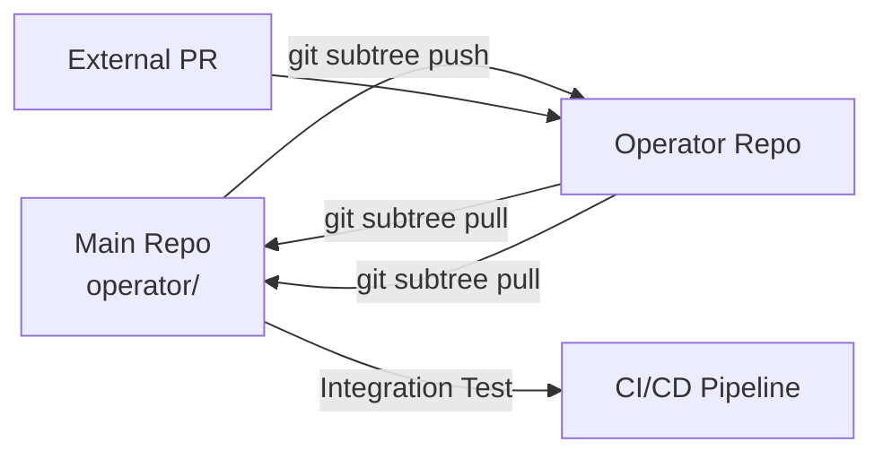

# Repository Structure Design

## Overview

The Nephio Intent Operator follows a dual-repository strategy with git subtree synchronization, enabling both standalone and embedded development workflows.

## Repository Architecture

```
┌─────────────────────────────────────────┐
│   nephio-intent-to-o2-demo (Main Repo)   │
│                                           │
│  ┌──────────────────────────────┐        │
│  │  /operator (git subtree)      │        │
│  │  - Embedded operator code     │◄───────┼─── Synchronization via
│  │  - Integrated with pipeline   │        │    git subtree pull/push
│  └──────────────────────────────┘        │
│                                           │
│  Shell Pipeline (v1.1.x)                  │
│  - scripts/                               │
│  - tools/                                 │
│  - orchestration/                         │
└─────────────────────────────────────────┘
                    ▲
                    │
              Git Subtree
                    │
                    ▼
┌─────────────────────────────────────────┐
│  nephio-intent-operator (Operator Repo)  │
│                                           │
│  Standalone Operator (v0.1.0-alpha)       │
│  - api/                                   │
│  - controllers/                           │
│  - config/                                │
│  - hack/                                  │
│  - CONTRIBUTING.md                        │
│  - CODEOWNERS                             │
└─────────────────────────────────────────┘
```

## Directory Layout

### Operator Repository (Standalone)

```
nephio-intent-operator/
├── .github/
│   └── workflows/          # CI/CD for operator
├── api/
│   └── v1alpha1/
│       ├── intentconfig_types.go
│       ├── groupversion_info.go
│       └── zz_generated.deepcopy.go
├── config/
│   ├── crd/               # CustomResourceDefinitions
│   ├── default/           # Kustomize defaults
│   ├── manager/           # Controller manager configs
│   ├── prometheus/        # Metrics and monitoring
│   ├── rbac/              # RBAC manifests
│   └── samples/           # Sample CRs
├── controllers/
│   ├── intentconfig_controller.go
│   ├── suite_test.go
│   └── reconciler/
│       ├── intent_translator.go
│       ├── network_slice_manager.go
│       └── sla_monitor.go
├── docs/
│   ├── api-reference.md
│   ├── design/
│   │   ├── repo-structure.md    # This document
│   │   ├── intent-model.md
│   │   └── reconciliation-flow.md
│   └── user-guide.md
├── hack/
│   ├── boilerplate.go.txt
│   ├── setup-envtest.sh
│   └── tools.go
├── test/
│   ├── e2e/
│   └── integration/
├── .gitignore
├── CODEOWNERS             # Operator maintainers
├── CONTRIBUTING.md        # Contribution guidelines
├── Dockerfile
├── go.mod
├── go.sum
├── LICENSE
├── Makefile
├── PROJECT               # Kubebuilder metadata
├── README.md
└── SYNC.md               # Subtree sync instructions
```

### Main Repository (Embedded Mode)

```
nephio-intent-to-o2-demo/
├── operator/             # Git subtree of operator repo
│   ├── api/
│   ├── controllers/
│   ├── config/
│   ├── docs/
│   ├── hack/
│   ├── README.md        # Embedded mode notes
│   └── SYNC.md          # Sync instructions
├── scripts/              # Shell pipeline (untouched)
├── tools/               # Pipeline tools (untouched)
├── orchestration/       # Orchestration logic
├── gitops/              # GitOps configurations
└── README.md            # Main repo documentation
```

## Version Strategy

### Independent Versioning

| Component | Version Schema | Current | Next Release |
|-----------|---------------|---------|--------------|
| Shell Pipeline | `v1.1.x` | `v1.1.1` | `v1.1.2` |
| Operator | `v0.x.y-alpha/beta/rc` | `v0.1.0-alpha` | `v0.2.0-alpha` |
| API Version | `v1alpha1/v1beta1/v1` | `v1alpha1` | `v1alpha1` |

### Git Tags

```bash
# Main repository tags
v1.1.0                    # Full demo release
v1.1.1                    # Patch release
pre-operator-subtree-*    # Backup points

# Operator repository tags
v0.1.0-alpha             # Operator alpha release
v0.2.0-beta              # Operator beta release
v1.0.0                   # Operator GA release
```

## Development Workflows

### Operator Development (Standalone)

```bash
# Clone operator repository
git clone https://github.com/thc1006/nephio-intent-operator.git
cd nephio-intent-operator

# Development cycle
make generate
make manifests
make test
make build

# Release
git tag -a v0.2.0-alpha -m "Release v0.2.0-alpha"
git push origin v0.2.0-alpha
```

### Integrated Development (Embedded)

```bash
# Work in main repository
cd nephio-intent-to-o2-demo/operator

# Make changes
vim controllers/intentconfig_controller.go

# Commit to main repo
git add .
git commit -m "feat(operator): improve reconciliation"
git push origin main

# Sync to operator repo
git subtree push --prefix=operator operator main
```

### Synchronization Flow



## File Ownership

### Operator Repository Files

Files that **MUST** live in the operator repository:
- `CONTRIBUTING.md` - Operator-specific contribution guidelines
- `CODEOWNERS` - Operator maintainer list
- `.github/workflows/` - Operator CI/CD
- `go.mod` / `go.sum` - Go dependencies
- `PROJECT` - Kubebuilder metadata
- `Makefile` - Build automation

### Main Repository Files

Files that **MUST** live in the main repository:
- Shell scripts (`scripts/`)
- Pipeline tools (`tools/`)
- Integration tests spanning shell + operator
- Demo configurations (`gitops/`)

### Shared Files

Files that exist in both (with different content):
- `README.md` - Different focus for each repo
- `.gitignore` - Different ignore patterns
- `LICENSE` - Same Apache 2.0 license

## CI/CD Integration

### Main Repository CI

```yaml
# .github/workflows/ci.yml
name: Main Pipeline CI
on: [push, pull_request]
jobs:
  shell-pipeline:
    # Tests for scripts/, tools/, orchestration/
    # Unchanged from current setup

  operator-integration:
    # Tests operator/ integration with pipeline
    # Runs operator unit tests
    # Validates CRDs
```

### Operator Repository CI

```yaml
# operator/.github/workflows/ci.yml
name: Operator CI
on: [push, pull_request]
jobs:
  test:
    # Unit tests
    # Integration tests
    # E2E tests

  build:
    # Build operator image
    # Push to registry
```

## Benefits of This Structure

1. **Independent Development**: Operator can be developed, tested, and released independently
2. **Clean Separation**: Clear boundaries between shell pipeline and operator code
3. **Flexible Integration**: Can be used standalone or embedded
4. **Preserved Pipeline**: Shell-first pipeline remains untouched
5. **Version Independence**: Operator and pipeline can evolve at different rates
6. **Community Friendly**: External contributors can work on operator without full demo setup

## Migration Path

For existing deployments:

1. **Phase 1**: Current shell pipeline continues working (v1.1.x)
2. **Phase 2**: Operator deployed alongside, handling specific CRDs (v0.1.0-alpha)
3. **Phase 3**: Gradual migration of logic from shell to operator (v0.x.y)
4. **Phase 4**: Full operator-based deployment (v1.0.0)

## Maintenance Guidelines

1. **Subtree Sync**: Perform weekly sync between repositories
2. **Version Bumps**: Independent version increments
3. **Breaking Changes**: Document in both repositories
4. **Dependencies**: Operator dependencies isolated in go.mod
5. **Testing**: Both unit tests (operator) and integration tests (main)

---

*Document Version: 1.0*
*Last Updated: 2025-09-16*
*Author: @repo-architect*