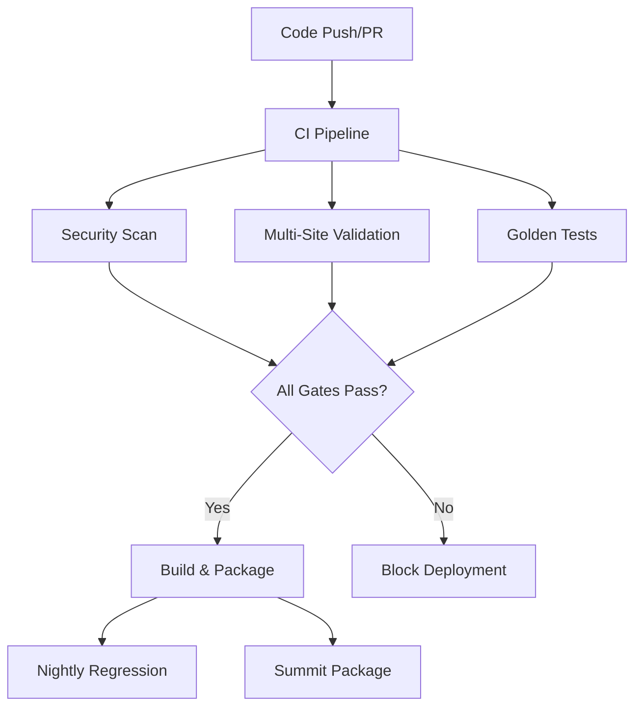

# CI/CD Pipeline Guide

## Overview

The Nephio Intent-to-O2IMS GitOps Orchestrator uses a comprehensive CI/CD pipeline that validates, tests, and packages the complete GitOps orchestrator functionality. The pipeline is designed to ensure reliable delivery of Summit packages with automated quality gates.

## Pipeline Architecture



## Workflow Components

### 1. Main CI Pipeline (`ci.yml`)

**Purpose**: Core continuous integration with comprehensive testing and validation

**Triggers**:
- Push to `main`, `develop`, `summit-llm-e2e` branches
- Pull requests to `main`, `develop`
- Manual dispatch with optional test skipping

**Jobs**:
1. **Setup** - Dependency caching and tool installation
2. **Lint** - Code quality checks (Python, Go, YAML)
3. **Test** - Unit, integration, and contract tests
4. **KRM Validation** - Kubernetes manifest validation
5. **Policy Validation** - Security policy compliance
6. **Build** - Component compilation and packaging
7. **Publish** - Artifact publishing and release preparation

**Key Features**:
- Matrix testing across Python versions
- Comprehensive caching strategy
- Golden test validation (CRITICAL - must pass)
- Multi-language support (Python, Go)
- Automatic artifact generation

### 2. Security Scanning (`security-scan.yml`)

**Purpose**: Comprehensive security analysis and compliance checking

**Triggers**:
- Code changes (push/PR)
- Daily scheduled scans (3 AM UTC)
- Manual dispatch

**Security Checks**:
1. **Dependency Vulnerabilities**
   - Python: `safety` scanner
   - Go: `govulncheck`
   - Automated vulnerability reporting

2. **Static Application Security Testing (SAST)**
   - Python: `bandit` security linter
   - General: `semgrep` rules
   - Secret detection patterns

3. **Container Security**
   - `trivy` vulnerability scanning
   - SARIF integration with GitHub Security

4. **GitOps Security**
   - `kube-score` Kubernetes manifest analysis
   - `kubesec` security policy validation
   - RBAC configuration checks

**Outputs**:
- Security compliance report
- SARIF files for GitHub Security integration
- Vulnerability remediation recommendations

### 3. Multi-Site Validation (`multi-site-validation.yml`)

**Purpose**: Validate GitOps configurations across multiple deployment sites

**Triggers**:
- GitOps configuration changes
- Commit messages containing `[multi-site]`
- Manual dispatch with site selection

**Validation Matrix**:
- **Edge1**: Single-site validation
- **Edge2**: Single-site validation
- **Both**: Multi-site orchestration validation

**Validation Steps**:
1. **GitOps Configuration**
   - YAML syntax validation
   - KRM package rendering
   - Site-specific customization

2. **SLO Threshold Validation**
   - Configuration completeness
   - Threshold value validation
   - Postcheck script syntax

3. **Rollback Procedure Testing**
   - Script validation
   - Dry-run testing
   - Recovery procedure verification

4. **Performance Benchmarking** (comprehensive mode)
   - Intent compilation performance
   - Pipeline integration timing
   - Resource utilization metrics

### 4. Summit Package Generation (`summit-package.yml`)

**Purpose**: Create comprehensive demonstration and deployment packages

**Triggers**:
- Release tags (`v*`)
- Commit messages containing `[summit]`
- Manual dispatch with audience selection

**Package Components**:
1. **Presentation Materials**
   - Technical slides (Markdown, HTML, PDF)
   - Executive presentations
   - Demo scripts and talking points

2. **Documentation**
   - Pocket Q&A guide for presenters
   - Technical implementation guide
   - Integration patterns and examples

3. **Artifacts**
   - Performance KPI dashboards
   - Build artifacts and configurations
   - Test results and validation reports

4. **Package Assembly**
   - Compressed archives (tar.gz, zip)
   - SHA256 checksums
   - GitHub releases integration

### 5. Nightly Regression (`nightly.yml`)

**Purpose**: Continuous performance monitoring and KPI collection

**Schedule**: Daily at 2 AM UTC

**Capabilities**:
- Mock LLM adapter simulation
- Multi-site performance testing
- KPI visualization generation
- HTML report creation
- GitHub Pages publishing

**Metrics Tracked**:
- Sync latency (target: <30ms)
- PR ready time (target: <15s)
- Intent processing time (target: <200ms)
- Success rates (target: >95%)

### 6. Golden Tests (`golden-tests.yml`)

**Purpose**: Validate intent compilation correctness and regression prevention

**Test Types**:
- **Golden**: Expected output validation
- **Contract**: Interface compliance testing
- **Integration**: End-to-end pipeline testing

**Features**:
- Multi-Python version matrix
- Performance benchmarking
- Coverage reporting
- Artifact preservation

## Integration Patterns

### Workflow Orchestration

The CI pipeline automatically triggers related workflows based on conditions:

```yaml
# Automatic security scanning on main branch pushes
trigger-security-scan:
  if: github.ref == 'refs/heads/main' && github.event_name == 'push'

# Multi-site validation on GitOps changes
trigger-multi-site-validation:
  if: contains(github.event.head_commit.message, '[multi-site]')

# Summit package on release tags
trigger-summit-package:
  if: startsWith(github.ref, 'refs/tags/v')
```

### Artifact Flow

```
CI Build → Security Scan ↘
                           ↓
        Multi-Site Val  → Final Package
                           ↓
        Nightly Tests  → Summit Package
```

### Caching Strategy

Intelligent caching reduces build times:

```yaml
cache_key: deps-${{ hashFiles('**/requirements.txt') }}-${{ env.PYTHON_VERSION }}
paths:
  - ~/.cache/pip
  - ~/.cache/go-build
  - ~/go/pkg/mod
  - /usr/local/bin/kpt
```

## Quality Gates

### Mandatory Gates (Block Deployment)

1. **Golden Tests**: Must pass - validates intent compilation correctness
2. **Security Compliance**: No high/critical vulnerabilities
3. **Multi-Site Validation**: All target sites must validate successfully
4. **Policy Compliance**: Kubernetes security policies must pass

### Advisory Gates (Warning Only)

1. **Performance Benchmarks**: May degrade but don't block
2. **Coverage Targets**: Encouraged but not mandatory
3. **Documentation Updates**: Recommended for changes

## Branch Protection

### Main Branch Requirements

- At least 1 approving review
- All status checks must pass
- Branch must be up to date
- No force push allowed

### Required Status Checks

```yaml
required_status_checks:
  - lint
  - test (python matrix)
  - test (go matrix)
  - test (integration matrix)
  - krm-validation
  - security-scan/dependency-check
  - security-scan/sast-scan
```

## Environment Management

### Variables and Secrets

**Environment Variables** (Public):
```yaml
GO_VERSION: '1.22'
PYTHON_VERSION: '3.11'
KPT_VERSION: 'v1.0.0-beta.49'
KUBECONFORM_VERSION: 'v0.6.4'
```

**Secrets** (Protected):
- No secrets should be stored in workflows
- Use GitHub's encrypted secrets for sensitive data
- Implement secret scanning to prevent accidental exposure

### Configuration Management

Site-specific configurations are managed through:
- `config/edge-sites-config.yaml` - Authoritative configuration
- Environment-specific overrides
- Runtime parameter injection

## Troubleshooting

### Common Failures

#### Golden Tests Fail
```bash
# Symptoms: test_golden_validation.py fails
# Solution: Verify expected outputs match actual outputs
cd tests && python3 test_golden_validation.py --verbose
```

#### Security Scan Issues
```bash
# Symptoms: security-scan workflow fails
# Solution: Review dependency vulnerabilities
safety check --file requirements.txt
govulncheck ./...
```

#### Multi-Site Validation Failures
```bash
# Symptoms: KRM rendering fails for specific sites
# Solution: Validate site configuration
cd packages/intent-to-krm && TARGET_SITE=edge1 kpt fn render .
```

#### Performance Degradation
```bash
# Symptoms: Nightly KPIs show degraded performance
# Solution: Review performance dashboard and investigate bottlenecks
```

### Debug Workflows

**Enable Debug Logging**:
```yaml
env:
  ACTIONS_STEP_DEBUG: true
  ACTIONS_RUNNER_DEBUG: true
```

**Artifact Debugging**:
- Download failed workflow artifacts
- Review build logs and error outputs
- Check artifact manifests for completeness

### Recovery Procedures

**Rollback Bad Release**:
1. Revert problematic commits
2. Re-run CI pipeline
3. Verify all gates pass
4. Deploy verified version

**Fix Broken Main Branch**:
1. Create hotfix branch
2. Apply minimal fix
3. Fast-track through CI with urgency flag
4. Merge with admin override if necessary

## Performance Optimization

### Build Time Optimization

1. **Parallel Job Execution**: Matrix strategies for independent tests
2. **Intelligent Caching**: Multi-level dependency caching
3. **Conditional Execution**: Skip unnecessary jobs based on change detection
4. **Tool Caching**: Cache downloaded binaries across runs

### Resource Optimization

1. **Runner Selection**: Use appropriate GitHub runner sizes
2. **Concurrent Limits**: Prevent resource contention
3. **Cleanup Procedures**: Remove temporary artifacts
4. **Storage Management**: Optimize artifact retention policies

## Monitoring and Alerting

### Key Metrics

1. **Pipeline Success Rate**: Target >95%
2. **Build Duration**: Target <15 minutes for full pipeline
3. **Cache Hit Rate**: Target >80%
4. **Security Scan Coverage**: 100% of dependencies

### Alerting Integration

- GitHub status checks for PR blocking
- Slack notifications for critical failures (if configured)
- Email notifications for security vulnerabilities
- Dashboard integration for performance tracking

## Best Practices

### Development Workflow

1. **Local Validation**: Run tests locally before pushing
2. **Incremental Changes**: Make small, focused changes
3. **Clear Commit Messages**: Use conventional commit format
4. **Branch Naming**: Use descriptive branch names

### CI/CD Maintenance

1. **Regular Updates**: Keep tool versions current
2. **Security Monitoring**: Review security scan results weekly
3. **Performance Review**: Analyze nightly KPI trends monthly
4. **Documentation**: Keep this guide updated with changes

### Summit Preparation

1. **Package Testing**: Validate Summit packages before events
2. **Demo Rehearsal**: Test all demo scenarios regularly
3. **Backup Procedures**: Have rollback plans for live demos
4. **Performance Baseline**: Establish performance expectations

## Future Enhancements

### Planned Improvements

1. **Enhanced Security**: Additional SAST tools and policies
2. **Performance Testing**: Load testing integration
3. **Multi-Cloud Support**: Extended deployment targets
4. **AI Integration**: Intelligent failure analysis and suggestions

### Integration Roadmap

1. **Q1 2025**: Enhanced security scanning with custom policies
2. **Q2 2025**: Performance regression detection with ML
3. **Q3 2025**: Multi-cloud deployment validation
4. **Q4 2025**: Automated incident response integration

---

**Contact Information**:
- **CI/CD Issues**: GitHub Issues or Engineering Team
- **Security Concerns**: Security Team
- **Documentation Updates**: Technical Writing Team
- **Performance Questions**: Platform Team