# Deployment Guard: SLO-Gated GitOps with Automated Rollback

**Version:** 1.0.0  
**Status:** Production Ready  
**Author:** Nephio Intent-to-O2 Demo Team  
**Last Updated:** September 7, 2025

## 🎯 Overview

The Deployment Guard system provides automated SLO-based validation and rollback capabilities for the VM-1 to VM-2 observability integration. It ensures that all deployments meet performance thresholds before being considered successful, and automatically reverts problematic changes when SLO violations are detected.

### Key Features

- **Automated SLO Validation**: Real-time performance metrics evaluation
- **Intelligent Rollback**: Multiple rollback strategies (revert/reset)
- **GitOps Integration**: Seamless integration with RootSync reconciliation
- **Observable**: Comprehensive logging and reporting
- **Configurable**: Flexible thresholds and behaviors
- **Security-First**: Following project security guardrails

## 📊 Complete Deployment Guard Flow

```mermaid
flowchart TD
    A["🚀 make publish-edge"] --> B["🔐 Precheck Gate"]
    B --> C{"Precheck\nPassed?"}
    C -->|❌ FAIL| D["🛑 Deployment Blocked"]
    C -->|✅ PASS| E["📦 Publish to Gitea"]
    
    E --> F["⏱️ Wait for RootSync"]
    F --> G{"RootSync\nReconciled?"}
    G -->|❌ TIMEOUT| H["🔔 Timeout Alert"]
    G -->|✅ SUCCESS| I["🔍 Query VM-2 Metrics"]
    
    I --> J{"Metrics\nAccessible?"}
    J -->|❌ FAIL| K["🚨 Connectivity Error"]
    J -->|✅ SUCCESS| L["📈 Evaluate SLOs"]
    
    L --> M{"SLOs\nMet?"}
    M -->|✅ PASS| N["✅ Deployment Success"]
    M -->|❌ FAIL| O["🔄 Trigger Rollback"]
    
    O --> P{"Rollback\nStrategy"}
    P -->|revert| Q["↩️ Git Revert"]
    P -->|reset| R["🏷️ Reset to Tag"]
    
    Q --> S["📤 Push Changes"]
    R --> S
    S --> T["🔔 Send Notifications"]
    T --> U["📊 Generate Report"]
    
    H --> V["❌ Manual Investigation"]
    K --> V
    U --> W["✅ System Restored"]
    
    style A fill:#e1f5fe
    style N fill:#e8f5e8
    style W fill:#e8f5e8
    style D fill:#ffebee
    style V fill:#ffebee
    style O fill:#fff3e0
    style T fill:#f3e5f5
```



## 🏗️ Architecture Components

### 1. Precheck Gate (`scripts/precheck.sh`)

**Purpose**: Supply chain security validation before deployment

**Validations**:
- Change size limits (500 lines, 20 files)
- Container image registry allowlists
- YAML manifest conformance
- kpt package structure
- Image signature verification (optional)

**Exit Codes**:
- `0`: All validations passed
- `1`: General validation failure
- `2`: Change size exceeded
- `3`: Registry allowlist violation
- `4`: Missing required signatures
- `5`: Missing dependencies
- `6`: kpt validation failed

### 2. Postcheck Gate (`scripts/postcheck.sh`)

**Purpose**: SLO validation and automated rollback trigger

**Process Flow**:
1. **Dependency Check**: Verify required tools (kubectl, curl, jq)
2. **RootSync Wait**: Poll for GitOps reconciliation completion
3. **Metrics Query**: Retrieve observability data from VM-2
4. **SLO Evaluation**: Compare metrics against thresholds
5. **Rollback Decision**: Trigger rollback on SLO violations

**Configuration Variables**:
```bash
VM2_IP=172.16.4.45                      # Target VM-2 IP address
VM2_OBSERVABILITY_PORT=30090             # Observability service port
MAX_ROOTSYNC_WAIT_SEC=300                # RootSync timeout in seconds
SLO_LATENCY_P95_MS=15                    # Latency SLO threshold (ms)
SLO_SUCCESS_RATE=0.995                   # Success rate SLO threshold
SLO_THROUGHPUT_P95_MBPS=200              # Throughput SLO threshold (Mbps)
ROLLBACK_ON_FAILURE=true                 # Trigger rollback on violations
```

### 3. Rollback System (`scripts/rollback.sh`)

**Purpose**: Automated recovery from failed deployments

**Strategies**:

#### Revert Strategy (Default)
- **Method**: `git revert` of last publish commit
- **Pros**: Preserves git history, audit trail
- **Cons**: May not work with complex conflicts
- **Use Case**: Single problematic commit

#### Reset Strategy
- **Method**: `git reset --hard` to known good tag
- **Pros**: Clean rollback, handles complex issues
- **Cons**: Destructive, loses commit history
- **Use Case**: Multiple problematic commits

**Configuration Variables**:
```bash
EDGE_REPO_DIR=${HOME}/edge1-config        # Edge GitOps repository path
ROLLBACK_STRATEGY=revert                  # Rollback strategy (revert|reset)
KNOWN_GOOD_TAG=stable                     # Tag to reset to (reset strategy)
AUTO_PUSH=true                           # Automatically push rollback
DRY_RUN=false                            # Preview without executing
```

## 📏 SLO Thresholds and Meanings

### Performance Metrics

| Metric | Threshold | Meaning | Impact if Violated |
|--------|-----------|---------|--------------------|
| **Latency P95** | ≤ 15ms | 95% of requests complete within 15ms | User experience degradation |
| **Success Rate** | ≥ 99.5% | Less than 0.5% of requests fail | Service availability impact |
| **Throughput P95** | ≥ 200Mbps | 95% of operations achieve 200+ Mbps | Performance bottleneck |

### SLO Evaluation Logic

```bash
# Latency check (lower is better)
if (( $(echo "${ACTUAL_LATENCY} > ${SLO_LATENCY}" | bc -l) )); then
    VIOLATION="Latency P95: ${ACTUAL_LATENCY}ms > ${SLO_LATENCY}ms"
fi

# Success rate check (higher is better)
if (( $(echo "${ACTUAL_SUCCESS_RATE} < ${SLO_SUCCESS_RATE}" | bc -l) )); then
    VIOLATION="Success Rate: ${ACTUAL_SUCCESS_RATE} < ${SLO_SUCCESS_RATE}"
fi

# Throughput check (higher is better)
if (( $(echo "${ACTUAL_THROUGHPUT} < ${SLO_THROUGHPUT}" | bc -l) )); then
    VIOLATION="Throughput P95: ${ACTUAL_THROUGHPUT}Mbps < ${SLO_THROUGHPUT}Mbps"
fi
```

### Metric Collection Endpoint

**Expected Format**: JSON response from `http://${VM2_IP}:${VM2_OBSERVABILITY_PORT}/metrics`

```json
{
  "timestamp": "2025-09-07T12:00:00Z",
  "metrics": {
    "latency_p95_ms": 8.5,
    "success_rate": 0.998,
    "throughput_p95_mbps": 250.3,
    "active_connections": 1024,
    "error_rate": 0.002
  },
  "metadata": {
    "cluster": "edge1",
    "node": "vm2-edge",
    "version": "v1.0.0"
  }
}
```

## 🔄 Rollback Strategies

### Strategy Selection Guide

```
┌─────────────────────────────────────────────────────────────────────────┐
│                        ROLLBACK DECISION TREE                           │
└─────────────────────────────────────────────────────────────────────────┘

Problematic Deployment Detected
        │
        ▼
┌─────────────────┐
│ How many commits│  ──── 1 commit ────▶ Use REVERT strategy
│ are problematic?│                      (git revert <commit>)
└─────────────────┘
        │
        ▼ multiple commits
┌─────────────────┐
│ Is git history  │  ──── Yes ────────▶ Use REVERT strategy
│ preservation    │                      (revert each commit)
│ critical?       │
└─────────────────┘
        │
        ▼ No
┌─────────────────┐
│ Known good tag  │  ──── Yes ────────▶ Use RESET strategy
│ available?      │                      (git reset --hard <tag>)
└─────────────────┘
        │
        ▼ No
┌─────────────────┐
│   Manual        │
│ Investigation   │
│   Required      │
└─────────────────┘
```

### Revert Strategy Details

```bash
# Revert the last publish commit
git revert --no-edit <publish_commit>

# Add rollback metadata
git commit --amend -m "Revert problematic deployment

Rollback triggered by SLO violation
Original commit: <publish_commit>
Rollback timestamp: 2025-09-07T12:00:00Z

🔄 Automated rollback by Claude Code
Co-Authored-By: Claude <noreply@anthropic.com>"
```

### Reset Strategy Details

```bash
# Reset to known good tag
git reset --hard <known_good_tag>

# Create rollback record
git commit --allow-empty -m "rollback: Reset to known good state <tag>

Reset from problematic deployment
Target tag: <known_good_tag>
Rollback timestamp: 2025-09-07T12:00:00Z

🔄 Automated rollback by Claude Code
Co-Authored-By: Claude <noreply@anthropic.com>"
```

## 🛠️ Recovery Procedures

### Scenario 1: RootSync Timeout

**Symptoms**: RootSync does not reach Reconciled status within 5 minutes

**Diagnosis Steps**:
```bash
# Check RootSync status
kubectl --kubeconfig=/tmp/kubeconfig-edge.yaml get rootsync -A

# Get detailed status
kubectl --kubeconfig=/tmp/kubeconfig-edge.yaml describe rootsync -A

# Check reconciler logs
kubectl --kubeconfig=/tmp/kubeconfig-edge.yaml logs -n config-management-system deploy/root-reconciler -c reconciler
```

**Recovery Actions**:
1. Verify Gitea repository accessibility
2. Check repository authentication
3. Validate YAML syntax in repository
4. Restart ConfigSync if necessary
5. Manual rollback if automated rollback fails

### Scenario 2: VM-2 Observability Unreachable

**Symptoms**: HTTP connection to VM-2:30090 fails

**Diagnosis Steps**:
```bash
# Test network connectivity
ping 172.16.4.45

# Test port accessibility
nc -vz 172.16.4.45 30090

# Check if service is running on VM-2
kubectl --kubeconfig=/tmp/kubeconfig-edge.yaml get svc -A
```

**Recovery Actions**:
1. Verify VM-2 is running and accessible
2. Check observability service deployment
3. Validate NodePort service configuration
4. Check firewall rules and network policies
5. Use mock data for testing if service is intentionally down

### Scenario 3: SLO Violations

**Symptoms**: Metrics exceed defined thresholds

**Diagnosis Steps**:
```bash
# Get current metrics
curl -s http://172.16.4.45:30090/metrics | jq .

# Check historical performance
# (Requires monitoring system integration)

# Verify threshold configuration
echo "SLO_LATENCY_P95_MS=${SLO_LATENCY_P95_MS}"
echo "SLO_SUCCESS_RATE=${SLO_SUCCESS_RATE}"
echo "SLO_THROUGHPUT_P95_MBPS=${SLO_THROUGHPUT_P95_MBPS}"
```

**Recovery Actions**:
1. Investigate root cause of performance degradation
2. Review recent configuration changes
3. Check resource utilization on VM-2
4. Validate if SLO thresholds are appropriate
5. Automatic rollback will restore previous state

### Scenario 4: Rollback Failure

**Symptoms**: Automated rollback script exits with non-zero code

**Diagnosis Steps**:
```bash
# Check git repository status
cd ${EDGE_REPO_DIR} && git status

# Look for merge conflicts
git status --porcelain | grep '^UU'

# Check git log
git log --oneline -10

# Verify repository permissions
ls -la ${EDGE_REPO_DIR}/.git
```

**Recovery Actions**:
1. **For merge conflicts**: Resolve manually and commit
2. **For permission issues**: Fix repository ownership/permissions
3. **For network issues**: Check remote repository accessibility
4. **For complex conflicts**: Use reset strategy instead of revert
5. **Last resort**: Manual rollback with known good commit/tag

## 📊 Troubleshooting Guide

### Common Issues and Solutions

#### Issue: "RootSync not found"

```bash
# Check if ConfigSync is installed
kubectl --kubeconfig=/tmp/kubeconfig-edge.yaml get ns config-management-system

# Install ConfigSync if missing
kubectl --kubeconfig=/tmp/kubeconfig-edge.yaml apply -f https://github.com/GoogleContainerTools/kpt-config-sync/releases/latest/download/config-sync-manifest.yaml
```

#### Issue: "bc: command not found"

```bash
# Install bc for floating-point arithmetic
sudo apt-get update && sudo apt-get install -y bc
```

#### Issue: "Kubeconfig not found"

```bash
# Verify kubeconfig exists and is readable
ls -la /tmp/kubeconfig-edge.yaml

# Test kubeconfig access
kubectl --kubeconfig=/tmp/kubeconfig-edge.yaml get nodes
```

#### Issue: "JSON parsing errors"

```bash
# Verify jq is installed
which jq || sudo apt-get install -y jq

# Test JSON response format
curl -s http://172.16.4.45:30090/metrics | jq type
```

### Debug Mode

**Enable verbose logging**:
```bash
# For postcheck
LOG_LEVEL=JSON ./scripts/postcheck.sh 2>&1 | tee postcheck-debug.log

# For rollback
DRY_RUN=true LOG_LEVEL=JSON ./scripts/rollback.sh 2>&1 | tee rollback-debug.log
```

**Script debugging**:
```bash
# Enable bash debug mode
bash -x ./scripts/postcheck.sh
bash -x ./scripts/rollback.sh
```

## 🚀 Usage Examples

### Basic Deployment with Guard

```bash
# Standard deployment flow
make publish-edge
# Output:
# Publishing edge overlay with security validation...
# Running post-deployment SLO validation...
# [INFO] Starting SLO-gated postcheck...
# [PASS] All SLO thresholds met - deployment is compliant
```

### Manual Postcheck

```bash
# Run postcheck independently
./scripts/postcheck.sh

# With custom thresholds
SLO_LATENCY_P95_MS=10 SLO_SUCCESS_RATE=0.999 ./scripts/postcheck.sh

# With JSON output
LOG_LEVEL=JSON ./scripts/postcheck.sh > postcheck-results.json
```

### Manual Rollback

```bash
# Trigger rollback
./scripts/rollback.sh

# Preview rollback (dry run)
DRY_RUN=true ./scripts/rollback.sh

# Reset to specific tag
ROLLBACK_STRATEGY=reset KNOWN_GOOD_TAG=v1.0.0 ./scripts/rollback.sh

# Rollback without auto-push
AUTO_PUSH=false ./scripts/rollback.sh
```

### Testing and Validation

```bash
# Test connectivity to VM-2
ping -c 3 172.16.4.45
nc -vz 172.16.4.45 30090

# Validate observability endpoint
curl -s http://172.16.4.45:30090/metrics | jq .

# Check RootSync status
kubectl --kubeconfig=/tmp/kubeconfig-edge.yaml get rootsync -A

# Monitor sync logs
kubectl --kubeconfig=/tmp/kubeconfig-edge.yaml logs -n config-management-system deploy/root-reconciler -c reconciler -f
```

## 🎛️ Configuration Management

### Environment Variables

**Global Configuration** (affects all scripts):
```bash
export LOG_LEVEL=INFO                    # INFO, JSON
export PROJECT_ROOT=/path/to/project     # Auto-detected if not set
```

**Postcheck Configuration** (`.postcheck.conf`):
```bash
# VM-2 connectivity
VM2_IP=172.16.4.45
VM2_OBSERVABILITY_PORT=30090
MAX_CURL_TIMEOUT_SEC=10

# RootSync settings
MAX_ROOTSYNC_WAIT_SEC=300
KUBECONFIG_EDGE=/tmp/kubeconfig-edge.yaml

# SLO thresholds
SLO_LATENCY_P95_MS=15
SLO_SUCCESS_RATE=0.995
SLO_THROUGHPUT_P95_MBPS=200

# Behavior
ROLLBACK_ON_FAILURE=true
LOG_LEVEL=INFO
```

**Rollback Configuration** (`.rollback.conf`):
```bash
# Repository settings
EDGE_REPO_DIR=${HOME}/edge1-config

# Rollback strategy
ROLLBACK_STRATEGY=revert
KNOWN_GOOD_TAG=stable
MAX_ROLLBACK_COMMITS=5

# Behavior
DRY_RUN=false
AUTO_PUSH=true

# Notifications
NOTIFICATION_WEBHOOK=https://hooks.slack.com/...

# Logging
LOG_LEVEL=INFO
```

### Configuration Validation

```bash
# Check configuration files
ls -la .postcheck.conf .rollback.conf 2>/dev/null || echo "No config files found (using defaults)"

# Validate configuration
./scripts/postcheck.sh --help
./scripts/rollback.sh --help

# Test configuration
DRY_RUN=true ./scripts/postcheck.sh
DRY_RUN=true ./scripts/rollback.sh
```

## 📈 Monitoring and Alerting

### Key Metrics to Monitor

```
┌─────────────────────────────────────────────────────────────────────┐
│                      DEPLOYMENT GUARD METRICS                       │
├─────────────────────────────────────────────────────────────────────┤
│                                                                      │
│  📊 Deployment Success Rate                                         │
│  ─────────────────────────                                          │
│  • Total Deployments: Count                                         │
│  • Successful Deployments: Count                                    │
│  • Failed Deployments: Count                                        │
│  • Success Rate: Percentage                                         │
│                                                                      │
│  ⏱️ Timing Metrics                                                  │
│  ─────────────────                                                  │
│  • Precheck Duration: Seconds                                       │
│  • RootSync Wait Time: Seconds                                      │
│  • Postcheck Duration: Seconds                                      │
│  • Total Pipeline Duration: Seconds                                 │
│                                                                      │
│  🔄 Rollback Metrics                                                │
│  ─────────────────                                                  │
│  • Rollback Frequency: Count/Day                                    │
│  • Rollback Success Rate: Percentage                                │
│  • MTTR (Mean Time to Recovery): Minutes                            │
│                                                                      │
│  🎯 SLO Compliance                                                  │
│  ─────────────────                                                  │
│  • Current Latency P95: Milliseconds                               │
│  • Current Success Rate: Percentage                                 │
│  • Current Throughput P95: Mbps                                    │
│  • SLO Violation Rate: Percentage                                  │
│                                                                      │
└─────────────────────────────────────────────────────────────────────┘
```

### Alerting Rules

**Critical Alerts**:
- Deployment failure rate > 10% in 1 hour
- Rollback frequency > 3 in 1 hour
- Postcheck timeout > 50% of attempts
- VM-2 unreachable for > 5 minutes

**Warning Alerts**:
- SLO violation rate > 5% in 4 hours
- RootSync reconciliation time > 2 minutes
- Precheck failure rate > 5% in 1 hour

### Sample Prometheus Alerts

```yaml
groups:
- name: deployment-guard
  rules:
  - alert: DeploymentGuardFailureHigh
    expr: (rate(deployment_failures_total[1h]) / rate(deployments_total[1h])) > 0.1
    for: 5m
    labels:
      severity: critical
    annotations:
      summary: "High deployment failure rate detected"
      description: "Deployment failure rate is {{ $value | humanizePercentage }} over the last hour"
  
  - alert: SLOViolationHigh
    expr: (rate(slo_violations_total[4h]) / rate(deployments_total[4h])) > 0.05
    for: 10m
    labels:
      severity: warning
    annotations:
      summary: "High SLO violation rate"
      description: "SLO violation rate is {{ $value | humanizePercentage }} over the last 4 hours"
  
  - alert: VM2Unreachable
    expr: vm2_observability_up == 0
    for: 5m
    labels:
      severity: critical
    annotations:
      summary: "VM-2 observability endpoint unreachable"
      description: "VM-2 observability endpoint has been unreachable for {{ $for }}"
```

## 🔒 Security Considerations

### Access Control

**Repository Access**:
- Use service accounts with minimal required permissions
- Implement branch protection rules
- Require signed commits in production
- Audit all repository access

**Credential Management**:
```bash
# Avoid hardcoded credentials
# Use environment variables or secret management
export GITEA_TOKEN=$(cat /var/secrets/gitea-token)
export NOTIFICATION_WEBHOOK_SECRET=$(cat /var/secrets/webhook-secret)

# Secure kubeconfig storage
chmod 600 /tmp/kubeconfig-edge.yaml
chown $(whoami):$(whoami) /tmp/kubeconfig-edge.yaml
```

**Network Security**:
- Use TLS for all HTTP connections
- Implement network policies for VM-2 access
- Regular security scanning of container images
- Validate all external inputs

### Audit Trail

**Git Audit**:
- All changes tracked in git history
- Signed commits for traceability
- Branch protection prevents force pushes
- Automated commit messages include metadata

**Logging Audit**:
- JSON structured logs for machine parsing
- Centralized log collection
- Log retention policies
- Security event correlation

## 📝 Maintenance Procedures

### Regular Maintenance Tasks

**Weekly Tasks**:
```bash
# Review deployment success rates
grep "PASS\|FAIL" artifacts/postcheck-summary-*.json | tail -20

# Check for configuration drift
diff .postcheck.conf.example .postcheck.conf
diff .rollback.conf.example .rollback.conf

# Validate observability endpoint health
curl -f http://172.16.4.45:30090/health || echo "Health check failed"
```

**Monthly Tasks**:
```bash
# Review and update SLO thresholds based on historical data
# Clean up old artifacts
find artifacts/ -name "*-summary.json" -mtime +30 -delete

# Update dependencies
sudo apt-get update && sudo apt-get upgrade kubectl jq curl

# Review and rotate service account tokens
# Update known good tags
git tag v$(date +%Y.%m) -m "Monthly stable release"
```

**Quarterly Tasks**:
```bash
# Disaster recovery testing
DRY_RUN=true ./scripts/rollback.sh

# Security audit
./scripts/precheck.sh --version
./scripts/postcheck.sh --version
./scripts/rollback.sh --version

# Performance baseline review
# Update SLO thresholds if necessary
# Review and update documentation
```

### Backup and Recovery

**Configuration Backup**:
```bash
# Backup configuration files
cp .postcheck.conf backup/postcheck.conf.$(date +%Y%m%d)
cp .rollback.conf backup/rollback.conf.$(date +%Y%m%d)

# Backup kubeconfig
cp /tmp/kubeconfig-edge.yaml backup/kubeconfig-edge.yaml.$(date +%Y%m%d)
```

**Repository Backup**:
```bash
# Create repository backup
cd ${EDGE_REPO_DIR}
git bundle create ../edge1-config-backup-$(date +%Y%m%d).bundle --all

# Test backup
git clone edge1-config-backup-$(date +%Y%m%d).bundle test-restore
cd test-restore && git log --oneline -5
cd .. && rm -rf test-restore
```

## 🚀 Getting Started

### Quick Setup

1. **Verify Prerequisites**:
```bash
# Check required tools
which kubectl jq curl git bc

# Check VM-2 connectivity
ping -c 1 172.16.4.45
nc -vz 172.16.4.45 30090
```

2. **Test Scripts**:
```bash
# Test postcheck (dry run mode)
DRY_RUN=true ./scripts/postcheck.sh

# Test rollback (dry run mode)
DRY_RUN=true ./scripts/rollback.sh
```

3. **Configure Thresholds**:
```bash
# Create configuration file
cat > .postcheck.conf << EOF
VM2_IP=172.16.4.45
SLO_LATENCY_P95_MS=15
SLO_SUCCESS_RATE=0.995
SLO_THROUGHPUT_P95_MBPS=200
EOF
```

4. **Test Complete Flow**:
```bash
# Run a test deployment
make publish-edge
```

### Production Deployment

1. **Security Configuration**:
```bash
# Enable strict mode for precheck
echo "STRICT_MODE=true" >> .precheck.conf
echo "COSIGN_REQUIRED=true" >> .precheck.conf

# Enable automatic rollback
echo "ROLLBACK_ON_FAILURE=true" >> .postcheck.conf
```

2. **Monitoring Setup**:
```bash
# Enable JSON logging
echo "LOG_LEVEL=JSON" >> .postcheck.conf
echo "LOG_LEVEL=JSON" >> .rollback.conf

# Configure notifications
echo "NOTIFICATION_WEBHOOK=https://your.webhook.url" >> .rollback.conf
```

3. **Validation**:
```bash
# Run full validation
make validate
make test

# Test emergency procedures
DRY_RUN=true make rollback
```

## 📚 References

### Related Documentation
- [VM1-VM2-GitOps-Integration-Complete.md](VM1-VM2-GitOps-Integration-Complete.md) - Complete integration guide
- [VM1-VM2-Connectivity-Matrix.md](VM1-VM2-Connectivity-Matrix.md) - Network connectivity validation
- [SLO-GATE.md](SLO-GATE.md) - SLO gating concepts
- [OPERATIONS.md](OPERATIONS.md) - Operational procedures
- [SECURITY.md](SECURITY.md) - Security guidelines

### External Standards
- [TMF921 Intent Management API](https://www.tmforum.org/resources/standard/tmf921-intent-management-api-user-guide-v4-0-0/)
- [3GPP TS 28.312 Intent-driven management services](https://www.3gpp.org/DynaReport/28312.htm)
- [O-RAN O2IMS Specification](https://www.o-ran.org/specifications)
- [Nephio R5 Release Documentation](https://docs.nephio.org/)
- [GitOps Principles](https://opengitops.dev/)

### Tool Documentation
- [kubectl Reference](https://kubernetes.io/docs/reference/kubectl/)
- [kpt CLI Reference](https://kpt.dev/reference/cli/)
- [ConfigSync Documentation](https://cloud.google.com/anthos-config-management/docs/config-sync-overview)
- [jq Manual](https://stedolan.github.io/jq/manual/)

---

**Next Steps**: After implementing the Deployment Guard, consider adding [SLO-based canary deployments](SLO-GATE.md#canary-deployments) and [multi-cluster rollback coordination](OPERATIONS.md#multi-cluster) for enhanced reliability.

**Support**: For issues or questions, check the [troubleshooting section](#-troubleshooting-guide) or refer to the [project's operational procedures](OPERATIONS.md).

---
*Generated by Nephio Intent-to-O2 Demo Team • Last updated: September 7, 2025*