# Deployment Guard: Automated SLO Enforcement & Rollback

This document describes the deployment guard system that provides automated SLO enforcement with intelligent rollback capabilities for the Nephio Intent-to-O2 demo pipeline.

## Overview

The Deployment Guard ensures that deployments meet performance requirements through:

1. **Precheck Gate**: Supply chain security validation before deployment
2. **Postcheck Gate**: SLO validation after deployment with VM-2 observability integration  
3. **Automatic Rollback**: Intelligent rollback strategies when SLO violations occur

## Deployment Flow Diagram

```mermaid
graph TD
    A[make publish-edge] --> B[Precheck Gate]
    B --> C{Precheck Pass?}
    C -->|No| D[❌ Block Deployment]
    C -->|Yes| E[Publish to GitOps]
    E --> F[Wait for RootSync]
    F --> G[Postcheck Gate]
    G --> H{VM-2 SLO Check}
    H -->|Pass| I[✅ Deployment Success]
    H -->|Fail| J[Auto Rollback]
    J --> K{Rollback Success?}
    K -->|Yes| L[🔄 Rolled Back]
    K -->|No| M[⚠️ Manual Intervention]
    
    style A fill:#e1f5fe
    style D fill:#ffebee
    style I fill:#e8f5e8
    style L fill:#fff3e0
    style M fill:#fce4ec
```



## SLO Thresholds

### Performance SLOs

| Metric | Threshold | Description |
|--------|-----------|-------------|
| `latency_p95_ms` | ≤ 15ms | 95th percentile response latency |
| `success_rate` | ≥ 0.995 | Request success rate (99.5%) |
| `throughput_p95_mbps` | ≥ 200Mbps | 95th percentile throughput |

### Infrastructure SLOs

| Component | Requirement | Description |
|-----------|-------------|-------------|
| RootSync | Reconciled | GitOps sync completion |
| ResourceGroup | Not Stalled | All resources applied successfully |
| VM-2 Observability | Reachable | Metrics endpoint available |

## Exit Codes & Meanings

### Postcheck Exit Codes (`scripts/postcheck.sh`)

| Code | Meaning | Description | Action |
|------|---------|-------------|---------|
| 0 | Success | All SLOs met, deployment healthy | Continue |
| 1 | RootSync Timeout | GitOps sync failed or timed out | Manual investigation |
| 2 | VM-2 Unreachable | Cannot connect to observability endpoint | Check VM-2 status |
| 3 | SLO Violation | Performance thresholds not met | Triggers rollback |
| 4 | Dependencies Missing | Required tools not available | Install dependencies |
| 5 | Configuration Error | Invalid configuration detected | Fix configuration |

### Rollback Exit Codes (`scripts/rollback.sh`)

| Code | Meaning | Description | Action |
|------|---------|-------------|---------|
| 0 | Success | Rollback completed successfully | Monitor system |
| 1 | No Commits | Nothing to rollback | Normal state |
| 2 | Git Operation Failed | Git commands failed | Check git state |
| 3 | Push Failed | Cannot push to remote | Check remote access |
| 4 | Dependencies Missing | Required tools not available | Install dependencies |
| 5 | Configuration Error | Invalid rollback configuration | Fix configuration |

## Rollback Strategies

### Revert Strategy (Default)

**When to use**: Standard SLO violations, preserving audit trail
**Behavior**: 
- Creates `git revert` of last publish commit
- Preserves complete git history
- Safe for shared repositories

```bash
# Manual revert rollback
make rollback REASON=slo-violation

# Configuration
ROLLBACK_STRATEGY=revert ./scripts/rollback.sh
```

### Reset Strategy

**When to use**: Critical security issues, clean slate needed
**Behavior**:
- Hard reset to main branch
- Creates rollback tag before reset
- Requires force push

```bash
# Reset rollback (destructive)
ROLLBACK_STRATEGY=reset make rollback REASON=security-incident

# Configuration  
ROLLBACK_STRATEGY=reset FORCE_PUSH=true ./scripts/rollback.sh
```

## Configuration

### Postcheck Configuration (`.postcheck.conf`)

```bash
# RootSync Configuration
ROOTSYNC_NAME="intent-to-o2-rootsync"
ROOTSYNC_NAMESPACE="config-management-system"
ROOTSYNC_TIMEOUT_SECONDS=600

# VM-2 Observability Endpoint
VM2_OBSERVABILITY_HOST="172.16.4.45"
VM2_OBSERVABILITY_PORT="30090"
VM2_METRICS_PATH="/metrics/api/v1/slo"
VM2_METRICS_TIMEOUT_SECONDS=30

# SLO Thresholds
LATENCY_P95_THRESHOLD_MS=15
SUCCESS_RATE_THRESHOLD=0.995
THROUGHPUT_P95_THRESHOLD_MBPS=200

# Logging
LOG_JSON=true
```

### Rollback Configuration (`.rollback.conf`)

```bash
# Rollback Strategy
ROLLBACK_STRATEGY="revert"  # revert|reset
PUBLISH_BRANCH="feat/slo-gate"
MAIN_BRANCH="main"

# Git Configuration
REMOTE_NAME="origin"
FORCE_PUSH=false

# Notifications
NOTIFY_WEBHOOK="https://your-webhook.example.com/rollback"
SLACK_WEBHOOK=""

# Logging
LOG_JSON=true
```

## Usage Examples

### Basic Deployment with Guards

```bash
# Full deployment with automated protection
make publish-edge

# Manual postcheck only
make postcheck

# Manual rollback
make rollback

# Dry-run rollback preview
make rollback-dry-run REASON=test
```

### Advanced Scenarios

```bash
# Custom SLO thresholds
LATENCY_P95_THRESHOLD_MS=10 make postcheck

# Reset rollback for security incident
ROLLBACK_STRATEGY=reset make rollback REASON=security-vulnerability

# Dry-run with custom configuration
DRY_RUN=true VM2_OBSERVABILITY_HOST=192.168.1.100 make postcheck
```

## VM-2 Observability Integration

### Expected Metrics JSON Format

```json
{
  "timestamp": "2025-09-07T12:34:56Z",
  "slo": {
    "latency_p95_ms": 12.5,
    "success_rate": 0.997,
    "throughput_p95_mbps": 250.3
  },
  "metadata": {
    "source": "vm-2-prometheus",
    "version": "1.0.0"
  }
}
```

### VM-2 Endpoint Setup

The system expects VM-2 to expose metrics at:
```
http://172.16.4.45:30090/metrics/api/v1/slo
```

**Service Requirements**:
- HTTP GET endpoint returning JSON
- Response time < 30 seconds  
- Valid JSON structure with required SLO fields

## Troubleshooting

### Common Issues

#### RootSync Not Reconciling

**Symptoms**: Postcheck times out waiting for RootSync

**Investigation**:
```bash
# Check RootSync status
kubectl get rootsync -n config-management-system

# Check ResourceGroup status
kubectl get resourcegroup -n config-management-system

# View detailed conditions
kubectl describe rootsync your-rootsync-name -n config-management-system
```

**Solutions**:
- Verify git repository access
- Check for YAML syntax errors in manifests
- Validate ResourceGroup CRD availability

#### VM-2 Observability Unreachable

**Symptoms**: Exit code 2 from postcheck

**Investigation**:
```bash
# Test endpoint directly
curl -v http://172.16.4.45:30090/metrics/api/v1/slo

# Check VM-2 service status
kubectl get svc -n vm2-namespace

# Verify network connectivity
ping 172.16.4.45
```

**Solutions**:
- Verify VM-2 service is running
- Check firewall/security group rules
- Validate endpoint configuration

#### SLO Violations

**Symptoms**: Exit code 3 from postcheck, automatic rollback triggered

**Investigation**:
```bash
# Review current metrics
curl http://172.16.4.45:30090/metrics/api/v1/slo | jq

# Check system performance
kubectl top pods -n your-namespace

# Review application logs
kubectl logs -l app=your-app -n your-namespace --tail=100
```

**Solutions**:
- Scale application resources
- Optimize application performance
- Adjust SLO thresholds if appropriate

#### Rollback Failures

**Symptoms**: Exit codes 2-3 from rollback script

**Investigation**:
```bash
# Check git repository state
git status
git log --oneline -10

# Verify remote access
git remote -v
git fetch origin

# Check for conflicts
git status --porcelain
```

**Solutions**:
- Resolve git conflicts manually
- Verify git remote permissions
- Use dry-run mode to preview changes

## Integration with CI/CD

### GitHub Actions Integration

```yaml
name: Deploy with SLO Gates
on:
  push:
    branches: [feat/slo-gate]
jobs:
  deploy:
    runs-on: ubuntu-latest
    steps:
      - uses: actions/checkout@v4
      - name: Deploy with Gates
        run: |
          make publish-edge
        env:
          LOG_JSON: true
          NOTIFY_WEBHOOK: ${{ secrets.WEBHOOK_URL }}
```

### GitLab CI Integration

```yaml
deploy:
  stage: deploy
  script:
    - make publish-edge
  variables:
    LOG_JSON: "true"
  after_script:
    - if [ $CI_JOB_STATUS == "failed" ]; then make rollback REASON=ci-failure; fi
```

## Monitoring & Alerting

### Key Metrics to Monitor

1. **Deployment Success Rate**: Track postcheck pass/fail ratio
2. **Rollback Frequency**: Monitor automatic rollback triggers
3. **SLO Compliance**: Track actual vs. threshold metrics
4. **RootSync Health**: Monitor GitOps reconciliation times

### Recommended Alerts

```yaml
# Prometheus AlertManager rules
groups:
- name: deployment-guard
  rules:
  - alert: FrequentRollbacks
    expr: rate(rollbacks_total[1h]) > 0.1
    annotations:
      summary: High rollback rate detected
      
  - alert: PostcheckFailures  
    expr: rate(postcheck_failures_total[5m]) > 0
    annotations:
      summary: Postcheck validation failures
```

## Security Considerations

### Access Control

- Limit rollback script execution to authorized users
- Use separate service accounts for GitOps operations
- Implement branch protection rules

### Audit Trail

- All rollbacks create timestamped audit reports
- Git tags preserve rollback history
- JSON logs enable security monitoring

### Notifications

- Configure webhook notifications for rollbacks
- Integrate with SIEM for security incident tracking
- Enable Slack/Teams alerts for team visibility

## References

- [Config Sync RootSync Documentation](https://cloud.google.com/anthos-config-management/docs/reference/rootsync-reposync-fields)
- [Nephio R5 Release Guide](https://nephio.org/releases/r5)
- [O-RAN O2IMS Specification](https://specifications.o-ran.org/)
- [GitOps Best Practices](https://opengitops.dev/)

---

**Version**: 1.0.0  
**Last Updated**: September 2025  
**Maintainer**: Nephio Intent-to-O2 Team