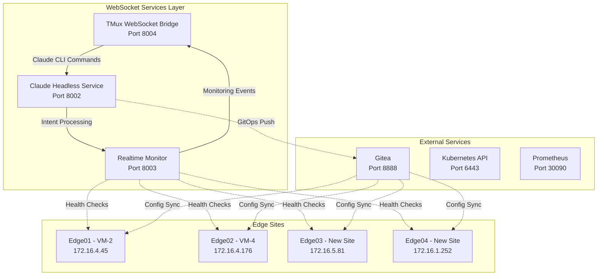

# WebSocket Services Guide
## VM-1 Intent-to-O2 Demo Environment

### 🏗️ Service Architecture Overview

The Intent-to-O2 pipeline uses three interconnected WebSocket services for real-time orchestration and monitoring:



---

## 🚀 Quick Start Guide

### Prerequisites

```bash
# Required packages
sudo apt-get update
sudo apt-get install -y tmux python3 python3-pip curl lsof

# Python dependencies
pip3 install fastapi uvicorn websockets aiofiles pydantic

# Claude CLI (optional, fallback mode available)
npm install -g @anthropic-ai/claude-cli
```

### Launch All Services

```bash
# Start all services
./scripts/start-websocket-services.sh

# Check status
./scripts/start-websocket-services.sh status

# Stop all services
./scripts/stop-websocket-services.sh

# View logs
./scripts/start-websocket-services.sh logs tmux-websocket-bridge
```

---

## 🔧 Service Descriptions

### 1. TMux WebSocket Bridge (Port 8004)

**Purpose**: Interactive terminal interface for Claude CLI with real-time WebSocket streaming

**Key Features**:
- Web-based terminal UI
- TMux session management (`claude-intent`)
- Real-time command output streaming
- Pipeline stage visualization
- Built-in intent shortcuts

**Web Interface**: http://localhost:8004

**WebSocket Endpoint**: `ws://localhost:8004/ws`

**Core Functions**:
```python
# TMux session management
create_session() -> bool
send_command(command: str) -> None
capture_output() -> str
clear_pane() -> None

# WebSocket communication
monitor_output(websocket: WebSocket)
check_patterns(content: str, websocket: WebSocket)
```

### 2. Claude Headless Service (Port 8002)

**Purpose**: Headless Claude CLI integration for intent processing with fallback

**Key Features**:
- RESTful API for intent processing
- Claude CLI integration with fallback
- TMF921-compliant output
- Batch processing support
- Caching layer for performance

**API Documentation**: http://localhost:8002/docs

**WebSocket Endpoint**: `ws://localhost:8002/ws`

**Core API Endpoints**:
```http
POST /api/v1/intent
POST /api/v1/intent/batch
GET /health
```

**Example Request**:
```bash
curl -X POST "http://localhost:8002/api/v1/intent" \
  -H "Content-Type: application/json" \
  -d '{
    "text": "Deploy eMBB service on edge01 with 100Mbps bandwidth",
    "target_sites": ["edge1", "edge2"]
  }'
```

### 3. Realtime Monitor (Port 8003)

**Purpose**: Real-time pipeline monitoring and visualization dashboard

**Key Features**:
- Live pipeline stage tracking
- Edge site health monitoring
- Performance metrics collection
- Service status dashboard
- WebSocket event broadcasting

**Web Dashboard**: http://localhost:8003

**WebSocket Endpoint**: `ws://localhost:8003/ws`

**Monitoring API**:
```http
POST /api/v1/pipeline/start
POST /api/v1/pipeline/update
POST /api/v1/edge/update
GET /api/v1/metrics
```

---

## 🌐 WebSocket Protocol Specifications

### TMux Bridge WebSocket Messages

**Client → Server**:
```json
{
  "type": "command",
  "content": "Deploy eMBB service with 200Mbps on edge01"
}

{
  "type": "clear"
}

{
  "type": "ping"
}
```

**Server → Client**:
```json
{
  "type": "connection",
  "status": "connected",
  "timestamp": "2025-09-27T10:30:00Z",
  "session": "claude-intent"
}

{
  "type": "output",
  "content": "Intent processed successfully...",
  "timestamp": "2025-09-27T10:30:15Z"
}

{
  "type": "event",
  "event": "processing|success|error|warning|intent|deployment",
  "timestamp": "2025-09-27T10:30:20Z"
}
```

### Realtime Monitor WebSocket Messages

**Server → Client**:
```json
{
  "type": "initial_state",
  "data": {
    "metrics": {...},
    "edge_status": {...},
    "current_pipeline": {...},
    "services": {...}
  }
}

{
  "type": "pipeline_started",
  "data": {
    "intent_id": "intent-1727432400",
    "intent_text": "Deploy eMBB...",
    "start_time": "2025-09-27T10:30:00Z"
  }
}

{
  "type": "stage_update",
  "data": {
    "pipeline": {...},
    "stage": {
      "stage": "krm_generating",
      "timestamp": "2025-09-27T10:30:30Z",
      "metadata": {}
    }
  }
}

{
  "type": "edge_update",
  "data": {
    "edge": "edge01",
    "status": {
      "status": "healthy",
      "last_sync": "2025-09-27T10:30:45Z",
      "deployments": 3
    }
  }
}
```

---

## 📋 API Reference

### Claude Headless Service API

#### Process Intent
```http
POST /api/v1/intent
Content-Type: application/json

{
  "text": "Deploy URLLC service with 1ms latency on edge01 and edge02",
  "context": {
    "project": "intent-to-o2-demo",
    "environment": "edge"
  },
  "target_sites": ["edge1", "edge2"]
}
```

**Response**:
```json
{
  "status": "success",
  "intent": {
    "intentId": "intent-1727432400",
    "intentType": "URLLC",
    "description": "Ultra-reliable low latency service deployment",
    "targetSites": ["edge1", "edge2"],
    "serviceProfile": {
      "bandwidth": "50Mbps",
      "latency": "1ms",
      "reliability": "99.999%"
    },
    "sloRequirements": {
      "availability": "99.9%",
      "latencyP95": "1ms",
      "throughputMin": "50Mbps"
    },
    "lifecycle": "draft",
    "priority": 8,
    "constraints": {}
  },
  "metadata": {
    "processedAt": "2025-09-27T10:30:00Z",
    "fallback": false
  }
}
```

#### Batch Processing
```http
POST /api/v1/intent/batch
Content-Type: application/json

[
  {
    "text": "Deploy eMBB on edge01",
    "target_sites": ["edge1"]
  },
  {
    "text": "Deploy mMTC for IoT on edge02",
    "target_sites": ["edge2"]
  }
]
```

### Realtime Monitor API

#### Start Pipeline Monitoring
```http
POST /api/v1/pipeline/start?intent_id=intent-123&intent_text=Deploy%20eMBB
```

#### Update Pipeline Stage
```http
POST /api/v1/pipeline/update
Content-Type: application/json

{
  "stage": "krm_generated",
  "metadata": {
    "files_created": 3,
    "duration_ms": 1200
  }
}
```

#### Update Edge Status
```http
POST /api/v1/edge/update
Content-Type: application/json

{
  "edge": "edge01",
  "status": "healthy",
  "metadata": {
    "deployments": 5,
    "cpu_usage": 45.2,
    "memory_usage": 67.8
  }
}
```

---

## 🎯 Usage Examples

### Example 1: Complete Intent Processing Flow

```bash
# 1. Start all services
./scripts/start-websocket-services.sh

# 2. Process an intent via API
curl -X POST "http://localhost:8002/api/v1/intent" \
  -H "Content-Type: application/json" \
  -d '{
    "text": "Deploy eMBB service on edge01 with 200Mbps bandwidth and 10ms latency",
    "target_sites": ["edge1"]
  }'

# 3. Monitor via WebSocket (JavaScript example)
const ws = new WebSocket('ws://localhost:8003/ws');
ws.onmessage = (event) => {
  const data = JSON.parse(event.data);
  console.log('Pipeline update:', data);
};

# 4. View real-time UI
# Open http://localhost:8003 in browser
```

### Example 2: Using TMux Bridge

```javascript
// Connect to TMux bridge WebSocket
const tmuxWs = new WebSocket('ws://localhost:8004/ws');

// Send natural language command
tmuxWs.send(JSON.stringify({
  type: 'command',
  content: 'Deploy URLLC service with 1ms latency on all edge sites'
}));

// Receive real-time output
tmuxWs.onmessage = (event) => {
  const data = JSON.parse(event.data);
  if (data.type === 'output') {
    console.log('Claude output:', data.content);
  }
};
```

### Example 3: Multi-Site Deployment

```bash
# Deploy to multiple sites
curl -X POST "http://localhost:8002/api/v1/intent/batch" \
  -H "Content-Type: application/json" \
  -d '[
    {
      "text": "Deploy eMBB service with 100Mbps on edge01",
      "target_sites": ["edge1"]
    },
    {
      "text": "Deploy URLLC service with 1ms latency on edge02",
      "target_sites": ["edge2"]
    },
    {
      "text": "Deploy mMTC for 10000 IoT devices on edge03 and edge04",
      "target_sites": ["edge3", "edge4"]
    }
  ]'
```

---

## 🔍 Troubleshooting Guide

### Common Issues

#### 1. Service Won't Start

**Problem**: Port already in use
```bash
# Check what's using the port
lsof -i :8004
lsof -i :8002
lsof -i :8003

# Force stop and restart
./scripts/stop-websocket-services.sh --force
./scripts/start-websocket-services.sh
```

**Problem**: Missing dependencies
```bash
# Install missing Python packages
pip3 install fastapi uvicorn websockets aiofiles pydantic

# Check tmux installation
sudo apt-get install tmux
```

#### 2. Claude CLI Issues

**Problem**: Claude CLI not found
```bash
# Install Claude CLI
npm install -g @anthropic-ai/claude-cli

# Or use fallback mode (automatic)
# Service will use rule-based processing when Claude CLI is unavailable
```

**Problem**: Claude CLI timeout
```bash
# Check Claude CLI is working
claude --version

# Test simple command
claude -p "Hello world"

# Service automatically falls back to rule-based processing on timeout
```

#### 3. WebSocket Connection Issues

**Problem**: WebSocket connection fails
```bash
# Check service health
curl http://localhost:8004/health
curl http://localhost:8002/health
curl http://localhost:8003/health

# Check network connectivity
netstat -tlnp | grep -E ':(8002|8003|8004)'
```

**Problem**: CORS issues
- Services are configured with `allow_origins=["*"]` for development
- For production, restrict CORS to specific domains

#### 4. TMux Session Issues

**Problem**: TMux session not created
```bash
# Check tmux is installed and working
tmux -V

# Manually create session
tmux new-session -d -s claude-intent

# Check existing sessions
tmux list-sessions
```

**Problem**: TMux permissions
```bash
# Ensure user can create tmux sessions
# Check /tmp permissions
ls -la /tmp/

# Create tmux socket directory if needed
mkdir -p /tmp/tmux-$(id -u)
```

### Debugging Commands

```bash
# Service status
./scripts/start-websocket-services.sh status

# View service logs
./scripts/start-websocket-services.sh logs claude-headless
./scripts/start-websocket-services.sh logs realtime-monitor
./scripts/start-websocket-services.sh logs tmux-websocket-bridge

# Check processes
ps aux | grep -E '(tmux_websocket|claude_headless|realtime_monitor)'

# Check ports
netstat -tlnp | grep -E ':(8002|8003|8004)'

# Test health endpoints
for port in 8002 8003 8004; do
  echo "Testing port $port:"
  curl -s "http://localhost:$port/health" | jq '.' || echo "Failed"
done
```

### Log Analysis

```bash
# View logs with timestamps
tail -f logs/services/claude-headless.log | while read line; do
  echo "$(date): $line"
done

# Search for errors
grep -i error logs/services/*.log

# Monitor WebSocket connections
grep -i websocket logs/services/*.log | tail -20
```

---

## 🚀 Performance Optimization

### Service Tuning

#### TMux Bridge Optimization
```python
# Adjust monitoring frequency in tmux_websocket_bridge.py
await asyncio.sleep(0.5)  # Default: 500ms
# For high-frequency updates: 0.1s
# For resource saving: 1.0s
```

#### Claude Headless Caching
```python
# Cache configuration in claude_headless.py
self.timeout = 30  # Claude CLI timeout
self.cache = {}    # In-memory cache

# For production: Use Redis for distributed caching
```

#### Monitor Performance
```python
# Metrics collection in realtime_monitor.py
self.metrics = {
    "total_intents": 0,
    "successful_intents": 0,
    "failed_intents": 0,
    "avg_processing_time": 0
}
```

### Resource Management

```bash
# Monitor system resources
htop
iostat 1
vmstat 1

# Monitor Python processes
ps aux | grep python3 | grep -E '(tmux_websocket|claude_headless|realtime_monitor)'

# Check memory usage
pmap -x $(pgrep -f claude_headless)
```

---

## 🔐 Security Considerations

### Network Security
- Services bind to `0.0.0.0` for development
- For production: Use specific interfaces or reverse proxy
- Implement authentication middleware
- Use HTTPS/WSS in production

### Process Security
```bash
# Run services as non-root user
# Use systemd for production deployment
# Implement log rotation
# Set proper file permissions on logs and PID files
```

### Configuration Security
```python
# Environment-based configuration
import os

CLAUDE_API_KEY = os.getenv('CLAUDE_API_KEY')
JWT_SECRET = os.getenv('JWT_SECRET', 'dev-secret-change-in-prod')
```

---

## 📝 Integration with Pipeline

### GitOps Integration
```bash
# Services integrate with Gitea at localhost:8888
# Claude Headless pushes generated KRM to GitOps repository
# Realtime Monitor tracks deployment status across edge sites
```

### Edge Site Monitoring
```yaml
# Edge sites configuration (from config/edge-sites-config.yaml)
edge_sites:
  edge1:
    ip: "172.16.4.45"
    user: "ubuntu"
    key: "id_ed25519"
    ports:
      o2ims: 31280
      prometheus: 30090
      k8s_api: 6443

  edge2:
    ip: "172.16.4.176"
    user: "ubuntu"
    key: "id_ed25519"
    ports:
      o2ims: 31280
      prometheus: 30090
      k8s_api: 6443

  edge3:
    ip: "172.16.5.81"
    user: "thc1006"
    key: "edge_sites_key"
    password: "1006"
    ports:
      o2ims: 31280
      prometheus: 30090
      k8s_api: 6443

  edge4:
    ip: "172.16.1.252"
    user: "thc1006"
    key: "edge_sites_key"
    password: "1006"
    ports:
      o2ims: 31280
      prometheus: 30090
      k8s_api: 6443
```

---

## 📚 Additional Resources

### Development Tools
- **FastAPI Documentation**: https://fastapi.tiangolo.com/
- **WebSocket API**: https://websockets.readthedocs.io/
- **TMux Manual**: https://man7.org/linux/man-pages/man1/tmux.1.html

### Related Documentation
- `docs/EDGE_SITE_ONBOARDING_GUIDE.md` - Edge site setup
- `docs/EDGE_SSH_CONTROL_GUIDE.md` - SSH configuration
- `config/edge-sites-config.yaml` - Edge sites configuration

### Service Files
- `services/tmux_websocket_bridge.py` - TMux bridge implementation
- `services/claude_headless.py` - Claude CLI integration
- `services/realtime_monitor.py` - Pipeline monitoring
- `scripts/start-websocket-services.sh` - Service launcher
- `scripts/stop-websocket-services.sh` - Service stopper

---

*This guide provides comprehensive documentation for the WebSocket services layer of the Intent-to-O2 demo environment on VM-1.*