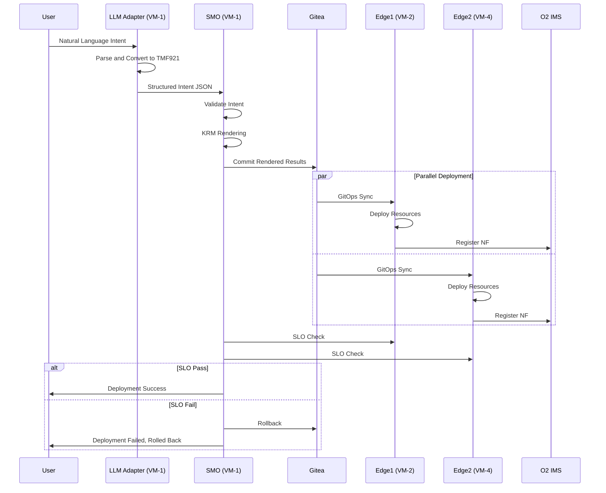

# Nephio Intent-to-O2 Demo System Architecture (High-Level Architecture)

## 1. System Overview

### 1.1 Project Vision
This project demonstrates a complete automation flow from natural language intent to O-RAN O2 IMS deployment, integrating LLM, 3GPP standardized intent, KRM resource management, GitOps multi-site deployment, and SLO gate control.

### 1.2 Core Value Proposition
- **Intent-Driven Networking**: Describe network requirements through natural language
- **Standardized Transformation**: Convert intent to 3GPP/TMF921 standard format
- **Declarative Deployment**: Use KRM (Kubernetes Resource Model) for resource management
- **Multi-Site Coordination**: Support edge1/edge2 multi-site simultaneous deployment
- **Quality Assurance**: SLO monitoring and automatic rollback mechanism

## 2. System Architecture

### 2.1 Four-Layer Architecture Model

```
┌─────────────────────────────────────────────────────────────┐
│                     UI Layer                                 │
│  • Natural Language Input  • Intent Description              │
│  • Monitoring Dashboard    • Report Visualization            │
└─────────────────────────────────────────────────────────────┘
                              ▼
┌─────────────────────────────────────────────────────────────┐
│                  Intent Layer                                │
│  • LLM Adapter (VM-1 Integrated)  • TMF921/3GPP Conversion             │
│  • Intent Validation                                         │
└─────────────────────────────────────────────────────────────┘
                              ▼
┌─────────────────────────────────────────────────────────────┐
│               Orchestration Layer                            │
│  • SMO/WF-C (VM-1)  • KRM Rendering  • GitOps Sync          │
│  • SLO Gate                                                  │
└─────────────────────────────────────────────────────────────┘
                              ▼
┌─────────────────────────────────────────────────────────────┐
│                 Infrastructure Layer                         │
│  • Edge Sites (VM-2/VM-4)  • K8s Clusters  • O2 IMS/DMS    │
└─────────────────────────────────────────────────────────────┘
```

### 2.2 Network Topology

```
                        ┌─────────────┐
                        │   Internet  │
                        └──────┬──────┘
                               │
                    ┌──────────┴──────────┐
                    │   OpenStack Cloud   │
                    │   (172.16.0.0/16)   │
                    └──────────┬──────────┘
                               │
        ┌──────────────────────┼──────────────────────┐
        │                      │                      │
   ┌────▼────┐          ┌─────▼─────┐         ┌─────▼─────┐
   │  VM-1   │                                 │   VM-4    │
   │  SMO +  │◄────────────────────────────────┤  edge2    │
   │LLM Integ│                                 │172.16.4.176│
   │172.16.0.78│                               │           │
   └────┬────┘          └───────────┘         └───────────┘
        │
        │ GitOps Sync
        ▼
   ┌─────────┐
   │  VM-2   │
   │  edge1  │
   │172.16.4.45│
   └─────────┘
```

### 2.3 Enhanced 4-Site Topology (Zero-Trust Mesh)

| Site | Role | IP Address | AI Capabilities | Key Services v1.2.0 |
|------|------|------------|-----------------|----------------------|
| VM-1 | GenAI Orchestrator Hub | 172.16.0.78 | 175B Claude-4, Real-time AI | • Gitea (8888)<br>• GenAI Service (8002)<br>• WebSocket Monitor (8003/8004)<br>• OrchestRAN Renderer<br>• AI-Enhanced SLO Controller |
| Edge1 | Primary Edge Site | 172.16.4.45 | Local AI validation, Config Sync | • Kubernetes API (6443)<br>• O2 IMS v3.0 (31280)<br>• Zero-Trust mTLS<br>• Real-time Metrics |
| Edge2 | Secondary Edge Site | 172.16.4.176 | AI-assisted deployment | • Kubernetes API<br>• O2 IMS v3.0<br>• Autonomous Operations<br>• Self-Healing |
| Edge3 | Tertiary Edge Site | 172.16.5.81 | Distributed AI inference | • Kubernetes API<br>• O2 IMS v3.0<br>• Federated Learning<br>• Edge AI Processing |
| Edge4 | Quaternary Edge Site | 172.16.1.252 | Edge AI optimization | • Kubernetes API<br>• O2 IMS v3.0<br>• Predictive Scaling<br>• Quantum-Ready Security |

## 3. Core Workflows

### 3.1 End-to-End Intent Processing Flow



### 3.2 Intent Transformation Flow

```
User Input: "I need to deploy 5G eMBB service in Taipei, downlink 100Mbps, latency 20ms"
                            ▼
┌─────────────────────────────────────────────────┐
│              LLM Adapter (VM-1)                 │
│  1. NLP Parsing                                 │
│  2. Entity Recognition (Service Type, Location, QoS) │
│  3. Parameter Extraction                        │
└─────────────────────────────────────────────────┘
                            ▼
TMF921 Intent JSON:
{
  "intentId": "intent-001",
  "intentType": "ServiceDeployment",
  "intentParameters": {
    "service": "eMBB",
    "location": "taipei",
    "targetSite": "edge1",
    "qos": {
      "downlink_mbps": 100,
      "uplink_mbps": 50,
      "latency_ms": 20
    }
  }
}
                            ▼
┌─────────────────────────────────────────────────┐
│              KRM Renderer (VM-1)                │
│  1. Intent Validation                           │
│  2. Template Selection                          │
│  3. Parameter Injection                         │
│  4. Resource Generation                         │
└─────────────────────────────────────────────────┘
                            ▼
Kubernetes Resources:
- Deployment (5G NF)
- Service
- ConfigMap
- NetworkPolicy
- O2 ProvisioningRequest
```

### 3.3 GitOps Multi-Site Sync Flow

```
VM-1 (SMO)                    VM-2 (edge1)              VM-4 (edge2)
    │                              │                          │
    ├─[1] Render KRM──────────────►│                          │
    │                              │                          │
    ├─[2] Git Commit              │                          │
    │   gitops/edge1-config/      │                          │
    │   gitops/edge2-config/      │                          │
    │                              │                          │
    ├─[3] Trigger Sync────────────►├─[4] Pull Updates        │
    │                              │                          │
    ├─[3] Trigger Sync─────────────────────────────────────►├─[4] Pull Updates
    │                              │                          │
    │                              ├─[5] Apply Resources     │
    │                              │                          ├─[5] Apply Resources
    │                              │                          │
    ├◄[6] Status Report────────────┤                          │
    │                              │                          │
    ├◄[6] Status Report───────────────────────────────────────┤
    │                              │                          │
    └─[7] SLO Validation           │                          │
```

## 4. Key Component Details

### 4.1 LLM Adapter (VM-1 Integrated Service)

**Functional Responsibilities**:
- Natural language understanding and intent extraction
- TMF921/3GPP standard format conversion
- Parameter validation and normalization
- REST API service provision

**Technology Stack**:
- Python FastAPI
- LangChain/OpenAI API
- Pydantic data validation
- uvicorn ASGI server

**API Endpoints**:
```
POST /intent/generate    # Generate intent
POST /intent/tmf921     # TMF921 format
GET  /health            # Health check
GET  /docs              # API documentation
```

### 4.2 SMO/Orchestrator (VM-1)

**Functional Responsibilities**:
- Workflow orchestration control
- KRM resource rendering
- GitOps trigger and monitoring
- SLO gate checking
- Automatic rollback control

**Core Scripts**:
```bash
scripts/
├── demo_llm.sh           # Main demo script
├── intent_from_llm.sh    # Intent generation
├── render_krm.sh         # KRM rendering
├── postcheck.sh          # SLO check
├── rollback.sh           # Rollback handling
└── package_artifacts.sh  # Artifact packaging
```

### 4.3 Edge Sites (VM-2/VM-4)

**Functional Responsibilities**:
- Kubernetes workload execution
- O2 IMS/DMS integration
- Network function deployment
- Metric data collection

**Deployment Components**:
- Config Sync Agent
- O2 IMS Controller
- Prometheus Metrics
- Network Functions (CU/DU/RU)

### 4.4 GitOps Configuration Structure

```
gitops/
├── edge1-config/
│   ├── kustomization.yaml
│   ├── namespaces/
│   ├── network-functions/
│   ├── o2ims-resources/
│   └── policies/
├── edge2-config/
│   ├── kustomization.yaml
│   ├── namespaces/
│   ├── network-functions/
│   ├── o2ims-resources/
│   └── policies/
└── common/
    ├── base-configs/
    └── templates/
```

## 5. Data Flow and Storage

### 5.1 Data Types

| Data Type | Format | Storage Location | Lifecycle |
|-----------|--------|------------------|-----------|
| User Intent | Text/JSON | LLM Adapter Memory | Session |
| TMF921 Intent | JSON | VM-1 artifacts/ | Persistent |
| KRM Resources | YAML | Git Repository | Version Controlled |
| SLO Metrics | JSON | Prometheus/O2IMS | Time Series (30d) |
| Deployment Report | JSON/HTML | reports/<timestamp>/ | Archive |
| Audit Logs | JSON | /var/log/demo/ | Rotation (7d) |

### 5.2 Key Data Flows

```
[Natural Language] ──► [Intent JSON] ──► [KRM YAML] ──► [K8s Resources]
                           │                  │              │
                           ▼                  ▼              ▼
                      [Validation]      [Git Commit]    [Deployment]
                           │                  │              │
                           ▼                  ▼              ▼
                       [Archive]         [Version]      [Monitoring]
```

## 6. Security Architecture

### 6.1 Network Security

**Firewall Rules**:
```
VM-1 → VM-2: 6443 (K8s API), 31280 (O2IMS)
VM-1 → VM-4: 6443 (K8s API)
VM-1 → External: 443 (LLM API access)
* → VM-1: 3000 (Gitea)
```

**Authentication Mechanisms**:
- Kubernetes: ServiceAccount + RBAC
- Gitea: Token-based Auth
- LLM Adapter: API Key
- O2 IMS: mTLS

### 6.2 Data Security

- **Transport Encryption**: TLS 1.3
- **Storage Encryption**: K8s Secrets (base64 + etcd encryption)
- **Audit Trail**: All API calls logged
- **Supply Chain Security**: Cosign signatures, SBOM generation

## 7. Monitoring and Observability

### 7.1 Monitoring Levels

```
Application Monitoring
├── Intent Success Rate
├── Deployment Latency
└── SLO Compliance

System Monitoring
├── CPU/Memory Usage
├── Network Latency
└── Disk I/O

Business Monitoring
├── Service Availability
├── QoS Metrics
└── User Experience
```

### 7.2 Key Performance Indicators (KPI)

| KPI | Target Value | Measurement Method | Alert Threshold |
|-----|--------------|-------------------|-----------------|
| Intent Processing Time | < 5s | LLM Response Time | > 10s |
| Deployment Success Rate | > 95% | Successful/Total Deployments | < 90% |
| SLO Achievement Rate | > 99% | Met SLOs/Total SLOs | < 95% |
| Rollback Time | < 60s | Rollback Trigger to Complete | > 120s |
| System Availability | 99.9% | Uptime/Total Time | < 99.5% |

## 8. Deployment Guide

### 8.1 Prerequisites

**Hardware Requirements**:
- VM-1: 4 vCPU, 8GB RAM, 100GB Disk
- VM-2/4: 8 vCPU, 16GB RAM, 200GB Disk

**Software Requirements**:
- Ubuntu 22.04 LTS
- Kubernetes 1.28+
- Docker 24.0+
- Python 3.10+
- Go 1.21+

**Network Requirements**:
- Internal network: 172.16.0.0/16
- Inter-VM connectivity
- VM-1 needs external network access (for LLM API)

### 8.2 Installation Steps

#### Step 1: Basic Environment Preparation (All VMs)

```bash
# Update system
sudo apt update && sudo apt upgrade -y

# Install basic tools
sudo apt install -y git curl wget jq make gcc

# Set timezone
sudo timedatectl set-timezone Asia/Taipei

# Set hostname
sudo hostnamectl set-hostname vm-{1,2,4}

# Configure /etc/hosts
cat <<EOF | sudo tee -a /etc/hosts
172.16.0.78   vm-1 smo orchestrator llm-adapter
172.16.4.45   vm-2 edge1
172.16.4.176  vm-4 edge2
EOF
```

#### Step 2: VM-1 (SMO) Deployment

```bash
# Clone project
cd ~
git clone https://github.com/your-org/nephio-intent-to-o2-demo.git
cd nephio-intent-to-o2-demo

# Install Docker
curl -fsSL https://get.docker.com | bash
sudo usermod -aG docker $USER

# Install Gitea
docker run -d --name=gitea \
  -p 3000:3000 -p 2222:22 \
  -v gitea:/data \
  -v /etc/timezone:/etc/timezone:ro \
  -v /etc/localtime:/etc/localtime:ro \
  --restart always \
  gitea/gitea:latest

# Install kpt
curl -L https://github.com/kptdev/kpt/releases/download/v1.0.0-beta.49/kpt_linux_amd64 -o kpt
chmod +x kpt && sudo mv kpt /usr/local/bin/

# Configure environment variables
cp scripts/env.sh.example scripts/env.sh
vim scripts/env.sh  # Edit configuration

# Initialize Git repository
./scripts/init_gitea.sh

# Test connection
./scripts/check_connectivity.sh
```

#### Step 3: VM-2/VM-4 (Edge Sites) Deployment

```bash
# Install Kubernetes (using kind or kubeadm)
# Option A: Use kind (development environment)
curl -Lo ./kind https://kind.sigs.k8s.io/dl/v0.20.0/kind-linux-amd64
chmod +x ./kind && sudo mv ./kind /usr/local/bin/
kind create cluster --name edge1 --config configs/kind-edge1.yaml

# Option B: Use kubeadm (production environment)
sudo apt install -y kubelet kubeadm kubectl
sudo kubeadm init --pod-network-cidr=10.244.0.0/16
mkdir -p $HOME/.kube
sudo cp -i /etc/kubernetes/admin.conf $HOME/.kube/config

# Install CNI (Flannel)
kubectl apply -f https://github.com/flannel-io/flannel/releases/latest/download/kube-flannel.yml

# Install Config Sync
kubectl apply -f https://github.com/GoogleContainerTools/kpt-config-sync/releases/download/v1.17.0/config-sync-manifest.yaml

# Configure RootSync
cat <<EOF | kubectl apply -f -
apiVersion: configsync.gke.io/v1beta1
kind: RootSync
metadata:
  name: root-sync
  namespace: config-management-system
spec:
  sourceType: git
  git:
    repo: http://vm-1:3000/nephio/edge1-config
    branch: main
    auth: token
    secretRef:
      name: git-creds
EOF

# Install O2 IMS CRDs
kubectl apply -f o2ims-sdk/crds/

# Deploy O2 IMS Controller
kubectl apply -f manifests/o2ims-controller/

# Verify deployment
kubectl get nodes
kubectl get pods -A
kubectl get rootsync -A
```

#### Step 4: VM-1 Integrated LLM Service

```bash
# LLM service is already integrated into VM-1
cd ~/nephio-intent-to-o2-demo/services

# Verify integrated services
python3 tmf921_processor.py &  # Port 8002
python3 tmux_websocket_bridge.py &  # Port 8004
python3 web_frontend.py &  # Port 8005

# Verify services
curl http://localhost:8002/health
curl http://localhost:8004/
curl http://localhost:8005/
```

#### Step 5: End-to-End Testing

```bash
# Execute on VM-1
cd ~/nephio-intent-to-o2-demo

# Run basic connectivity test
./scripts/test_connectivity.sh

# Run intent processing test
./scripts/demo_llm.sh --target=edge1 --mode=test

# Run multi-site deployment test
./scripts/demo_llm.sh --target=both --dry-run

# Check deployment status
kubectl --kubeconfig ~/.kube/edge1.config get pods -A
kubectl --kubeconfig ~/.kube/edge2.config get pods -A

# View SLO report
cat reports/latest/postcheck_report.json

# Run complete E2E test
make test-e2e
```

### 8.3 Configuration Adjustments

**Key Configuration Files**:

1. **scripts/env.sh** - Environment variable configuration
```bash
VM1_IP="172.16.0.78"
VM2_IP="172.16.4.45"
VM4_IP="172.16.4.176"
LLM_ADAPTER_URL="http://localhost:8002"  # Integrated into VM-1
GITEA_URL="http://localhost:8888"
```

2. **configs/sites.yaml** - Site configuration
```yaml
sites:
  edge1:
    ip: 172.16.4.45
    kubeconfig: ~/.kube/edge1.config
    gitops_path: gitops/edge1-config
  edge2:
    ip: 172.16.4.176
    kubeconfig: ~/.kube/edge2.config
    gitops_path: gitops/edge2-config
```

3. **services/config.yaml** - Integrated LLM service configuration
```yaml
llm:
  provider: claude  # Using Claude CLI integration
  model: claude-3
  temperature: 0.7
  max_tokens: 2000
  endpoint: localhost:8002
```

### 8.4 Troubleshooting

**Common Issues and Solutions**:

1. **LLM Service Cannot Connect**
```bash
# Check integrated service status
ps aux | grep tmf921_processor
# Check service health
curl -v http://localhost:8002/health
# Check firewall
sudo ufw status
```

2. **GitOps Sync Failed**
```bash
# Check RootSync status
kubectl get rootsync -A -o yaml
# Check Git authentication
kubectl get secret git-creds -n config-management-system -o yaml
# View sync logs
kubectl logs -n config-management-system -l app=reconciler
```

3. **SLO Check Failed**
```bash
# Manually run SLO check
./scripts/postcheck.sh --verbose
# View metrics
curl http://vm-2:31280/metrics/api/v1/slo
# Check O2IMS status
kubectl get provisioningrequests -A
```

## 9. Operations Guide

### 9.1 Daily Operations Tasks

**Daily Tasks**:
- Check system health status
- Review deployment logs
- Confirm SLO achievement

**Weekly Tasks**:
- Backup Git repository
- Update security patches
- Clean up expired reports

**Monthly Tasks**:
- Capacity planning review
- Performance optimization analysis
- Disaster recovery drill

### 9.2 Backup and Recovery

```bash
# Backup Gitea
docker exec gitea /usr/local/bin/gitea dump -c /data/gitea/conf/app.ini
mv /tmp/gitea-dump-*.zip /backup/

# Backup Kubernetes
kubectl get all -A -o yaml > k8s-backup.yaml

# Backup configuration
tar -czf config-backup.tar.gz configs/ scripts/env.sh

# Recovery procedure
./scripts/restore.sh --from=/backup/latest
```

### 9.3 Scaling and Upgrading

**Horizontal Scaling**:
```bash
# Add new edge site
./scripts/add_edge_site.sh --name=edge3 --ip=172.16.x.x

# Scale LLM Adapter
docker-compose scale llm-adapter=3
```

**Version Upgrade**:
```bash
# Upgrade process
1. Backup existing system
2. Verify in test environment
3. Gray deployment (10% → 50% → 100%)
4. Monitor key metrics
5. Prepare rollback plan
```

## 10. Appendix

### 10.1 Glossary

| Term | Full Name | Description |
|------|-----------|-------------|
| SMO | Service Management and Orchestration | Service management and orchestration |
| KRM | Kubernetes Resource Model | Kubernetes resource model |
| O2 IMS | O-RAN O2 Infrastructure Management Services | O-RAN O2 infrastructure management services |
| SLO | Service Level Objective | Service level objective |
| TMF921 | TM Forum Intent Management API | TM Forum intent management API |
| eMBB | enhanced Mobile Broadband | Enhanced mobile broadband |
| URLLC | Ultra-Reliable Low-Latency Communication | Ultra-reliable low-latency communication |
| mMTC | massive Machine Type Communication | Massive machine type communication |

### 10.2 Reference Links

- [Nephio Project](https://nephio.org/)
- [O-RAN Alliance](https://www.o-ran.org/)
- [kpt Documentation](https://kpt.dev/)
- [Config Sync](https://cloud.google.com/kubernetes-engine/docs/add-on/config-sync)
- [TMF Open APIs](https://www.tmforum.org/open-apis/)

### 10.3 Contact Information

**Technical Support**:
- Email: support@example.com
- Slack: #nephio-intent-demo
- GitHub Issues: https://github.com/your-org/nephio-intent-to-o2-demo/issues

**Maintenance Team**:
- Architecture Team: architecture@example.com
- Operations Team: operations@example.com
- Security Team: security@example.com

---

*Document Version: 1.0.0*
*Last Updated: 2024-09-13*
*Next Review: 2024-10-13*