# Deployment Guard v1.2.0: Multi-Site SLO Enforcement & Automated Rollback

This document describes the enhanced deployment guard system for the 4-site Nephio Intent-to-O2 deployment topology, providing automated SLO enforcement with intelligent rollback capabilities across all edge sites.

## Overview (v1.2.0 Enhancements)

The Deployment Guard ensures that deployments meet performance requirements across all 4 edge sites through:

1. **Precheck Gate**: Supply chain security validation before deployment
2. **Multi-Site Postcheck**: SLO validation across all 4 edge sites with observability integration
3. **Automated Rollback**: Intelligent rollback strategies when SLO violations occur on any site
4. **GitOps Integration**: Automated deployment guard for Edge3/Edge4 via Config Sync

## 4-Site Deployment Flow

```mermaid
graph TD
    A[make publish-edge-4sites] --> B[Precheck Gate]
    B --> C{Precheck Pass?}
    C -->|No| D[❌ Block Deployment]
    C -->|Yes| E[Publish to GitOps - All Sites]
    E --> F[Wait for RootSync - All Sites]
    F --> G[Multi-Site Postcheck Gate]
    G --> H{All Sites SLO Check}
    H -->|Pass| I[✅ 4-Site Deployment Success]
    H -->|Fail| J[Auto Rollback All Sites]
    J --> K{Rollback Success?}
    K -->|Yes| L[🔄 All Sites Rolled Back]
    K -->|No| M[⚠️ Manual Intervention Required]

    style A fill:#e1f5fe
    style D fill:#ffebee
    style I fill:#e8f5e8
    style L fill:#fff3e0
    style M fill:#fce4ec
```



## Enhanced SLO Thresholds (v1.2.0)

### Multi-Site Performance SLOs

| Metric | Threshold | Scope | Description |
|--------|-----------|-------|-------------|
| `latency_p95_ms` | ≤ 15ms | Per Site | 95th percentile response latency |
| `success_rate` | ≥ 0.995 | Per Site | Request success rate (99.5%) |
| `throughput_p95_mbps` | ≥ 200Mbps | Per Site | 95th percentile throughput |
| `deployment_success_rate` | 100% | All Sites | All 4 sites must succeed |
| `o2ims_availability` | ≥ 99.9% | Per Site | O2IMS service availability |

### Infrastructure SLOs (4-Site)

| Component | Requirement | Sites | Description |
|-----------|-------------|-------|-------------|
| RootSync | Reconciled | All 4 | GitOps sync completion |
| ResourceGroup | Not Stalled | All 4 | All resources applied successfully |
| O2IMS Services | Running | All 4 | Systemd services operational |
| TMF921 Adapter | Responsive | VM-1 | Multi-site API endpoint available |
| WebSocket Services | Connected | All 4 | Real-time communication active |

## Exit Codes & Meanings (Enhanced)

### Multi-Site Postcheck Exit Codes (`scripts/postcheck.sh`)

| Code | Meaning | Description | Action |
|------|---------|-------------|---------|
| 0 | Success | All 4 sites meet SLOs | Continue |
| 1 | RootSync Timeout | GitOps sync failed on one or more sites | Manual investigation |
| 2 | Site Unreachable | Cannot connect to one or more edge sites | Check site status |
| 3 | SLO Violation | Performance thresholds not met | Triggers automatic rollback |
| 4 | Dependencies Missing | Required tools not available | Install dependencies |
| 5 | Configuration Error | Invalid 4-site configuration detected | Fix configuration |
| 6 | SSH Key Error | Cannot connect due to wrong SSH key | Use correct key for site group |
| 7 | O2IMS Service Down | O2IMS systemd service not running | Restart O2IMS service |
| 8 | TMF921 Adapter Error | Multi-site adapter not responding | Check TMF921 adapter logs |

### Enhanced Rollback Exit Codes (`scripts/rollback.sh`)

| Code | Meaning | Description | Action |
|------|---------|-------------|---------|
| 0 | Success | All sites rolled back successfully | Monitor all systems |
| 1 | No Commits | Nothing to rollback on any site | Normal state |
| 2 | Git Operation Failed | Git commands failed on one or more sites | Check git state |
| 3 | Push Failed | Cannot push to remote repositories | Check remote access |
| 4 | Dependencies Missing | Required tools not available | Install dependencies |
| 5 | Configuration Error | Invalid rollback configuration | Fix configuration |
| 6 | Partial Rollback | Some sites rolled back, others failed | Manual intervention needed |

## Multi-Site Rollback Strategies

### Coordinated Revert Strategy (Default for 4-Site)

**When to use**: Standard SLO violations, preserving audit trail across all sites
**Behavior**:
- Creates `git revert` of last publish commit for all affected sites
- Preserves complete git history for all repositories
- Safe for shared repositories
- Coordinates rollback sequence across sites

```bash
# Coordinated revert rollback for all sites
make rollback-4sites REASON=slo-violation

# Configuration for coordinated rollback
ROLLBACK_STRATEGY=coordinated-revert ./scripts/rollback-all-sites.sh
```

### Emergency Reset Strategy (4-Site)

**When to use**: Critical security issues, system corruption
**Behavior**:
- Hard reset to main branch on all affected sites
- Creates rollback tags before reset on all sites
- Requires force push to all repositories
- Coordinates reset sequence to maintain system integrity

```bash
# Emergency reset rollback (destructive - all sites)
ROLLBACK_STRATEGY=emergency-reset make rollback-4sites REASON=security-incident

# Configuration for emergency reset
ROLLBACK_STRATEGY=emergency-reset FORCE_PUSH=true ./scripts/emergency-rollback-all-sites.sh
```

### Selective Site Rollback

**When to use**: Issues affecting specific sites only
**Behavior**:
- Rollback specific sites while maintaining others
- Preserves inter-site dependencies
- Gradual rollback with validation

```bash
# Rollback specific sites only
./scripts/rollback-selective-sites.sh --sites edge3,edge4 --reason "Edge3/Edge4 SLO violation"

# Validate remaining sites after selective rollback
./scripts/validate-remaining-sites.sh --exclude edge3,edge4
```

## Enhanced Configuration (4-Site)

### Multi-Site Postcheck Configuration (`.postcheck.conf`)

```bash
# Multi-Site RootSync Configuration
SITES=("edge1" "edge2" "edge3" "edge4")
ROOTSYNC_NAMES=("edge1-rootsync" "edge2-rootsync" "edge3-automated-sync" "edge4-automated-sync")
ROOTSYNC_NAMESPACE="config-management-system"
ROOTSYNC_TIMEOUT_SECONDS=600

# Site-Specific Observability Endpoints
EDGE1_HOST="172.16.4.45"
EDGE2_HOST="172.16.4.176"
EDGE3_HOST="172.16.5.81"
EDGE4_HOST="172.16.1.252"
OBSERVABILITY_PORT="30090"
METRICS_PATH="/metrics/api/v1/slo"
METRICS_TIMEOUT_SECONDS=30

# Enhanced SLO Thresholds (v1.2.0)
LATENCY_P95_THRESHOLD_MS=15
SUCCESS_RATE_THRESHOLD=0.995
THROUGHPUT_P95_THRESHOLD_MBPS=200
DEPLOYMENT_SUCCESS_RATE_THRESHOLD=1.0  # 100% - all sites must succeed
O2IMS_AVAILABILITY_THRESHOLD=0.999

# SSH Configuration per Site Group
SSH_CONFIG_EDGE1_EDGE2_KEY="~/.ssh/id_ed25519"
SSH_CONFIG_EDGE1_EDGE2_USER="ubuntu"
SSH_CONFIG_EDGE3_EDGE4_KEY="~/.ssh/edge_sites_key"
SSH_CONFIG_EDGE3_EDGE4_USER="thc1006"

# Logging
LOG_JSON=true
LOG_LEVEL=INFO
```

### Enhanced Rollback Configuration (`.rollback.conf`)

```bash
# Multi-Site Rollback Strategy
ROLLBACK_STRATEGY="coordinated-revert"  # coordinated-revert|emergency-reset|selective
PUBLISH_BRANCH="feat/slo-gate"
MAIN_BRANCH="main"

# Site Repository Configuration
EDGE1_REPO="http://172.16.0.78:3000/nephio/edge1-config"
EDGE2_REPO="http://172.16.0.78:3000/nephio/edge2-config"
EDGE3_REPO="http://172.16.0.78:3000/nephio/edge3-config"
EDGE4_REPO="http://172.16.0.78:3000/nephio/edge4-config"

# Git Configuration
REMOTE_NAME="origin"
FORCE_PUSH=false
ROLLBACK_SEQUENCE_DELAY=30  # seconds between site rollbacks

# Multi-Site Coordination
COORDINATE_ROLLBACK=true
VALIDATE_DEPENDENCIES=true
PRESERVE_CROSS_SITE_CONFIG=true

# Notifications
NOTIFY_WEBHOOK="https://your-webhook.example.com/4site-rollback"
SLACK_WEBHOOK=""
TEAMS_WEBHOOK=""

# Logging
LOG_JSON=true
LOG_AGGREGATION=true
```

## Usage Examples (4-Site Deployment)

### Basic Deployment with Multi-Site Guards

```bash
# Full 4-site deployment with automated protection
make publish-edge-4sites

# Manual postcheck for all sites
make postcheck-4sites

# Manual rollback for all sites
make rollback-4sites

# Dry-run rollback preview for all sites
make rollback-dry-run-4sites REASON=test
```

### Advanced Multi-Site Scenarios

```bash
# Custom SLO thresholds for all sites
LATENCY_P95_THRESHOLD_MS=10 make postcheck-4sites

# Emergency reset rollback for security incident
ROLLBACK_STRATEGY=emergency-reset make rollback-4sites REASON=security-vulnerability

# Selective site rollback
./scripts/rollback-selective-sites.sh --sites edge3,edge4 --reason "Performance degradation"

# Dry-run with custom configuration
DRY_RUN=true ALL_SITES=true make postcheck-4sites
```

## Multi-Site Observability Integration

### Expected Metrics JSON Format (Per Site)

```json
{
  "timestamp": "2025-09-27T12:34:56Z",
  "site_id": "edge1",
  "site_ip": "172.16.4.45",
  "slo": {
    "latency_p95_ms": 12.5,
    "success_rate": 0.997,
    "throughput_p95_mbps": 250.3,
    "o2ims_availability": 0.999
  },
  "services": {
    "o2ims_status": "running",
    "prometheus_status": "running",
    "gitops_sync_status": "synced"
  },
  "metadata": {
    "source": "edge1-prometheus",
    "version": "v1.2.0",
    "deployment_guard_enabled": true
  }
}
```

### Multi-Site Endpoint Setup

The system expects all edge sites to expose metrics at:
```
http://172.16.4.45:30090/metrics/api/v1/slo    # Edge1
http://172.16.4.176:30090/metrics/api/v1/slo   # Edge2
http://172.16.5.81:30090/metrics/api/v1/slo    # Edge3
http://172.16.1.252:30090/metrics/api/v1/slo   # Edge4
```

**Service Requirements**:
- HTTP GET endpoint returning JSON per site
- Response time < 30 seconds per site
- Valid JSON structure with required SLO fields
- O2IMS systemd service status included

## Troubleshooting (4-Site Deployment)

### Common Multi-Site Issues

#### Partial Site Failure

**Symptoms**: Some sites pass SLO, others fail
**Investigation**:
```bash
# Check individual site status
for site in edge1 edge2 edge3 edge4; do
  echo "Checking $site..."
  ./scripts/check-site-status.sh --site $site
done

# Identify failing sites
./scripts/identify-failing-sites.sh --threshold-violations
```

**Solutions**:
- Use selective rollback for failing sites only
- Investigate site-specific issues
- Consider partial deployment strategies

#### SSH Key Mismatch Across Sites

**Symptoms**: Cannot connect to Edge3/Edge4, can connect to Edge1/Edge2
**Investigation**:
```bash
# Test SSH connectivity for all sites
./scripts/test-ssh-all-sites.sh

# Expected output:
# Edge1: ✅ SSH OK (id_ed25519, ubuntu)
# Edge2: ✅ SSH OK (id_ed25519, ubuntu)
# Edge3: ❌ SSH FAILED - use edge_sites_key with thc1006
# Edge4: ❌ SSH FAILED - use edge_sites_key with thc1006
```

**Solutions**:
```bash
# Use correct SSH key for site groups
ssh -i ~/.ssh/id_ed25519 ubuntu@172.16.4.45      # Edge1
ssh -i ~/.ssh/id_ed25519 ubuntu@172.16.4.176     # Edge2
ssh -i ~/.ssh/edge_sites_key thc1006@172.16.5.81   # Edge3
ssh -i ~/.ssh/edge_sites_key thc1006@172.16.1.252  # Edge4
```

#### O2IMS Systemd Service Issues

**Symptoms**: O2IMS not responding on 31280 across sites
**Investigation**:
```bash
# Check O2IMS service status on all sites
for site in edge1 edge2 edge3 edge4; do
  echo "Checking O2IMS on $site..."
  ssh_key=$([ "$site" = "edge1" ] || [ "$site" = "edge2" ] && echo "~/.ssh/id_ed25519" || echo "~/.ssh/edge_sites_key")
  user=$([ "$site" = "edge1" ] || [ "$site" = "edge2" ] && echo "ubuntu" || echo "thc1006")
  ip=$(yq ".sites.$site.network.internal_ip" config/edge-sites-config.yaml)

  ssh -i $ssh_key $user@$ip "sudo systemctl status o2ims-$site"
done
```

**Solutions**:
```bash
# Restart O2IMS service on specific site
ssh -i ~/.ssh/edge_sites_key thc1006@172.16.5.81 "sudo systemctl restart o2ims-edge3"

# Restart O2IMS on all sites
./scripts/restart-o2ims-all-sites.sh
```

#### GitOps Sync Failures (Edge3/Edge4)

**Symptoms**: Automated GitOps not syncing for Edge3/Edge4
**Investigation**:
```bash
# Check Config Sync status for automated sites
./scripts/check-automated-gitops.sh --sites edge3,edge4

# Check Config Sync logs
kubectl logs -n config-management-system -l app=root-reconciler --tail=100
```

**Solutions**:
- Verify Git repository access from Edge3/Edge4
- Check network connectivity between sites and VM-1
- Restart Config Sync controllers
- Validate GitOps configuration

#### TMF921 Adapter Multi-Site Issues

**Symptoms**: TMF921 adapter not responding to multi-site requests
**Investigation**:
```bash
# Test TMF921 adapter health
curl http://localhost:8889/health

# Test multi-site intent submission
curl -X POST http://localhost:8889/api/intent \
  -H "Content-Type: application/json" \
  -d '{
    "intentType": "SliceIntent",
    "targetSites": ["edge1", "edge2", "edge3", "edge4"],
    "sloRequirements": {
      "latency": "10ms",
      "throughput": "1Gbps"
    }
  }'
```

**Solutions**:
```bash
# Check TMF921 adapter logs
sudo journalctl -u tmf921-adapter --since="1 hour ago"

# Restart TMF921 adapter
sudo systemctl restart tmf921-adapter

# Validate site connectivity from adapter
./scripts/validate-tmf921-connectivity.sh --all-sites
```

## Integration with CI/CD (4-Site)

### GitHub Actions Integration (Enhanced)

```yaml
name: Deploy with 4-Site SLO Gates
on:
  push:
    branches: [feat/slo-gate]
jobs:
  deploy-4sites:
    runs-on: ubuntu-latest
    steps:
      - uses: actions/checkout@v4
      - name: Deploy with 4-Site Guards
        run: |
          make publish-edge-4sites
        env:
          LOG_JSON: true
          ALL_SITES: true
          NOTIFY_WEBHOOK: ${{ secrets.WEBHOOK_URL }}
          SSH_EDGE1_EDGE2_KEY: ${{ secrets.SSH_ID_ED25519 }}
          SSH_EDGE3_EDGE4_KEY: ${{ secrets.SSH_EDGE_SITES_KEY }}
      - name: Validate All Sites
        if: success()
        run: |
          ./scripts/validate-4site-deployment.sh
      - name: Emergency Rollback
        if: failure()
        run: |
          make rollback-4sites REASON=ci-failure
```

### GitLab CI Integration (4-Site)

```yaml
deploy-4sites:
  stage: deploy
  script:
    - make publish-edge-4sites
  variables:
    LOG_JSON: "true"
    ALL_SITES: "true"
  after_script:
    - if [ $CI_JOB_STATUS == "failed" ]; then make rollback-4sites REASON=ci-failure; fi
  artifacts:
    when: always
    reports:
      junit: reports/4site-deployment-results.xml
```

## Monitoring & Alerting (4-Site)

### Key Multi-Site Metrics

1. **4-Site Deployment Success Rate**: Track postcheck pass/fail ratio across all sites
2. **Site-Specific Rollback Frequency**: Monitor automatic rollback triggers per site
3. **Cross-Site SLO Compliance**: Track actual vs. threshold metrics across sites
4. **Multi-Site RootSync Health**: Monitor GitOps reconciliation times
5. **TMF921 Multi-Site Response Time**: Track adapter performance

### Recommended Alerts (Enhanced)

```yaml
# Prometheus AlertManager rules for 4-site deployment
groups:
- name: deployment-guard-4sites
  rules:
  - alert: MultiSiteRollbacks
    expr: rate(rollbacks_total{deployment="4sites"}[1h]) > 0.1
    annotations:
      summary: High rollback rate detected across multiple sites

  - alert: SiteSpecificPostcheckFailures
    expr: rate(postcheck_failures_total{site=~"edge[1-4]"}[5m]) > 0
    annotations:
      summary: Postcheck validation failures on specific sites

  - alert: O2IMSMultiSiteDown
    expr: up{job="o2ims-endpoints"} == 0
    annotations:
      summary: O2IMS service down on one or more sites

  - alert: TMF921AdapterUnresponsive
    expr: up{job="tmf921-adapter"} == 0
    annotations:
      summary: TMF921 adapter not responding to multi-site requests

  - alert: GitOpsSyncFailureAutomated
    expr: config_sync_status{site=~"edge[34]",type="automated"} != 1
    annotations:
      summary: Automated GitOps sync failure on Edge3 or Edge4
```

## Security Considerations (Enhanced)

### Multi-Site Access Control

- **SSH Key Segregation**: Different keys for different site groups
- **Service Account Isolation**: Separate accounts for automated vs manual sites
- **Repository Access Control**: Fine-grained access to GitOps repositories
- **Inter-Site Communication**: Secured channels between sites

### Enhanced Audit Trail

- **Multi-Site Rollback Tracking**: All rollbacks tracked across sites
- **Git History Preservation**: Complete audit trail for all repositories
- **Cross-Site Activity Correlation**: Coordinated logging across sites
- **Security Event Aggregation**: Centralized security monitoring

### Site-Specific Notifications

```bash
# Configure site-specific webhooks
./scripts/setup-site-webhooks.sh \
  --edge1-webhook $EDGE1_WEBHOOK \
  --edge2-webhook $EDGE2_WEBHOOK \
  --edge3-webhook $EDGE3_WEBHOOK \
  --edge4-webhook $EDGE4_WEBHOOK

# Enable cross-site security monitoring
./scripts/enable-cross-site-security.sh --siem-integration
```

## Performance Targets (v1.2.0)

| Metric | Target | Scope | Description |
|--------|--------|-------|-------------|
| **4-Site Deployment Time** | <45min | All Sites | Time to deploy all 4 sites |
| **Cross-Site Sync Latency** | <2min | All Sites | Config propagation time |
| **Multi-Site SLO Validation** | <60s | All Sites | End-to-end validation |
| **Coordinated Rollback Time** | <8min | All Sites | Full 4-site rollback |
| **Site Recovery Time** | <15min | Per Site | Individual site recovery |

## References

- [Config Sync Multi-Repository Guide](https://cloud.google.com/anthos-config-management/docs/config-sync-overview)
- [Nephio R4 Multi-Site Documentation](https://nephio.org/releases/r4)
- [O-RAN O2IMS v3.0 Specification](https://specifications.o-ran.org/)
- [TMF921 Intent Management v5.0](https://www.tmforum.org/resources/standard/tmf921-intent-management-api-rest-specification-r21-0-0/)
- [GitOps Multi-Site Best Practices](https://opengitops.dev/)

---

**Version**: 1.2.0 - 4-Site Deployment
**Last Updated**: September 2025
**Maintainer**: Nephio Intent-to-O2 Team

**The v1.2.0 Deployment Guard provides comprehensive SLO enforcement and automated rollback capabilities across all 4 edge sites, ensuring 100% deployment success rate with intelligent failure recovery.**

---
*Deployment Guard Guide | Version: 1.2.0 | Date: 2025-09-27 | Classification: Technical*