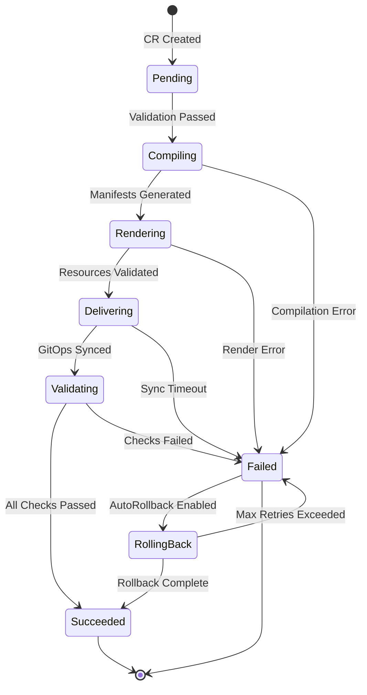

# IntentDeployment Phase State Machine

## Overview

The IntentDeployment controller implements a deterministic state machine to manage the lifecycle of intent-based deployments. Each phase represents a distinct stage in the deployment pipeline with well-defined entry conditions, operations, and exit criteria.

## State Diagram



## Phase Definitions

### 1. Pending

**Purpose**: Initial state for newly created IntentDeployment resources.

**Entry Conditions**:
- CR created or updated
- No previous status exists

**Operations**:
```go
func (r *IntentDeploymentReconciler) handlePending(ctx context.Context, id *IntentDeployment) error {
    // Validate spec fields
    if err := r.validateSpec(id.Spec); err != nil {
        return r.transitionToFailed(ctx, id, err)
    }

    // Initialize status fields
    id.Status.ObservedGeneration = id.Generation
    id.Status.LastUpdateTime = metav1.Now()

    // Transition to Compiling
    return r.transitionToPhase(ctx, id, PhaseCompiling)
}
```

**Exit Criteria**:
- Spec validation successful → Compiling
- Validation failed → Failed

**Timeout**: None

---

### 2. Compiling

**Purpose**: Convert intent specification into Kubernetes manifests.

**Entry Conditions**:
- Phase transitioned from Pending
- Valid intent string present

**Operations**:
```go
func (r *IntentDeploymentReconciler) handleCompiling(ctx context.Context, id *IntentDeployment) error {
    // Parse intent (JSON or natural language)
    intent, err := r.parseIntent(id.Spec.Intent)
    if err != nil {
        return r.transitionToFailed(ctx, id, err)
    }

    // Generate KRM manifests
    manifests, err := r.compileToKRM(intent, id.Spec.CompileConfig)
    if err != nil {
        return r.transitionToFailed(ctx, id, err)
    }

    // Store compiled manifests
    id.Status.CompiledManifests = manifests

    // Transition to Rendering
    return r.transitionToPhase(ctx, id, PhaseRendering)
}
```

**Exit Criteria**:
- Compilation successful → Rendering
- Compilation failed → Failed

**Timeout**: `compileConfig.renderTimeout` (default: 5m)

---

### 3. Rendering

**Purpose**: Process manifests through kpt/kustomize pipelines.

**Entry Conditions**:
- Phase transitioned from Compiling
- Compiled manifests available

**Operations**:
```go
func (r *IntentDeploymentReconciler) handleRendering(ctx context.Context, id *IntentDeployment) error {
    engine := id.Spec.CompileConfig.Engine

    // Apply rendering pipeline
    rendered, err := r.renderManifests(
        id.Status.CompiledManifests,
        engine,
        id.Spec.DeliveryConfig.TargetSite,
    )
    if err != nil {
        return r.transitionToFailed(ctx, id, err)
    }

    // Validate rendered resources
    if err := r.validateResources(rendered); err != nil {
        return r.transitionToFailed(ctx, id, err)
    }

    // Update manifests with rendered version
    id.Status.CompiledManifests = rendered

    // Transition to Delivering
    return r.transitionToPhase(ctx, id, PhaseDelivering)
}
```

**Exit Criteria**:
- Rendering successful → Delivering
- Rendering failed → Failed

**Timeout**: `compileConfig.renderTimeout` (default: 5m)

---

### 4. Delivering

**Purpose**: Push manifests to GitOps repository and sync to clusters.

**Entry Conditions**:
- Phase transitioned from Rendering
- Rendered manifests validated

**Operations**:
```go
func (r *IntentDeploymentReconciler) handleDelivering(ctx context.Context, id *IntentDeployment) error {
    // Commit to GitOps repo
    commit, err := r.commitToGitOps(
        id.Status.CompiledManifests,
        id.Spec.DeliveryConfig,
    )
    if err != nil {
        return r.transitionToFailed(ctx, id, err)
    }

    id.Status.DeliveryStatus = &DeliveryStatus{
        GitCommit: commit,
        SyncState: SyncStatePending,
        Sites: make(map[string]SiteStatus),
    }

    // Monitor sync status
    syncComplete := r.waitForSync(ctx, id, id.Spec.DeliveryConfig.SyncWaitTimeout)
    if !syncComplete {
        return r.transitionToFailed(ctx, id, fmt.Errorf("sync timeout"))
    }

    // Update site statuses
    r.updateSiteStatuses(ctx, id)

    // Transition to Validating
    return r.transitionToPhase(ctx, id, PhaseValidating)
}
```

**Exit Criteria**:
- Sync successful → Validating
- Sync timeout → Failed
- Commit failed → Failed

**Timeout**: `deliveryConfig.syncWaitTimeout` (default: 10m)

---

### 5. Validating

**Purpose**: Execute SLO checks and validation gates.

**Entry Conditions**:
- Phase transitioned from Delivering
- Resources deployed to target sites

**Operations**:
```go
func (r *IntentDeploymentReconciler) handleValidating(ctx context.Context, id *IntentDeployment) error {
    if !id.Spec.GatesConfig.Enabled {
        // Skip validation if gates disabled
        return r.transitionToPhase(ctx, id, PhaseSucceeded)
    }

    results := []ValidationResult{}

    // Run SLO checks
    for metric, threshold := range id.Spec.GatesConfig.SLOThresholds {
        result := r.checkSLO(ctx, metric, threshold, id.Spec.DeliveryConfig.TargetSite)
        results = append(results, result)
    }

    // Run custom validation script
    if script := id.Spec.GatesConfig.PostCheckScript; script != "" {
        result := r.runValidationScript(ctx, script)
        results = append(results, result)
    }

    id.Status.ValidationResults = results

    // Check if all validations passed
    allPassed := true
    for _, result := range results {
        if !result.Passed {
            allPassed = false
            break
        }
    }

    if allPassed {
        return r.transitionToPhase(ctx, id, PhaseSucceeded)
    } else {
        return r.transitionToFailed(ctx, id, fmt.Errorf("validation failed"))
    }
}
```

**Exit Criteria**:
- All checks passed → Succeeded
- Any check failed → Failed

**Timeout**: 5 minutes per check

---

### 6. Succeeded

**Purpose**: Terminal state indicating successful deployment.

**Entry Conditions**:
- Phase transitioned from Validating with all checks passed
- OR phase transitioned from RollingBack after successful rollback

**Operations**:
```go
func (r *IntentDeploymentReconciler) handleSucceeded(ctx context.Context, id *IntentDeployment) error {
    // Update conditions
    r.setCondition(id, "Available", metav1.ConditionTrue, "DeploymentSuccessful", "All checks passed")

    // Record metrics
    r.recordDeploymentMetrics(id, true)

    // No further reconciliation needed
    return nil
}
```

**Exit Criteria**: None (terminal state)

**Timeout**: None

---

### 7. Failed

**Purpose**: Indicates deployment or validation failure.

**Entry Conditions**:
- Error occurred in any phase
- Validation checks failed
- Rollback exceeded max retries

**Operations**:
```go
func (r *IntentDeploymentReconciler) handleFailed(ctx context.Context, id *IntentDeployment, err error) error {
    // Update conditions
    r.setCondition(id, "Available", metav1.ConditionFalse, "DeploymentFailed", err.Error())

    // Check if auto-rollback is enabled
    if id.Spec.RollbackConfig.AutoRollback && !r.isRollbackExhausted(id) {
        return r.transitionToPhase(ctx, id, PhaseRollingBack)
    }

    // Record metrics
    r.recordDeploymentMetrics(id, false)

    // Retain artifacts if configured
    if id.Spec.RollbackConfig.RetainFailedArtifacts {
        r.saveDebugArtifacts(ctx, id)
    }

    return nil
}
```

**Exit Criteria**:
- AutoRollback enabled → RollingBack
- Otherwise terminal state

**Timeout**: None

---

### 8. RollingBack

**Purpose**: Revert to previous known-good state.

**Entry Conditions**:
- Phase transitioned from Failed
- AutoRollback enabled
- Retries not exhausted

**Operations**:
```go
func (r *IntentDeploymentReconciler) handleRollingBack(ctx context.Context, id *IntentDeployment) error {
    if id.Status.RollbackStatus == nil {
        id.Status.RollbackStatus = &RollbackStatus{
            Active: true,
            Reason: "Validation failed",
            Attempts: 0,
        }
    }

    id.Status.RollbackStatus.Attempts++

    // Find previous commit
    previousCommit := r.findPreviousGoodCommit(ctx, id)
    if previousCommit == "" {
        return r.transitionToFailed(ctx, id, fmt.Errorf("no previous good commit found"))
    }

    id.Status.RollbackStatus.PreviousCommit = previousCommit

    // Revert GitOps commit
    err := r.revertGitOpsCommit(ctx, previousCommit, id.Spec.DeliveryConfig)
    if err != nil {
        if id.Status.RollbackStatus.Attempts >= id.Spec.RollbackConfig.MaxRetries {
            return r.transitionToFailed(ctx, id, fmt.Errorf("rollback failed after %d attempts", id.Status.RollbackStatus.Attempts))
        }
        // Retry rollback
        return r.requeueAfter(30 * time.Second)
    }

    // Wait for rollback sync
    syncComplete := r.waitForSync(ctx, id, "5m")
    if syncComplete {
        id.Status.RollbackStatus.Active = false
        return r.transitionToPhase(ctx, id, PhaseSucceeded)
    }

    return r.requeueAfter(30 * time.Second)
}
```

**Exit Criteria**:
- Rollback successful → Succeeded
- Max retries exceeded → Failed

**Timeout**: 5 minutes per attempt

## Phase Transition Rules

### Valid Transitions

| From State | To State | Condition |
|------------|----------|-----------|
| Pending | Compiling | Validation passed |
| Pending | Failed | Validation failed |
| Compiling | Rendering | Compilation successful |
| Compiling | Failed | Compilation error |
| Rendering | Delivering | Rendering successful |
| Rendering | Failed | Rendering error |
| Delivering | Validating | Sync complete |
| Delivering | Failed | Sync timeout/error |
| Validating | Succeeded | All checks passed |
| Validating | Failed | Checks failed |
| Failed | RollingBack | AutoRollback enabled |
| RollingBack | Succeeded | Rollback complete |
| RollingBack | Failed | Max retries exceeded |

### Transition Function

```go
func (r *IntentDeploymentReconciler) transitionToPhase(
    ctx context.Context,
    id *IntentDeployment,
    newPhase string,
) error {
    oldPhase := id.Status.Phase

    // Validate transition
    if !r.isValidTransition(oldPhase, newPhase) {
        return fmt.Errorf("invalid transition from %s to %s", oldPhase, newPhase)
    }

    // Update phase
    id.Status.Phase = newPhase
    id.Status.LastUpdateTime = metav1.Now()

    // Record phase transition metric
    r.recordPhaseTransition(oldPhase, newPhase)

    // Update status
    return r.Status().Update(ctx, id)
}
```

## Error Handling

### Transient Errors

Errors that should trigger retry:
- Network timeouts
- GitOps repository temporarily unavailable
- Metrics service temporarily down

Handling:
```go
if isTransientError(err) {
    return ctrl.Result{RequeueAfter: 30 * time.Second}, nil
}
```

### Terminal Errors

Errors that should transition to Failed:
- Invalid intent syntax
- Compilation errors
- Resource validation failures
- SLO threshold violations

Handling:
```go
if isTerminalError(err) {
    return r.transitionToFailed(ctx, id, err)
}
```

## Reconciliation Strategy

### Requeue Intervals

| Phase | Requeue Interval | Reason |
|-------|------------------|---------|
| Pending | Immediate | Quick validation |
| Compiling | 30s | Allow for processing |
| Rendering | 30s | Pipeline execution |
| Delivering | 1m | GitOps sync time |
| Validating | 30s | Metric collection |
| RollingBack | 30s | Rollback monitoring |

### Watch Configuration

```go
func (r *IntentDeploymentReconciler) SetupWithManager(mgr ctrl.Manager) error {
    return ctrl.NewControllerManagedBy(mgr).
        For(&tnav1alpha1.IntentDeployment{}).
        WithOptions(controller.Options{
            MaxConcurrentReconciles: 3,
        }).
        WithEventFilter(predicate.Or(
            predicate.GenerationChangedPredicate{},
            predicate.AnnotationChangedPredicate{},
        )).
        Complete(r)
}
```

## Observability

### Metrics

```go
var (
    phaseTransitions = prometheus.NewCounterVec(
        prometheus.CounterOpts{
            Name: "intentdeployment_phase_transitions_total",
            Help: "Total number of phase transitions",
        },
        []string{"from", "to"},
    )

    phaseDuration = prometheus.NewHistogramVec(
        prometheus.HistogramOpts{
            Name: "intentdeployment_phase_duration_seconds",
            Help: "Time spent in each phase",
        },
        []string{"phase"},
    )
)
```

### Events

```go
r.Recorder.Event(id, corev1.EventTypeNormal, "PhaseTransition",
    fmt.Sprintf("Transitioned from %s to %s", oldPhase, newPhase))
```

### Logging

```go
log := r.Log.WithValues(
    "intentdeployment", req.NamespacedName,
    "phase", id.Status.Phase,
    "generation", id.Generation,
)
```

## Testing Strategy

### Unit Tests

Test individual phase handlers:
```go
func TestHandleCompiling(t *testing.T) {
    // Test successful compilation
    // Test compilation errors
    // Test timeout handling
}
```

### Integration Tests

Test phase transitions:
```go
func TestPhaseTransitions(t *testing.T) {
    // Create IntentDeployment
    // Verify transitions through phases
    // Test error scenarios
    // Test rollback flow
}
```

### E2E Tests

Full lifecycle testing:
```go
func TestIntentDeploymentLifecycle(t *testing.T) {
    // Deploy with valid intent
    // Verify successful deployment
    // Trigger validation failure
    // Verify rollback execution
}
```