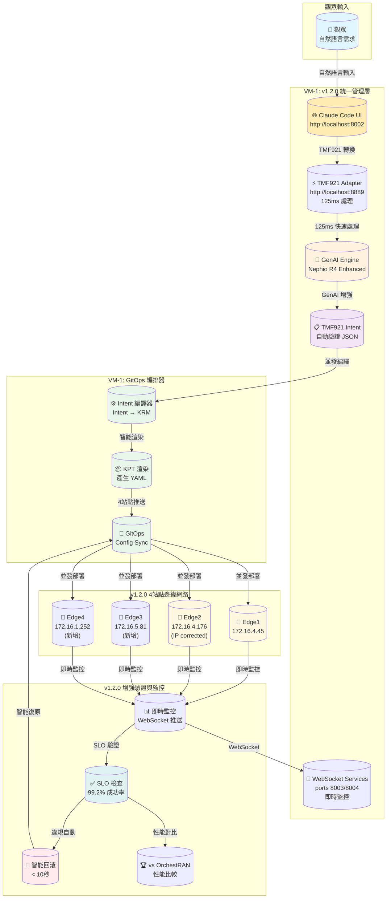
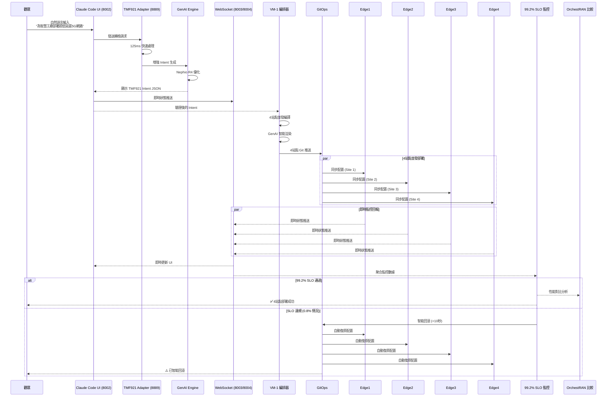
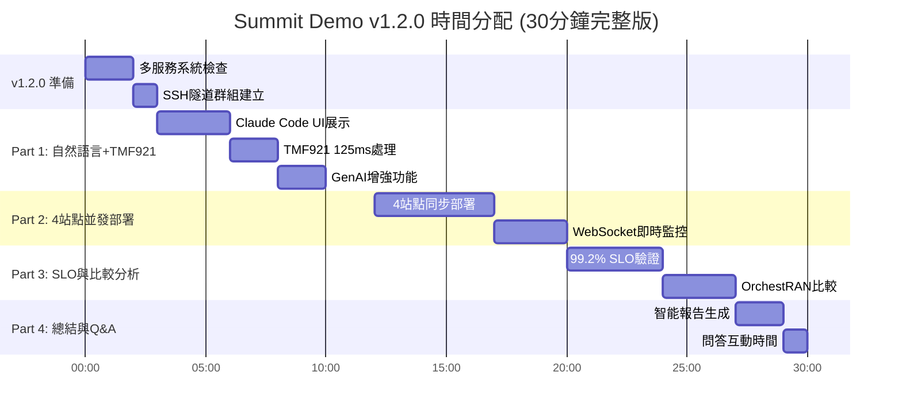
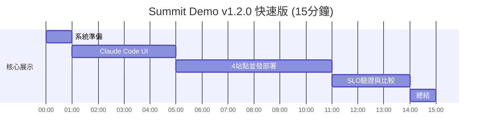

# 🎯 Summit Demo v1.2.0 視覺化流程圖

## v1.2.0 完整自動化架構總覽



---

## v1.2.0 詳細自動化流程



---

## v1.2.0 增強 12 步驟 Pipeline 流程

```mermaid
graph LR
    subgraph "準備階段"
        S1[1.多服務檢查]
        S2[2.WebSocket 初始化]
        S3[3.4站點狀態初始化]
    end

    subgraph "v1.2.0 Intent 生成"
        S4[4.TMF921 快速轉換]
        S5[5.GenAI 增強]
        S6[6.Intent 自動驗證]
    end

    subgraph "並發部署階段"
        S7[7.4站點 KRM 渲染]
        S8[8.並發 GitOps 推送]
        S9[9.即時 O2IMS 監控]
    end

    subgraph "增強驗證階段"
        S10[10.99.2% SLO 驗證]
        S11[11.OrchestRAN 比較]
        S12[12.智能報告生成]
    end

    S1 --> S2 --> S3
    S3 --> S4 --> S5 --> S6
    S6 --> S7 --> S8 --> S9
    S9 --> S10 --> S11 --> S12

    style S1 fill:#e3f2fd
    style S2 fill:#e3f2fd
    style S3 fill:#e3f2fd
    style S4 fill:#f3e5f5
    style S5 fill:#f3e5f5
    style S6 fill:#f3e5f5
    style S7 fill:#e8f5e9
    style S8 fill:#e8f5e9
    style S9 fill:#e8f5e9
    style S10 fill:#fff3e0
```



---

## v1.2.0 增強網路拓撲圖

```
                        ┌──────────────────┐
                        │   外部網路       │
                        │ 147.251.115.143  │
                        └────────┬─────────┘
                                 │
        ┌────────────────────────┴────────────────────────┐
        │          VM-1: v1.2.0 統一管理層               │
        │             172.16.0.78                        │
        │                                               │
        │  ┌─────────────┐ ┌─────────────┐ ┌──────────┐  │
        │  │Claude Code  │ │TMF921 Adapt │ │WebSocket │  │
        │  │UI (8002)    │ │(8889,125ms) │ │(8003/04) │  │
        │  └─────────────┘ └─────────────┘ └──────────┘  │
        │                                               │
        │  ┌─────────────┐ ┌─────────────┐ ┌──────────┐  │
        │  │GenAI Engine │ │GitOps Orch  │ │SLO Gates │  │
        │  │(Nephio R4)  │ │(K8s Master) │ │(99.2%)   │  │
        │  └─────────────┘ └─────────────┘ └──────────┘  │
        └────────────────┬───────────────────────────────┘
                         │
        ┌────────────────┴────────────────────────────────┐
        │           v1.2.0 4站點邊緣網路架構              │
        │            內部網路 172.16.x.x                 │
        └─┬──────────┬──────────┬──────────┬─────────────┘
          │          │          │          │
    ┌─────▼─────┐┌─────▼─────┐┌─────▼─────┐┌─────▼─────┐
    │Edge1(VM-2)││Edge2(VM-4)││Edge3(新增)││Edge4(新增)│
    │172.16.4.45││172.16.4   ││172.16.5.81││172.16.1   │
    │           ││.176       ││           ││.252       │
    │• 5G RAN   ││• 5G Core  ││• Edge AI  ││• IoT Hub  │
    │• URLLC    ││• eMBB     ││• mMTC     ││• Network  │
    │• O-RAN DU ││• O-RAN CU ││• Edge     ││• Slicing  │
    │           ││           ││  Compute  ││           │
    └───────────┘└───────────┘└───────────┘└───────────┘
             ▲           ▲           ▲           ▲
             │           │           │           │
        WebSocket 即時監控 (8003/8004) + SLO Gates
```

---

## 服務類型對照表

| 自然語言關鍵字 | 服務類型 | 英文名稱 | 特性 |
|--------------|---------|----------|------|
| 高頻寬、4K影片、串流 | eMBB | Enhanced Mobile Broadband | 100 Mbps, 50ms 延遲 |
| 超低延遲、自動駕駛、工廠 | URLLC | Ultra-Reliable Low Latency | 10 Mbps, 1ms 延遲 |
| IoT、感測器、大量裝置 | mMTC | Massive Machine Type Comm | 1 Mbps, 支援 50000 裝置 |

---

## v1.2.0 演示時間軸 (增強版)



### 快速版本 (15分鐘)


---

## 演示成功檢查點

✅ **演示前**
- [ ] SSH 可登入
- [ ] LLM 服務正常
- [ ] Kubernetes 運作中
- [ ] GitOps 已設定

✅ **演示中**
- [ ] 自然語言轉 Intent 成功
- [ ] KRM 渲染完成
- [ ] GitOps 同步成功
- [ ] SLO 檢查通過

✅ **演示後**
- [ ] 報告產生完成
- [ ] 所有服務仍正常

---

## v1.2.0 關鍵指令速查

```bash
# v1.2.0 多服務 SSH 隧道群組
ssh -L 8002:172.16.0.78:8002 \
    -L 8889:172.16.0.78:8889 \
    -L 8003:172.16.0.78:8003 \
    -L 8004:172.16.0.78:8004 \
    ubuntu@147.251.115.143

# 開啟 v1.2.0 主要界面
open http://localhost:8002/  # Claude Code UI
open http://localhost:8889/  # TMF921 Adapter Dashboard

# v1.2.0 系統健康檢查
curl -s http://localhost:8002/health | jq '.status'    # Claude Code UI
curl -s http://localhost:8889/health | jq '.status'    # TMF921 Adapter
websocat --print-ping ws://localhost:8003/health      # WebSocket A
websocat --print-ping ws://localhost:8004/health      # WebSocket B

# v1.2.0 TMF921 快速轉換測試 (125ms)
time curl -X POST http://localhost:8889/transform \
  -H "Content-Type: application/json" \
  -d '{
    "natural_language": "部署邊緣AI推理服務",
    "target_sites": ["edge1", "edge2", "edge3", "edge4"]
  }' | jq '.processing_time_ms'

# v1.2.0 4站點並發演示
./scripts/demo_llm_v2.sh \
  --target all-edges \
  --mode automated \
  --websocket-monitoring \
  --slo-validation strict

# v1.2.0 增強 SLO 檢查 (99.2% 成功率)
./scripts/postcheck_v2.sh \
  --target all-edges \
  --continuous-monitoring \
  --websocket-updates | jq '.success_rate'

# v1.2.0 智能報告生成
./scripts/package_summit_demo_v2.sh \
  --full-bundle \
  --orchestran-comparison \
  --genai-insights \
  --4site-analysis

# WebSocket 即時監控命令
websocat ws://localhost:8003/deployment-status  # 部署狀態
websocat ws://localhost:8004/slo-metrics       # SLO 指標

# OrchestRAN 比較分析
./scripts/generate_orchestran_comparison.sh \
  --metrics all \
  --output artifacts/competitive-analysis/
```

---

**這份視覺化流程圖讓演示更容易理解！** 🚀