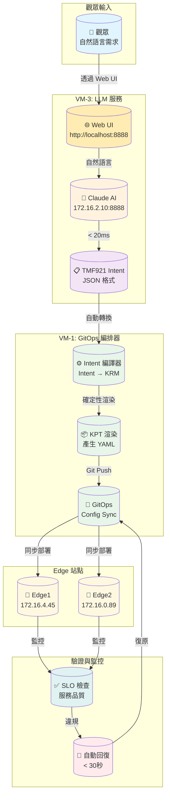
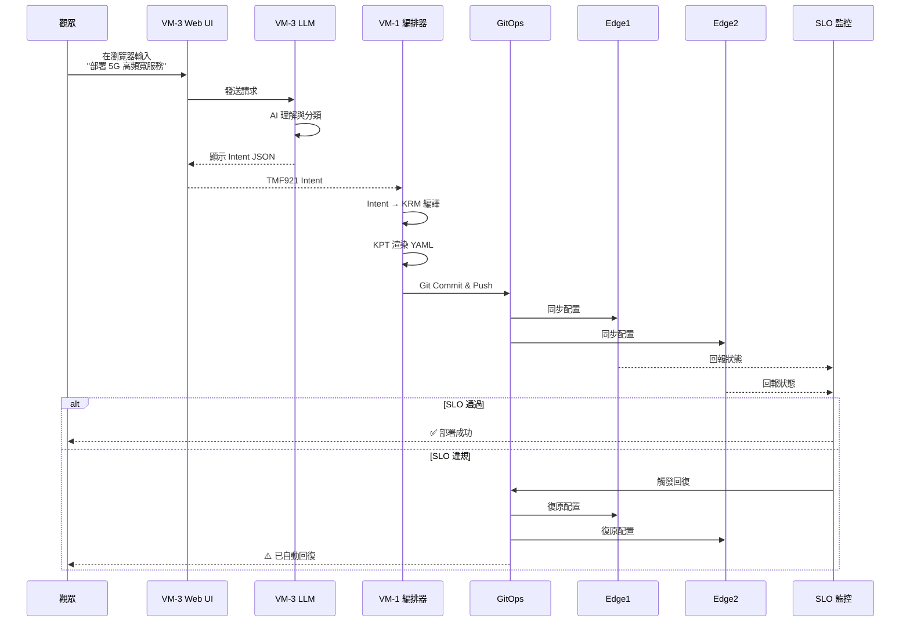
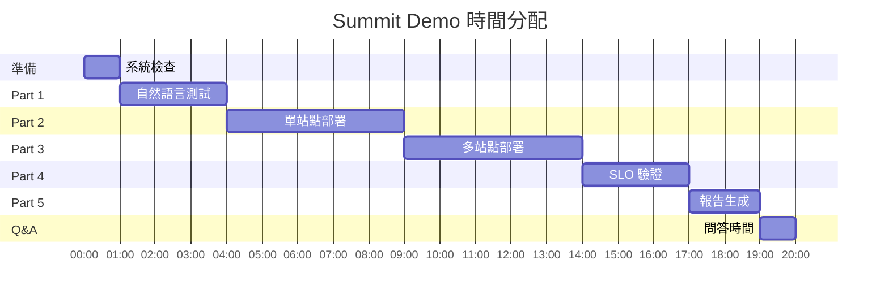

# 🎯 Summit Demo 視覺化流程圖

## 演示架構總覽



---

## 詳細步驟流程



---

## 10 步驟 Pipeline 流程

```mermaid
graph LR
    subgraph "準備階段"
        S1[1.檢查相依性]
        S2[2.設定工作區]
        S3[3.初始化狀態]
    end

    subgraph "Intent 生成"
        S4[4.驗證目標]
        S5[5.檢查 LLM]
        S6[6.生成 Intent]
    end

    subgraph "部署階段"
        S7[7.渲染 KRM]
        S8[8.GitOps 部署]
        S9[9.等待 O2IMS]
    end

    subgraph "驗證階段"
        S10[10.SLO 檢查]
    end

    S1 --> S2 --> S3
    S3 --> S4 --> S5 --> S6
    S6 --> S7 --> S8 --> S9
    S9 --> S10

    style S1 fill:#e3f2fd
    style S2 fill:#e3f2fd
    style S3 fill:#e3f2fd
    style S4 fill:#f3e5f5
    style S5 fill:#f3e5f5
    style S6 fill:#f3e5f5
    style S7 fill:#e8f5e9
    style S8 fill:#e8f5e9
    style S9 fill:#e8f5e9
    style S10 fill:#fff3e0
```



---

## 網路拓撲圖

```
                        ┌──────────────────┐
                        │   外部網路       │
                        │ 147.251.115.143  │
                        └────────┬─────────┘
                                 │
                    ┌────────────┴────────────┐
                    │                         │
        ┌───────────▼───────────┐ ┌──────────▼──────────┐
        │   VM-1 (GitOps)       │ │   VM-3 (LLM)       │
        │   172.16.0.78         │ │   172.16.2.10      │
        │                       │ │                    │
        │  • Kubernetes Master  │ │  • Claude AI API   │
        │  • Config Sync        │ │  • Intent Gen      │
        │  • Intent Compiler    │ │  • Port 8888       │
        └───────────┬───────────┘ └──────────┬──────────┘
                    │                         │
        ┌───────────┴───────────────────────┴───────────┐
        │              內部網路 172.16.x.x               │
        └───────────┬───────────────────────┬───────────┘
                    │                        │
        ┌───────────▼───────────┐ ┌─────────▼───────────┐
        │   VM-2 (Edge1)        │ │   VM-4 (Edge2)      │
        │   172.16.4.45         │ │   172.16.0.89       │
        │                       │ │                     │
        │  • Edge Cluster #1    │ │  • Edge Cluster #2  │
        │  • 5G Network Func    │ │  • 5G Network Func  │
        │  • O-RAN Components   │ │  • O-RAN Components │
        └───────────────────────┘ └─────────────────────┘
```

---

## 服務類型對照表

| 自然語言關鍵字 | 服務類型 | 英文名稱 | 特性 |
|--------------|---------|----------|------|
| 高頻寬、4K影片、串流 | eMBB | Enhanced Mobile Broadband | 100 Mbps, 50ms 延遲 |
| 超低延遲、自動駕駛、工廠 | URLLC | Ultra-Reliable Low Latency | 10 Mbps, 1ms 延遲 |
| IoT、感測器、大量裝置 | mMTC | Massive Machine Type Comm | 1 Mbps, 支援 50000 裝置 |

---

## 演示時間軸



---

## 演示成功檢查點

✅ **演示前**
- [ ] SSH 可登入
- [ ] LLM 服務正常
- [ ] Kubernetes 運作中
- [ ] GitOps 已設定

✅ **演示中**
- [ ] 自然語言轉 Intent 成功
- [ ] KRM 渲染完成
- [ ] GitOps 同步成功
- [ ] SLO 檢查通過

✅ **演示後**
- [ ] 報告產生完成
- [ ] 所有服務仍正常

---

## 關鍵指令速查

```bash
# 建立 SSH 隧道（用於 Web UI）
ssh -L 8888:172.16.2.10:8888 ubuntu@147.251.115.143

# 開啟 Web UI
open http://localhost:8888/

# 快速健康檢查
curl -s http://172.16.2.10:8888/health | jq '.status'

# 中文 Intent 測試（命令列）
curl -X POST http://172.16.2.10:8888/generate_intent \
  -d '{"natural_language": "部署 5G 服務", "target_site": "edge1"}' | jq

# 執行完整演示
./scripts/demo_llm.sh --dry-run --target both --mode automated

# 檢查 SLO
./scripts/postcheck.sh --target edge1 --json-output | jq '.summary'

# 產生報告
./scripts/package_summit_demo.sh --full-bundle
```

---

**這份視覺化流程圖讓演示更容易理解！** 🚀