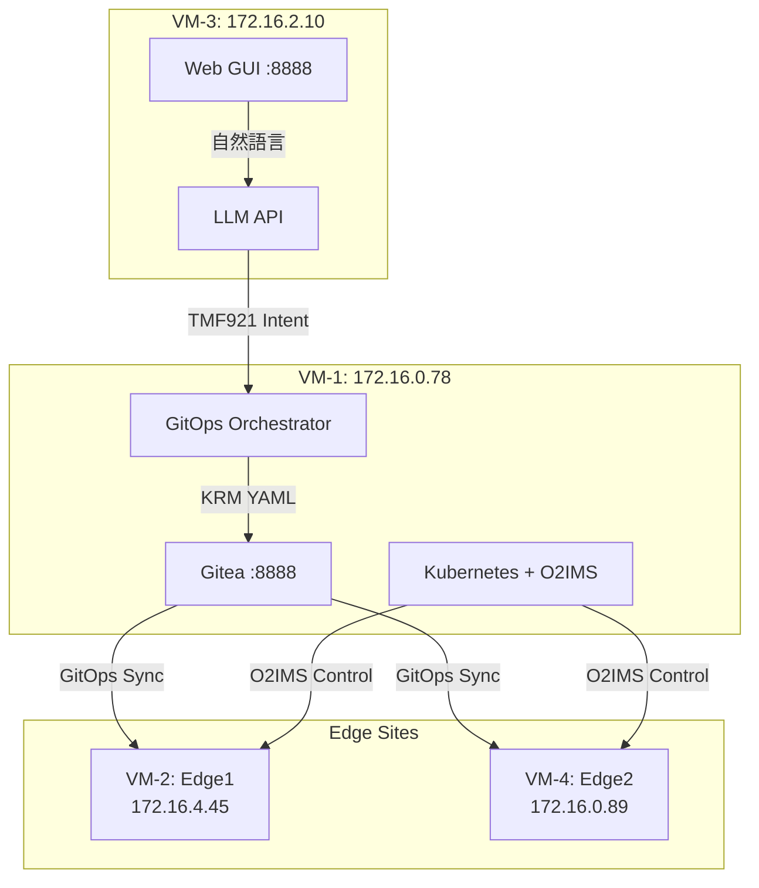

# 📋 VM-3 資訊驗證報告

## 🔍 驗證結果總結

VM-3 提供的資訊**部分正確**，但有幾個需要修正的地方：

### ❌ 需要修正的部分

1. **IP 位址錯誤**
   - VM-3 提到: `192.168.0.201`
   - **正確應該是: `172.16.2.10`**
   - VM-3 的所有服務都在 `172.16.2.10:8888`

2. **VM-1 IP 錯誤**
   - VM-3 提到: `192.168.0.47`
   - **正確應該是: `172.16.0.78`**

3. **O2IMS API 端點**
   - VM-3 提到: `http://172.16.0.89:31280`
   - 這是 VM-4 (Edge2) 的 IP，但 O2IMS 實際上在 VM-1 的 Kubernetes 叢集中

### ✅ 正確的部分

1. **Web GUI 存在** ✅
   - VM-3 確實有 Web GUI 在 `http://172.16.2.10:8888/`
   - 標題: "TMF921 Intent Generator - VM3 LLM Adapter"

2. **API 端點正確** ✅
   - `/health` - 健康檢查
   - `/generate_intent` - Intent 生成
   - 回應格式符合 TMF921 標準

3. **流程架構正確** ✅
   - Web GUI → Intent → KRM → GitOps → O2IMS → SLO → Rollback
   - 這個流程是正確的

---

## 📐 修正後的正確架構

### 正確的 IP 對照表
```
VM-1 (GitOps 編排器): 172.16.0.78  # Kubernetes Master, GitOps
VM-2 (Edge1 站台):    172.16.4.45  # Edge Cluster 1
VM-3 (LLM 服務):      172.16.2.10  # LLM Adapter with Web GUI
VM-4 (Edge2 站台):    172.16.0.89  # Edge Cluster 2
```

### 正確的端到端流程



---

## 🎯 正確的演示步驟

### Step 1: 從 VM-3 Web GUI 開始
```bash
# 正確的 Web GUI 位址
http://172.16.2.10:8888/

# 在輸入框輸入自然語言
"Deploy eMBB service at edge1 with 200Mbps downlink for video streaming"

# 點擊 [Generate Intent]
```

### Step 2: 用 API 測試（替代方案）
```bash
# 如果 Web GUI 有問題，可以直接用 API
curl -X POST http://172.16.2.10:8888/generate_intent \
  -H "Content-Type: application/json" \
  -d '{
    "natural_language": "Deploy eMBB service with 200Mbps for video streaming",
    "target_site": "edge1"
  }' | jq
```

### Step 3: VM-1 處理 Intent → KRM
```bash
# 在 VM-1 執行（172.16.0.78）
cd /home/ubuntu/nephio-intent-to-o2-demo

# 執行完整 pipeline
./scripts/demo_llm.sh --target edge1 --mode automated
```

### Step 4: 查看 GitOps 部署
```bash
# Gitea Web UI（在 VM-1）
http://147.251.115.143:8888
# 或內部 IP
http://172.16.0.78:8888

# 帳號: admin / admin123
```

### Step 5: 監控 O2IMS 狀態
```bash
# 在 VM-1 查看 O2IMS ProvisioningRequest
kubectl get provisioningrequests -A

# 查看 GitOps 同步狀態
kubectl get rootsync -n config-management-system
```

### Step 6: SLO 檢查與回滾
```bash
# 執行 SLO 檢查
./scripts/postcheck.sh --target edge1 --json-output | jq

# 如果需要回滾
./scripts/rollback.sh --target edge1
```

---

## 📊 修正後的監控儀表板

| 階段 | 監控點 | 正確的 URL/指令 |
|------|--------|----------------|
| NL→Intent | VM-3 Web GUI | http://172.16.2.10:8888/ |
| Intent API | VM-3 Health | `curl http://172.16.2.10:8888/health` |
| Intent→KRM | VM-1 logs | `tail -f artifacts/demo-llm-*/logs/*.log` |
| KRM→GitOps | Gitea | http://172.16.0.78:8888 |
| GitOps Status | Config Sync | `kubectl get rootsync -n config-management-system` |
| O2IMS Status | Kubernetes | `kubectl get provisioningrequests -A` |
| SLO Check | Postcheck | `./scripts/postcheck.sh --target edge1` |

---

## ✅ 結論

VM-3 的整體流程概念是**正確的**，但需要修正以下幾點：

1. **所有 IP 位址都要更新為正確的內部網路 IP**
2. **O2IMS 在 VM-1 的 Kubernetes 中，不是在 VM-4**
3. **Web GUI 確實存在且可用**，位於 `http://172.16.2.10:8888/`

建議 VM-3 團隊：
- 更新所有文件中的 IP 位址
- 測試時使用 `172.16.2.10` 而非 `192.168.0.201`
- 確認 Web GUI 的自然語言輸入功能正常運作

整個端到端流程是可行的，只要使用正確的 IP 位址即可！