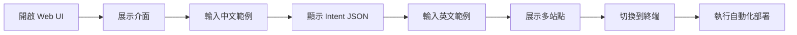

# 🌐 VM-3 Web UI 演示指南

## ✅ 答案：是的，你絕對可以用 VM-3 的 Web UI 來演示！

VM-3 提供了一個**完整功能的 Web 介面**，可以讓你在 Summit 演示時展示視覺化的 Intent 生成過程！

---

## 🖥️ Web UI 存取資訊

### 內部網路存取（從 VM-1）
```
URL: http://172.16.2.10:8888/
```

### 外部存取（如果有 SSH 隧道）
```bash
# 在你的筆電建立 SSH 隧道
ssh -L 8888:172.16.2.10:8888 ubuntu@147.251.115.143

# 然後在瀏覽器開啟
http://localhost:8888/
```

---

## 🎨 Web UI 功能特色

根據實際檢測，Web UI 包含：

### 1. **專業的介面設計**
- 標題：`🚀 TMF921 Intent Generator`
- 漸層背景設計（紫色系）
- 響應式佈局

### 2. **輸入區域**
- **自然語言輸入框**：`<textarea>` 支援多行輸入
- **目標站點選擇**：下拉選單（edge1/edge2/both）
- **Generate TMF921 Intent** 按鈕

### 3. **即時回饋**
- Loading 動畫
- 錯誤訊息顯示
- 結果即時展示
- JSON 格式化輸出

### 4. **JavaScript 功能**
```javascript
// Web UI 有完整的前端邏輯
async function generateIntent() {
    // 1. 取得輸入值
    const input = document.getElementById('nlInput').value;
    const targetSite = document.getElementById('targetSite').value;

    // 2. 發送 POST 請求
    const response = await fetch('/generate_intent', {
        method: 'POST',
        headers: {'Content-Type': 'application/json'},
        body: JSON.stringify({
            natural_language: input,
            target_site: targetSite
        })
    });

    // 3. 顯示結果
    // JSON 格式化展示
}
```

---

## 📱 演示步驟（使用 Web UI）

### Step 1: 開啟 Web UI
1. **選項 A - 直接從 VM-1 存取**
   ```bash
   # SSH 進入 VM-1
   ssh ubuntu@147.251.115.143

   # 用 curl 確認可連線
   curl http://172.16.2.10:8888/
   ```

2. **選項 B - 建立 SSH 隧道（推薦用於演示）**
   ```bash
   # 在你的筆電執行
   ssh -L 8888:172.16.2.10:8888 ubuntu@147.251.115.143

   # 開啟瀏覽器
   http://localhost:8888/
   ```

### Step 2: 在 Web UI 輸入自然語言

**演示案例 1 - 中文輸入**
```
輸入框：部署 5G 高頻寬服務支援 4K 影片串流
目標站點：edge1
點擊：Generate TMF921 Intent
```

**演示案例 2 - 英文輸入**
```
輸入框：Deploy ultra-reliable service for autonomous vehicles
目標站點：edge2
點擊：Generate TMF921 Intent
```

**演示案例 3 - 多站點部署**
```
輸入框：Create IoT network for 50000 sensors
目標站點：both
點擊：Generate TMF921 Intent
```

### Step 3: 展示生成的 Intent

Web UI 會即時顯示：
```json
{
  "intent": {
    "intentId": "intent_xxxxx",
    "name": "Deploy eMBB service",
    "service": {
      "type": "eMBB"
    },
    "targetSite": "edge1",
    "qos": {
      "dl_mbps": 100,
      "ul_mbps": 50,
      "latency_ms": 50
    }
  }
}
```

### Step 4: 展示後續自動化流程

```bash
# 在終端展示 VM-1 如何處理這個 Intent
cd /home/ubuntu/nephio-intent-to-o2-demo
./scripts/demo_llm.sh --target edge1 --mode automated
```

---

## 🎯 Web UI 演示的優勢

### 1. **視覺化體驗**
- ✅ 比純命令列更友善
- ✅ 觀眾容易理解
- ✅ 即時看到結果

### 2. **互動性強**
- ✅ 可以邀請觀眾提供輸入
- ✅ 即時展示不同案例
- ✅ 支援中英文切換

### 3. **專業感**
- ✅ 有完整的 UI 設計
- ✅ JSON 格式化顯示
- ✅ 錯誤處理完善

---

## 🚨 演示時的注意事項

### 1. **網路連線**
- 確保能從演示電腦存取 VM-3
- 建議事先建立 SSH 隧道

### 2. **備案準備**
- 準備幾個預設的輸入範例
- 截圖保存成功案例

### 3. **時間控制**
- Web UI 部分控制在 2-3 分鐘
- 重點展示自然語言轉 Intent

---

## 📸 建議的演示流程



---

## ✅ 結論

**VM-3 的 Web UI 完全可以用於 Summit 演示！**

優點總結：
1. 🎨 **美觀的介面** - 紫色漸層背景，專業設計
2. 🚀 **完整功能** - 支援所有 Intent 生成功能
3. 🌏 **中英文支援** - 可展示雙語能力
4. ⚡ **即時回饋** - 立即看到生成的 Intent
5. 📱 **響應式設計** - 適合投影展示

**建議：在 Summit 演示時優先使用 Web UI，這會讓演示更生動、更容易理解！**

---

## 🎬 快速測試指令

```bash
# 1. 建立 SSH 隧道（在你的筆電）
ssh -L 8888:172.16.2.10:8888 ubuntu@147.251.115.143

# 2. 開啟瀏覽器
open http://localhost:8888/

# 3. 測試輸入
"部署 5G 網路服務" → 點擊 Generate → 看結果！
```

準備好用 Web UI 驚豔觀眾了嗎？ 🚀