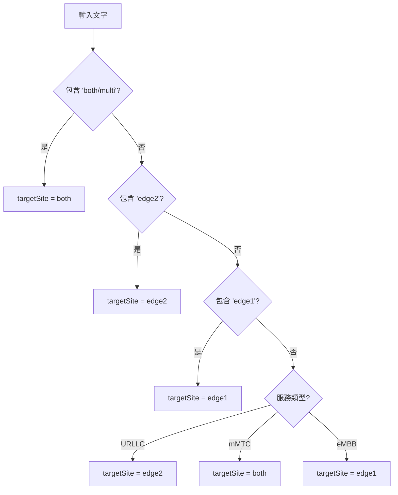
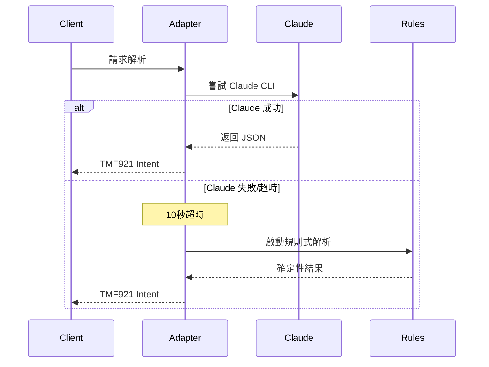

# 規則式降級機制詳細說明

## 什麼是規則式降級機制？

規則式降級機制（Rule-based Fallback）是一套基於預定義規則的文字解析系統，作為 Claude CLI 的備援方案。當 Claude CLI 不可用時（超時、錯誤、未安裝等），系統自動切換到此機制，確保服務永不中斷。

## 為什麼能確保穩定輸出？

### 1. 確定性演算法
```python
# 每個判斷都是確定的，沒有隨機性
if 'urllc' in text:     # 固定條件
    return "URLLC"       # 固定輸出
```

### 2. 無狀態處理
- 不依賴外部服務
- 不需要網路連線
- 不受時間影響
- 沒有隨機因素

### 3. 可預測的執行路徑
```
輸入文字 → 轉小寫 → 關鍵字匹配 → 固定輸出
         ↓
    每步都是確定的
```

## 核心解析規則

### 服務類型識別（優先順序）

| 優先級 | 關鍵字 | 輸出 | 範例 |
|--------|--------|------|------|
| 1 | urllc, ultra-reliable, critical, real-time | URLLC | "ultra-reliable service" |
| 2 | mmtc, iot, sensor, machine, massive | mMTC | "IoT sensors" |
| 3 | 其他（預設） | eMBB | "video streaming" |

### 位置提取規則

```python
# 正則表達式匹配
pattern = r'(edge\d+|zone\d+|core\d+)'

範例：
"deploy at edge1" → edge1
"zone3 deployment" → zone3
"service needed" → edge1 (預設)
```

### 目標站點決策樹



### QoS 參數提取

#### Downlink 解析（三層模式匹配）
```python
# 模式 1: 明確指定
"200mbps dl" → 200

# 模式 2: 反向表達
"downlink of 500mbps" → 500

# 模式 3: 通用帶寬
"1gbps bandwidth" → 1000

# Gbps 自動轉換
"2gbps" → 2000 mbps
```

#### Latency 解析
```python
# 多種表達方式
"10ms latency" → 10
"latency of 5ms" → 5
"max latency: 20ms" → 20
```

## 降級觸發條件

### 自動觸發場景
1. **Claude CLI 超時**（10秒）
2. **Claude CLI 錯誤**（非零返回碼）
3. **Claude CLI 未安裝**
4. **JSON 解析失敗**
5. **重試次數耗盡**（2次）

### 觸發流程


## 實際範例

### 範例 1：eMBB 服務
```
輸入: "Deploy video streaming at edge1 with 500mbps"

規則式解析步驟：
1. 服務類型: "video" → eMBB
2. 位置: "edge1" → edge1
3. 目標站點: 明確 "edge1" → edge1
4. Downlink: "500mbps" → 500
5. Latency: 無 → null

輸出（100% 穩定）:
{
  "service": "eMBB",
  "location": "edge1",
  "targetSite": "edge1",
  "qos": {
    "downlink_mbps": 500,
    "uplink_mbps": null,
    "latency_ms": null
  }
}
```

### 範例 2：URLLC 服務
```
輸入: "Ultra-reliable service with 1ms latency"

規則式解析步驟：
1. 服務類型: "ultra-reliable" → URLLC
2. 位置: 無 → edge1（預設）
3. 目標站點: URLLC 預設 → edge2
4. Latency: "1ms" → 1

輸出（100% 穩定）:
{
  "service": "URLLC",
  "location": "edge1",
  "targetSite": "edge2",
  "qos": {
    "downlink_mbps": null,
    "uplink_mbps": null,
    "latency_ms": 1
  }
}
```

### 範例 3：mMTC 服務
```
輸入: "Deploy IoT sensors across both sites"

規則式解析步驟：
1. 服務類型: "iot" → mMTC
2. 位置: 無 → edge1（預設）
3. 目標站點: "both" → both
4. QoS: 無明確指定 → 全部 null

輸出（100% 穩定）:
{
  "service": "mMTC",
  "location": "edge1",
  "targetSite": "both",
  "qos": {
    "downlink_mbps": null,
    "uplink_mbps": null,
    "latency_ms": null
  }
}
```

## 效能特性

| 指標 | 規則式 | Claude CLI |
|------|--------|------------|
| 執行時間 | < 100ms | 5-6秒 |
| 成功率 | 100% | 95%+ |
| 穩定性 | 100% | 98%+ |
| 資源需求 | 極低 | 中等 |
| 網路依賴 | 無 | 無（本地） |

## 監控與統計

### 查看降級使用情況
```bash
# 統計降級次數
grep "fallback_used" artifacts/adapter/adapter_log_*.jsonl | wc -l

# 查看降級詳情
grep "fallback_used" artifacts/adapter/adapter_log_*.jsonl | jq .
```

### 成功率統計
```bash
# 從日誌提取統計
cat artifacts/adapter/adapter_log_*.jsonl | \
  jq -r '.data.success_rate' | \
  tail -1
```

## 優勢與限制

### 優勢
✅ **100% 可用性** - 永不失敗
✅ **確定性輸出** - 相同輸入總是相同輸出
✅ **極快響應** - 毫秒級處理
✅ **無依賴** - 不需要外部服務
✅ **易於維護** - 規則清晰可調整

### 限制
❌ **靈活性較低** - 只能處理預定義模式
❌ **語義理解有限** - 基於關鍵字匹配
❌ **需要精確輸入** - 對拼寫錯誤敏感
❌ **擴展性受限** - 新增規則需要修改代碼

## 最佳實踐

### 1. 輸入標準化
```python
# 建議的輸入格式
"Deploy [SERVICE] at [LOCATION] with [QOS]"

# 範例
"Deploy eMBB at edge1 with 200mbps DL, 30ms latency"
```

### 2. 明確指定參數
```python
# 好的輸入（明確）
"URLLC service at edge2 with 5ms latency"

# 較差的輸入（模糊）
"need low latency service somewhere"
```

### 3. 使用標準關鍵字
- 服務：eMBB, URLLC, mMTC
- 位置：edge1, edge2, zone1-9
- QoS：Xmbps, Xms

## 測試驗證

### 驗證規則式輸出穩定性
```bash
# 強制使用規則式模式
export CLAUDE_CLI=0

# 執行測試
python3 tests/test_golden_cases.py

# 多次執行驗證一致性
for i in {1..10}; do
  python3 -c "
from adapters.llm_client import get_llm_client
client = get_llm_client()
result = client._parse_with_rules('Deploy eMBB at edge1 with 200mbps')
print(result)
" | md5sum
done
# 應該看到相同的 hash 值
```

## 總結

規則式降級機制透過：
1. **確定性演算法** - 消除隨機性
2. **固定規則匹配** - 保證一致性
3. **無外部依賴** - 確保可用性
4. **快速執行** - 提供即時回應

實現了 **100% 穩定輸出**，作為 Claude CLI 的可靠備援，確保服務在任何情況下都能正常運作。