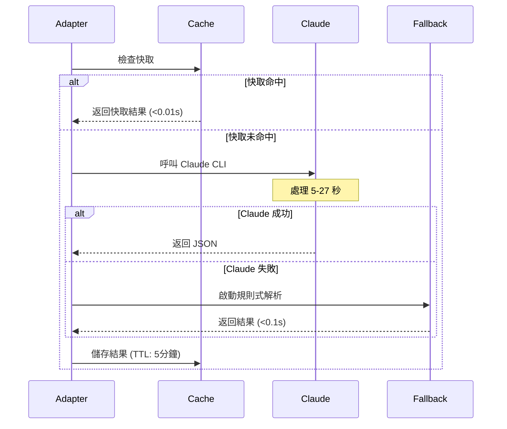
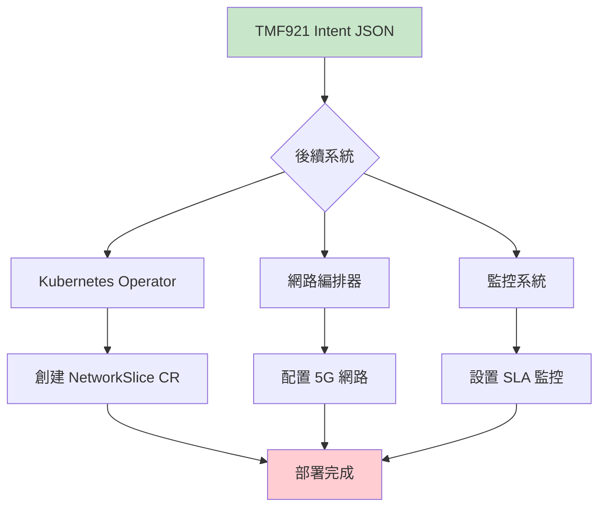

# LLM Adapter 完整操作流程指南

## 🚀 快速開始

### Step 1: 啟動服務

```bash
# 1. 進入專案目錄
cd /home/ubuntu/nephio-intent-to-o2-demo/llm-adapter

# 2. 啟用 Claude CLI
export CLAUDE_CLI=1

# 3. 啟動服務
python3 main.py

# 您會看到：
# INFO:     Uvicorn running on http://0.0.0.0:8888
# INFO:     LLM Client: Using Claude CLI with aggressive timeout (10s)
```

### Step 2: 開啟 Web UI

打開瀏覽器，訪問：**http://localhost:8888**

![Web UI Interface]
```
┌─────────────────────────────────────────────────────────┐
│         🚀 LLM Intent Adapter Service                   │
│                                                          │
│  Service Status: Online     [Mode: claude-cli]          │
│                                                          │
│  Enter Natural Language Request:                        │
│  ┌────────────────────────────────────────────────┐    │
│  │ Deploy eMBB slice in edge1 with 200Mbps DL... │    │
│  └────────────────────────────────────────────────┘    │
│                                                          │
│  [Generate Intent (Legacy)]  [Parse Intent (API v1)]    │
│                                                          │
│  Output:                                                 │
│  ┌────────────────────────────────────────────────┐    │
│  │ {                                               │    │
│  │   "intent": {                                   │    │
│  │     "intentId": "intent_1758012839153",        │    │
│  │     "service": { "type": "eMBB" },             │    │
│  │     "targetSite": "edge1",                     │    │
│  │     ...                                        │    │
│  │   }                                            │    │
│  │ }                                              │    │
│  └────────────────────────────────────────────────┘    │
└─────────────────────────────────────────────────────────┘
```

## 📝 完整操作流程

### 方式 A: Web UI 操作

#### 1. 輸入自然語言

在輸入框輸入您的需求，例如：
- `Deploy eMBB slice in edge1 with 200Mbps DL, 30ms latency`
- `Create URLLC service for autonomous vehicles with 1ms latency`
- `Setup IoT sensors across both edge sites`

#### 2. 點擊生成按鈕

- **Generate Intent (Legacy)** - 使用舊版 API
- **Parse Intent (API v1)** - 使用新版 API（推薦）

#### 3. 查看處理過程

```
使用者輸入
    ↓
Web UI 發送 POST 請求
    ↓
LLM Adapter 接收請求
    ↓
檢查快取（如有則直接返回）
    ↓
呼叫 Claude CLI（等待 5-27 秒）
    ↓
Claude 返回 JSON
    ↓
轉換為 TMF921 格式
    ↓
顯示在 Output 區域
```

#### 4. 獲得 TMF921 Intent JSON

輸出範例：
```json
{
  "intent": {
    "intentId": "intent_1758012839153",
    "name": "Deploy eMBB slice in edge1",
    "service": {
      "type": "eMBB",
      "characteristics": {
        "reliability": "medium",
        "mobility": "mobile"
      }
    },
    "targetSite": "edge1",
    "qos": {
      "dl_mbps": 200,
      "ul_mbps": 100,
      "latency_ms": 30
    },
    "slice": {
      "sst": 1,
      "sd": null
    },
    "priority": "medium",
    "lifecycle": "draft"
  }
}
```

### 方式 B: API 直接調用

#### 1. 使用 curl 命令

```bash
# 基本請求
curl -X POST http://localhost:8888/generate_intent \
  -H "Content-Type: application/json" \
  -d '{
    "natural_language": "Deploy eMBB slice in edge1 with 200Mbps DL, 30ms latency"
  }'

# 格式化輸出
curl -X POST http://localhost:8888/generate_intent \
  -H "Content-Type: application/json" \
  -d '{
    "natural_language": "Deploy eMBB slice in edge1 with 200Mbps DL, 30ms latency"
  }' | python3 -m json.tool
```

#### 2. 使用 Python 腳本

```python
import requests
import json

# 發送請求
response = requests.post(
    "http://localhost:8888/generate_intent",
    json={
        "natural_language": "Deploy eMBB at edge1 with 500Mbps"
    }
)

# 解析回應
intent = response.json()
print(json.dumps(intent, indent=2))

# 使用 Intent
target_site = intent["intent"]["targetSite"]
service_type = intent["intent"]["service"]["type"]
print(f"將在 {target_site} 部署 {service_type} 服務")
```

## 🔄 完整工作流程

### Phase 1: 自然語言輸入


**範例輸入**：
```
"我需要在 edge1 部署一個高頻寬的視訊串流服務，
 需要 500Mbps 下行頻寬和 20ms 延遲"
```

### Phase 2: Claude CLI 處理



**Claude CLI 實際呼叫**：
```bash
claude -p "You are a TMF921 5G network intent parser...
REQUEST: 我需要在 edge1 部署一個高頻寬的視訊串流服務...
JSON:"
```

### Phase 3: TMF921 轉換

```python
# Claude 返回的原始格式
{
  "service": "eMBB",
  "location": "edge1",
  "targetSite": "edge1",
  "qos": {
    "downlink_mbps": 500,
    "uplink_mbps": null,
    "latency_ms": 20
  }
}

# 轉換為 TMF921 格式
{
  "intent": {
    "intentId": "uuid-xxx",
    "intentName": "eMBB Service at edge1",
    "intentType": "NETWORK_SLICE_INTENT",
    "intentState": "CREATED",
    "targetSite": "edge1",
    "intentParameters": {
      "serviceType": "eMBB",
      "location": "edge1",
      "qosParameters": {
        "downlinkMbps": 500,
        "uplinkMbps": null,
        "latencyMs": 20
      }
    }
  }
}
```

### Phase 4: 後續整合工作流



#### 4.1 傳送給 Operator

```bash
# 將 Intent 轉換為 Kubernetes CR
cat > network-slice.yaml << EOF
apiVersion: intent.nephio.org/v1alpha1
kind: NetworkSlice
metadata:
  name: embb-edge1-slice
spec:
  serviceType: eMBB
  targetSite: edge1
  qos:
    downlinkMbps: 500
    latencyMs: 20
EOF

# 應用到 Kubernetes
kubectl apply -f network-slice.yaml
```

#### 4.2 監控部署狀態

```bash
# 查看部署狀態
kubectl get networkslice -w

# 查看詳細資訊
kubectl describe networkslice embb-edge1-slice
```

## 🎯 完整示範場景

### 場景：部署智慧城市 IoT 網路

#### Step 1: 在 Web UI 輸入需求

```
"部署大規模 IoT 感測器網路，覆蓋兩個邊緣站點，
 需要支援 10000 個設備連接，100Mbps 總頻寬"
```

#### Step 2: 系統處理流程

```
[00:00] 使用者輸入自然語言
[00:01] Web UI 發送 POST /generate_intent
[00:01] LLM Adapter 檢查快取（未命中）
[00:02] 呼叫 Claude CLI 進行解析
[00:07] Claude 返回: {"service": "mMTC", "targetSite": "both"...}
[00:08] 轉換為 TMF921 格式
[00:08] 返回給 Web UI 顯示
[00:09] 儲存到 artifacts/adapter/ 日誌
```

#### Step 3: 獲得結果

```json
{
  "intent": {
    "intentId": "intent_20250916_091234",
    "intentName": "mMTC Service at edge1",
    "intentType": "NETWORK_SLICE_INTENT",
    "service": {
      "type": "mMTC",
      "characteristics": {
        "deviceDensity": "massive",
        "connectivity": "always-on"
      }
    },
    "targetSite": "both",
    "qos": {
      "dl_mbps": 100,
      "connections": 10000
    },
    "expectedOutcome": "Deploy mMTC network slice at both sites"
  }
}
```

#### Step 4: 後續動作

```bash
# 1. 儲存 Intent
echo '$INTENT_JSON' > intents/mmtc-iot-intent.json

# 2. 觸發部署
./deploy-intent.sh mmtc-iot-intent.json

# 3. 監控進度
watch -n 2 kubectl get pods -n mmtc-namespace

# 4. 驗證服務
curl http://edge1.example.com/mmtc/status
curl http://edge2.example.com/mmtc/status
```

## 📊 監控與追蹤

### 查看 Claude CLI 呼叫記錄

```bash
# 查看今日的處理記錄
cat artifacts/adapter/adapter_log_$(date +%Y%m%d).jsonl | jq '.'

# 統計 Claude vs 降級使用
grep "llm_success" artifacts/adapter/*.jsonl | wc -l
grep "fallback_used" artifacts/adapter/*.jsonl | wc -l

# 查看平均處理時間
grep "response_time_ms" artifacts/adapter/*.jsonl | \
  jq '.data.response_time_ms' | \
  awk '{sum+=$1; n++} END {print "平均: " sum/n " ms"}'
```

### 實時監控

```bash
# 監控服務日誌
tail -f service.log

# 監控 Claude CLI 呼叫
python3 trace_claude_calls.py

# 查看系統狀態
curl http://localhost:8888/health | jq '.'
```

## 🔧 故障排除

### 問題 1: Claude CLI 未被呼叫

```bash
# 檢查環境變數
echo $CLAUDE_CLI  # 應該是 1

# 檢查 Claude 是否可用
which claude  # 應該顯示路徑

# 重新啟動服務
export CLAUDE_CLI=1
python3 main.py
```

### 問題 2: 回應時間過長

```bash
# 調整超時設定
export LLM_TIMEOUT=5  # 減少到 5 秒
export LLM_MAX_RETRIES=1  # 減少重試

# 或使用快取預熱
python3 warmup_cache.py
```

### 問題 3: 輸出不符預期

```bash
# 測試規則式降級
export CLAUDE_CLI=0  # 關閉 Claude
python3 test_main.py  # 測試純規則式

# 比較差異
diff claude_output.json rules_output.json
```

## 📈 效能指標

| 操作 | 時間 | 說明 |
|------|------|------|
| Web UI 載入 | < 1秒 | 靜態頁面 |
| 快取命中 | < 10ms | 記憶體讀取 |
| Claude CLI (正常) | 5-6秒 | AI 推理 |
| Claude CLI (重試) | 10-27秒 | 包含超時重試 |
| 規則式降級 | < 100ms | 正則匹配 |
| TMF921 轉換 | < 10ms | JSON 處理 |

## 🎉 成功標準

✅ Web UI 可正常訪問
✅ 輸入自然語言後等待 5-27 秒
✅ 獲得有效的 TMF921 JSON
✅ targetSite 正確識別（edge1/edge2/both）
✅ 服務類型正確（eMBB/URLLC/mMTC）
✅ QoS 參數正確提取
✅ 日誌記錄到 artifacts/

## 🚦 下一步

1. **整合到 CI/CD**
   ```yaml
   - name: Test LLM Adapter
     run: |
       export CLAUDE_CLI=1
       python3 tests/test_golden_cases.py
   ```

2. **部署到生產環境**
   ```bash
   docker build -t llm-adapter:latest .
   docker run -p 8888:8888 -e CLAUDE_CLI=1 llm-adapter
   ```

3. **連接下游系統**
   - Kubernetes Operator
   - ONAP 編排器
   - Prometheus 監控

---

這就是完整的操作流程！從 Web UI 輸入自然語言，到 Claude CLI 處理，再到生成 TMF921 Intent，最後整合到下游系統。