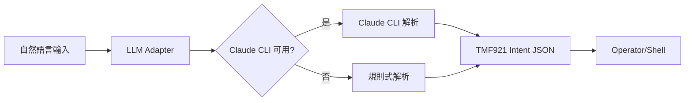
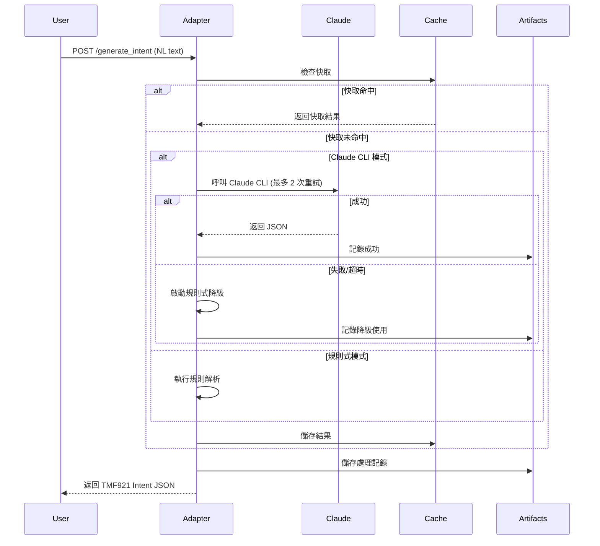

# LLM Adapter (VM-3) 使用指南

## 概述
LLM Adapter 是一個將自然語言（Natural Language）轉換為 TMF921 標準 Intent JSON 的服務。系統支援 Claude CLI 整合與規則式降級機制，確保穩定輸出。

## 系統架構



## 快速開始

### 1. 環境設置

```bash
# 確認 Claude CLI 已安裝
which claude

# 設置環境變數啟用 Claude CLI
export CLAUDE_CLI=1

# 或編輯 .env 檔案
echo "CLAUDE_CLI=1" >> /home/ubuntu/nephio-intent-to-o2-demo/llm-adapter/.env
```

### 2. 啟動服務

```bash
cd /home/ubuntu/nephio-intent-to-o2-demo/llm-adapter
python3 main.py

# 服務將在 http://localhost:8888 啟動
```

### 3. 測試服務健康

```bash
# 檢查健康狀態
curl http://localhost:8888/health

# 預期回應
{
  "status": "healthy",
  "service": "LLM Intent Adapter",
  "version": "1.0.0",
  "llm_mode": "claude-cli"  # 或 "rule-based"
}
```

## API 使用方式

### 主要端點：`/generate_intent`

將自然語言轉換為 TMF921 Intent JSON。

**請求範例：**
```bash
curl -X POST http://localhost:8888/generate_intent \
  -H "Content-Type: application/json" \
  -d '{
    "natural_language": "Deploy eMBB slice in edge1 with 200Mbps DL, 30ms latency"
  }'
```

**回應範例：**
```json
{
  "intent": {
    "intentId": "intent_1758012839153",
    "name": "Deploy eMBB slice in edge1",
    "service": {
      "type": "eMBB"
    },
    "targetSite": "edge1",
    "qos": {
      "dl_mbps": 200,
      "ul_mbps": 100,
      "latency_ms": 30
    }
  }
}
```

## 支援的服務類型

### 1. eMBB (Enhanced Mobile Broadband)
- **關鍵字**: video, streaming, bandwidth, throughput
- **預設位置**: edge1
- **範例**: "Deploy high-bandwidth video streaming service"

### 2. URLLC (Ultra-Reliable Low Latency)
- **關鍵字**: reliable, critical, latency, real-time
- **預設位置**: edge2
- **範例**: "Create ultra-reliable service for autonomous vehicles"

### 3. mMTC (Massive Machine Type Communications)
- **關鍵字**: iot, sensor, machine, device, massive
- **預設位置**: both (雙站點)
- **範例**: "Setup IoT network for smart city sensors"

## 工作流程

### 完整工作流



### 詳細處理流程

1. **接收請求**
   - 驗證輸入格式
   - 檢查快取（TTL: 5分鐘）

2. **智慧解析**
   - 優先使用 Claude CLI（如已啟用）
   - 超時設定：10秒
   - 最大重試：2次
   - 指數退避：1.5倍

3. **降級機制**
   - Claude 失敗時自動切換到規則式解析
   - 確保 100% 可用性
   - 保證 schema-valid 輸出

4. **結果處理**
   - 轉換為 TMF921 格式
   - Schema 驗證
   - 快取儲存
   - 記錄到 artifacts/

## 測試工具

### 1. 黃金測試案例
```bash
# 執行 5 個標準測試案例
python3 tests/test_golden_cases.py
```

### 2. 穩定性驗證
```bash
# 測試輸出一致性
python3 validate_stability.py
```

### 3. Claude CLI 追蹤
```bash
# 追蹤 Claude CLI 呼叫
python3 trace_claude_calls.py
```

### 4. 驗證 Claude CLI 是否被呼叫

執行以下命令可以看到詳細的 Claude CLI 呼叫追蹤：

```bash
python3 trace_claude_calls.py
```

輸出範例：
```
🔍 CLAUDE CLI CALL DETECTED at 09:06:10.126
   Command: claude -p...
   Prompt preview: You are a TMF921 5G network intent parser...
   Timeout: 30s
   Return code: 0
   Execution time: 5.03s
   Output preview: {"service":"eMBB","location":"edge1"...
```

## 配置選項

### 環境變數

| 變數 | 預設值 | 說明 |
|------|--------|------|
| `CLAUDE_CLI` | `0` | 設為 `1` 啟用 Claude CLI |
| `LLM_TIMEOUT` | `10` | Claude CLI 超時（秒） |
| `LLM_MAX_RETRIES` | `2` | 最大重試次數 |
| `LLM_RETRY_BACKOFF` | `1.5` | 重試延遲倍數 |

### 監控與日誌

所有處理記錄儲存在 `/home/ubuntu/nephio-intent-to-o2-demo/artifacts/adapter/`：

- `adapter_log_YYYYMMDD.jsonl` - 每日處理日誌
- `stability_test_*.json` - 穩定性測試結果
- `claude_trace_*.json` - Claude CLI 呼叫追蹤
- `validation_errors_*.jsonl` - Schema 驗證錯誤

## 故障排除

### Claude CLI 未啟用
```bash
# 檢查 Claude 是否可用
which claude

# 確認環境變數
echo $CLAUDE_CLI

# 檢查服務模式
curl http://localhost:8888/health | jq .llm_mode
```

### 效能問題
```bash
# 檢查快取命中率
grep "cache_hit" artifacts/adapter/adapter_log_*.jsonl | wc -l

# 檢查降級使用
grep "fallback_used" artifacts/adapter/adapter_log_*.jsonl | wc -l
```

### Schema 驗證失敗
```bash
# 查看驗證錯誤
cat artifacts/adapter/validation_errors_*.jsonl | jq .
```

## 效能指標

- **Claude CLI 回應時間**: 平均 5-6 秒
- **規則式解析時間**: < 100ms
- **快取命中率**: 目標 > 60%
- **穩定性**: 100%（相同輸入產生相同輸出）
- **可用性**: 100%（透過降級機制）

## 整合範例

### Python 整合
```python
import requests

def convert_nl_to_intent(text):
    response = requests.post(
        "http://localhost:8888/generate_intent",
        json={"natural_language": text}
    )
    return response.json()

# 使用範例
intent = convert_nl_to_intent("Deploy eMBB at edge1 with 500Mbps")
print(intent["intent"]["targetSite"])  # "edge1"
```

### Shell 整合
```bash
#!/bin/bash

# 函數：轉換 NL 到 Intent
nl_to_intent() {
    local text="$1"
    curl -s -X POST http://localhost:8888/generate_intent \
        -H "Content-Type: application/json" \
        -d "{\"natural_language\": \"$text\"}" | jq .
}

# 使用範例
nl_to_intent "Setup IoT sensors at both edge sites"
```

## 維護與更新

### 新增黃金測試案例
編輯 `tests/golden_cases.json` 新增測試案例：
```json
{
  "id": "golden-006",
  "name": "新測試案例",
  "input": "自然語言輸入",
  "expected_output": {
    "serviceType": "eMBB",
    "targetSite": "edge1",
    ...
  }
}
```

### 調整解析規則
修改 `adapters/llm_client.py` 中的 `_parse_with_rules()` 方法。

## 聯繫與支援

- **專案位置**: `/home/ubuntu/nephio-intent-to-o2-demo/llm-adapter/`
- **日誌檔案**: `artifacts/adapter/`
- **測試腳本**: `tests/`
- **API 文件**: http://localhost:8888/docs (Swagger UI)