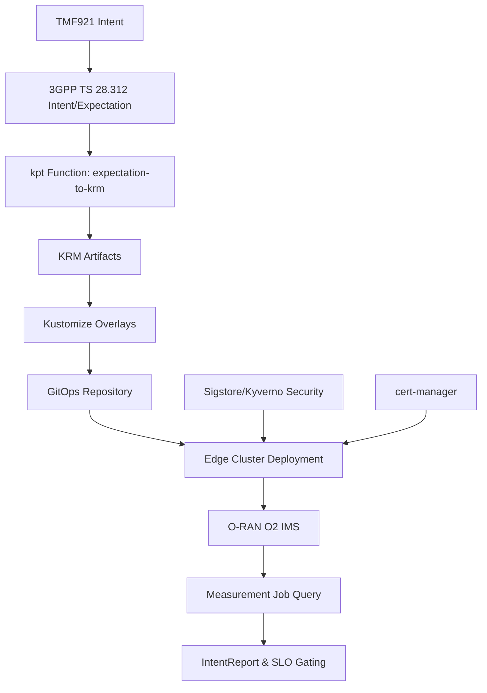

# Intent-to-KRM GitOps Pipeline

This document describes the complete Intent→KRM→GitOps pipeline that transforms 3GPP TS 28.312 Intent/Expectation objects into Kubernetes Resource Model (KRM) packages and deploys them via GitOps.

## Architecture Overview



## Pipeline Components

### 1. Intent Processing

The pipeline starts with 3GPP TS 28.312 compliant Intent/Expectation JSON objects:

```json
{
  "intentExpectationId": "ran-perf-001",
  "intentExpectationType": "ServicePerformance",
  "intentExpectationContext": {
    "contextAttribute": "networkFunction",
    "contextCondition": "EQUAL",
    "contextValueRange": ["gNB", "CU", "DU"]
  },
  "intentExpectationTarget": {
    "targetAttribute": "throughput",
    "targetCondition": "GREATER_THAN",
    "targetValue": "1000Mbps"
  },
  "intentExpectationObject": {
    "objectType": "RANFunction", 
    "objectInstance": "ran-cell-001"
  }
}
```

### 2. KRM Transformation

The `expectation-to-krm` kpt function transforms intentions into Kubernetes resources:

#### Generated Resources

For each intent expectation, the function generates:

1. **ConfigMap**: Raw expectation storage
   - Contains the original 3GPP TS 28.312 JSON
   - Labeled for filtering and selection
   - Annotated with metadata

2. **Domain-Specific Bundle**: Typed KRM resource
   - `RANBundle` for RAN performance expectations
   - `CNBundle` for Core Network capacity expectations  
   - `TNBundle` for Transport Network coverage expectations

#### Example Output

```yaml
apiVersion: v1
kind: ConfigMap
metadata:
  name: expectation-ran-perf-001
  namespace: intent-to-krm
  labels:
    expectation.nephio.org/id: ran-perf-001
    expectation.nephio.org/type: ServicePerformance
---
apiVersion: ran.nephio.org/v1alpha1
kind: RANBundle
metadata:
  name: ran-bundle-ran-perf-001
  namespace: intent-to-krm
spec:
  expectationId: ran-perf-001
  expectationType: ServicePerformance
  networkFunctions: [gNB, CU, DU]
  performance:
    throughput:
      condition: GREATER_THAN
      value: 1000Mbps
```

### 3. Edge Deployment Overlays

Kustomize overlays in `dist/edge1/` transform base KRM for edge deployment:

- **Namespace Transformation**: Resources deployed to `edge1` namespace
- **Edge Labels**: Added for site-specific identification
- **Location Annotations**: Geographic coordinates for edge placement
- **Resource Prefixing**: `edge1-` prefix for unique naming

#### Kustomization Structure

```yaml
apiVersion: kustomize.config.k8s.io/v1beta1
kind: Kustomization

resources:
- namespace.yaml
- ../../artifacts/cn_capacity.yaml
- ../../artifacts/ran_performance.yaml
- ../../artifacts/tn_coverage.yaml

namespace: edge1
namePrefix: edge1-

commonLabels:
  app.kubernetes.io/instance: edge1
  deployment.nephio.org/site: edge1

patches:
- patch: |-
    - op: add
      path: /metadata/labels/deployment.nephio.org~1edge-zone
      value: "zone-alpha"
  target:
    kind: ConfigMap
```

### 4. GitOps Publication

The `publish-edge` Makefile target automates GitOps deployment:

1. **Validation**: Ensures target repository exists
2. **Artifact Copy**: Copies edge overlay to `$EDGE_REPO_DIR/apps/intent/`
3. **Kustomize Build**: Generates rendered YAML
4. **Git Operations**: Commits and pushes changes

```bash
make publish-edge EDGE_REPO_DIR=/path/to/gitops/repo
```

### 5. Security Integration

Default-on security through multiple layers:

#### Sigstore Policy Controller
```yaml
apiVersion: policy.sigstore.dev/v1beta1
kind: ClusterImagePolicy
metadata:
  name: nephio-intent-images
spec:
  images:
  - glob: "registry.nephio.org/**"
  authorities:
  - keyless:
      url: https://fulcio.sigstore.dev
      identities:
      - issuer: https://accounts.google.com
        subject: ".*@nephio.org"
```

#### Kyverno Verification
```yaml
apiVersion: kyverno.io/v1
kind: ClusterPolicy
metadata:
  name: verify-intent-images
spec:
  validationFailureAction: enforce
  background: false
  rules:
  - name: check-image-signature
    match:
      any:
      - resources:
          kinds:
          - Pod
          namespaces:
          - edge1
    verifyImages:
    - imageReferences:
      - "registry.nephio.org/*"
      attestors:
      - entries:
        - keyless:
            subject: "*@nephio.org"
            issuer: "https://accounts.google.com"
            rekor:
              url: https://rekor.sigstore.dev
```

## Integration Points

### Nephio R5 Integration

The pipeline integrates with Nephio R5 through:

1. **Package Orchestration**: kpt packages managed by Porch
2. **Resource Provisioning**: KRM resources applied via PackageVariant and PackageVariantSet  
3. **Edge Computing**: Deployment to edge clusters via Nephio topology

### O-RAN O2 IMS Integration

Integration with O-RAN O2 Interface Management Service:

#### ProvisioningRequest Creation
```yaml
apiVersion: o2ims.nephio.org/v1alpha1
kind: ProvisioningRequest
metadata:
  name: edge1-ran-provisioning
spec:
  description: "RAN provisioning for edge1 site"
  requirements:
    resources:
    - resourceTypeId: "ran.o2ims.org/v1/RANFunction"
      resourceTemplateId: "ran-template-001"
      requirements:
        performance:
          throughput: ">1000Mbps"
        networkFunctions: ["gNB", "CU", "DU"]
```

#### Measurement Job Query
```yaml
apiVersion: o2ims.nephio.org/v1alpha1
kind: MeasurementJob
metadata:
  name: edge1-performance-monitoring
spec:
  resourceId: "ran-cell-001"
  measurementTypes:
  - "throughput"
  - "latency"
  - "availability"
  periodicityMs: 5000
  reportingPeriodMs: 30000
```

### SLO-Gated GitOps

Final pipeline stage validates deployment success:

```yaml
apiVersion: gitops.nephio.org/v1alpha1
kind: IntentReport
metadata:
  name: edge1-intent-report
spec:
  intentId: "ran-perf-001"
  deploymentSite: "edge1"
  sloGate:
    criteria:
    - name: "latency_p95_ms"
      condition: "LESS_THAN_EQUAL"
      threshold: "15"
    - name: "success_rate"
      condition: "GREATER_THAN_EQUAL" 
      threshold: "0.995"
    - name: "throughput_p95_mbps"
      condition: "GREATER_THAN_EQUAL"
      threshold: "200"
  status:
    phase: "Validating"
    conditions:
    - type: "SLOsMet"
      status: "Unknown"
      reason: "PendingMeasurement"
```

## Example Workflows

### 1. Basic Intent Processing

```bash
# Generate KRM from intent expectations
make render

# Validate generated artifacts
make conform

# Test the complete pipeline
make validate
```

### 2. Edge Deployment

```bash
# Set GitOps repository path
export EDGE_REPO_DIR=/path/to/edge-gitops-repo

# Generate and publish edge overlay
make publish-edge

# Verify deployment in target cluster
kubectl get ranbundles,cnbundles,tnbundles -n edge1
```

### 3. Integration Testing

```bash
# Run kpt function integration test
make integration-test

# Test with real kpt render
cd testdata && kpt fn render .
```

### 4. Performance Monitoring

```bash
# Run benchmarks
make benchmark

# Profile memory usage
go test -memprofile=mem.prof -bench=.
go tool pprof mem.prof
```

## Pipeline Configuration

### Environment Variables

| Variable | Description | Required |
|----------|-------------|----------|
| `EDGE_REPO_DIR` | Path to GitOps repository | Yes (for publish-edge) |
| `KUBECONFIG` | Kubernetes cluster config | No (uses default) |
| `KPT_FN_CONFIG_PATH` | kpt function config file | No (uses expectation-config.yaml) |

### File Structure

```
packages/intent-to-krm/
├── artifacts/                 # Generated KRM artifacts
│   ├── cn_capacity.yaml
│   ├── ran_performance.yaml
│   └── tn_coverage.yaml
├── dist/edge1/               # Edge deployment overlays
│   ├── kustomization.yaml
│   └── namespace.yaml  
├── testdata/
│   ├── input/               # Test intent expectations
│   └── golden/              # Expected outputs
├── schemas/                 # JSON Schema validation
├── docs/
│   └── PIPELINE.md         # This document
├── Makefile                # Build and deployment targets
└── main.go                 # kpt function implementation
```

## Troubleshooting

### Common Issues

1. **Missing kustomize**: Install via `go install sigs.k8s.io/kustomize/kustomize/v5@latest`
2. **GitOps push fails**: Check `EDGE_REPO_DIR` and Git credentials
3. **Schema validation fails**: Verify intent JSON against 3GPP TS 28.312 spec
4. **Resource conflicts**: Use unique `intentExpectationId` values

### Debug Commands

```bash
# Verbose kpt function execution
echo '{}' | ./bin/expectation-to-krm --verbose

# Validate kustomization
cd dist/edge1 && kustomize build --enable-helm

# Check generated YAML syntax
yamllint artifacts/*.yaml

# Verify Kubernetes resources
kubeconform -summary -verbose artifacts/*.yaml
```

## Security Considerations

1. **Supply Chain**: All images must be Sigstore-signed
2. **Input Validation**: Intent JSON validated against schemas
3. **RBAC**: Principle of least privilege for service accounts
4. **Secrets**: Use external secret management (no plaintext)
5. **Network Policies**: Enforce traffic segmentation

## Performance Metrics

The pipeline is designed for:

- **Latency**: P95 processing time < 15ms per intent
- **Throughput**: > 200 intents/second sustained  
- **Success Rate**: 99.5% conversion success
- **Resource Usage**: < 100MB memory per instance

## Contributing

See the main project README for contribution guidelines. Key points:

1. **TDD**: Write failing tests first
2. **Small commits**: Atomic changes with clear messages
3. **Security**: Default-on security policies
4. **Documentation**: Update pipeline docs for changes

## References

- [Nephio R5 Documentation](https://nephio.org/docs/)
- [O-RAN O2 IMS Specification](https://orandownloadsweb.azurewebsites.net/)
- [3GPP TS 28.312 Intent Driven Management](https://www.3gpp.org/specifications/28312)
- [kpt Function Developer Guide](https://kpt.dev/book/04-using-functions/01-declarative-function-execution)
- [Sigstore Policy Controller](https://docs.sigstore.dev/policy-controller/)
- [Kyverno Documentation](https://kyverno.io/docs/)